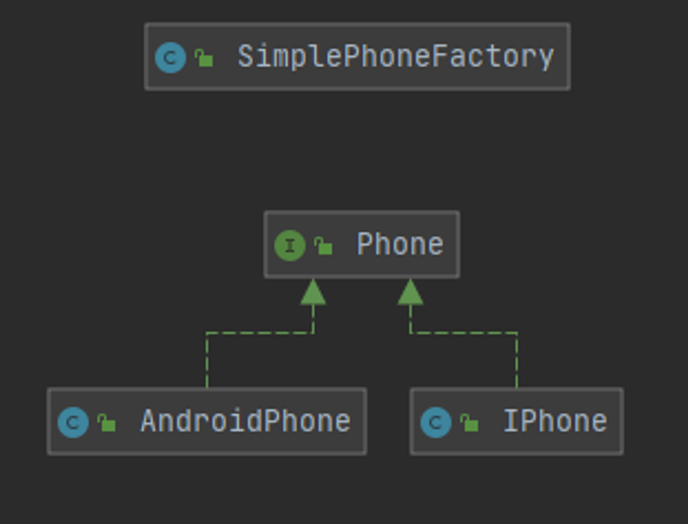
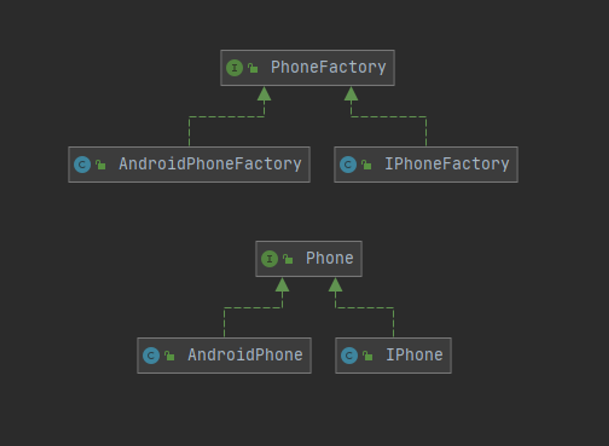
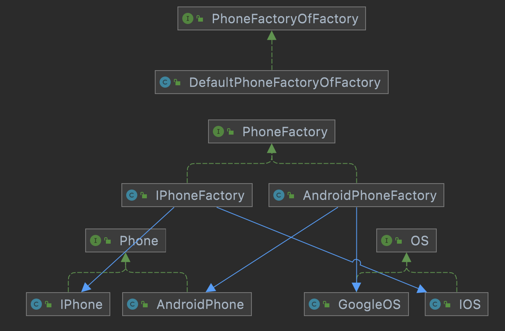

# 02. 팩토리 패턴

## ✨팩토리 패턴이란?✨

### 📌 정의

#### ✔️ 객체 생성 부분을 추상화한 패턴

상속 관계에 있는 두 클래스에서 상위 클래스가 중요한 뼈대를 결정하고, 하위 클래스에서 객체 생성에 관한 구체적인 내용을 결정함

### 📌 장점

- 클래스 생성과 사용의 로직을 분리하여 결합도를 낮추고, 정보 은닉이 가능
- 확장성이 높음
- 객체 생성 코드를 하나로 이동하여 단일책임원칙(ISP)를 만족

### 📌 단점

- 제품마다 팩토리 클래스를 모두 구현해야하기 때문에 제품이 늘어날 때마다 서브 클래스 수가 증가
- 코드의 복잡성이 증가

## ✨팩토리 패턴 유형 3가지✨

### 📌 심플 팩토리 패턴

객체를 생성하는 클래스를 따로 두는 것을 의미
객체 생성 부분을 캡슐화 => 객체 생성 코드를 팩토리 클래스에서 구현

#### ✔️ 예제코드

클라이언트에서 휴대폰을 주문하는 코드

```java
//휴대폰을 만드는 공장
public class SimplePhoneFactory {
    public Phone orderPhone(String type) {
        Phone phone = createPhone(type);
        phone.complete();
        return phone;
    }
    private Phone createPhone(String type) {
        return switch (type) {
            case "IPHONE" -> new IPhone();
            case "ANDROID" -> new AndroidPhone();
            default -> null;
        };
    }
}

//휴대폰 인터페이스
public interface Phone {
    void complete();
    void call();
}

//아이폰
public class IPhone implements Phone{
    @Override
    public void complete() {
        System.out.println("아이폰 완성");
    }

    @Override
    public void call() {
        System.out.println("아이폰으로 전화를 한다");
    }
}

//안드로이드 폰
public class AndroidPhone implements Phone{
    @Override
    public void complete() {
        System.out.println("안드로이드폰 완성");
    }

    @Override
    public void call() {
        System.out.println("안드로이드폰으로 전화를 한다");
    }
}

//클라이언트는 휴대폰 공장에 휴대폰을 주문한다.
public class Practice {
    public static void main(String[] args){
        SimplePhoneFactory simplePhoneFactory = new SimplePhoneFactory();
        Phone phone = simplePhoneFactory.orderPhone("ANDROID");
        phone.call();
    }
}

//결과
안드로이드폰 완성
안드로이드폰으로 전화를 한다
```



### 📌 팩토리 메소드 패턴

- 객체를 생성하기 위한 인터페이스를 정의하는 과정에서 어떤 클래스의 인스턴스를 만들지는 `서브클래스`에서 결정
- 즉, 클래스의 인스턴스를 만드는 일을 `서브클래스`에게 맡기는 것

#### ✔️ 예제코드

```java
//휴대폰을 만드는 공장
public interface PhoneFactory {
    default Phone orderPhone() {
        Phone phone = createPhone();
        phone.complete();
        return phone;
    }
    Phone createPhone();
}

//아이폰 공장
public class IPhoneFactory implements PhoneFactory {
    @Override
    public Phone createPhone() {
        return new IPhone();
    }
}

//안드로이드폰 공장
public class AndroidPhoneFactory implements PhoneFactory {
    @Override
    public Phone createPhone() {
        return new AndroidPhone();
    }
}

//휴대폰 인터페이스
public interface Phone {
    void complete();
    void call();
}

//아이폰
public class IPhone implements Phone{
    @Override
    public void complete() { System.out.println("아이폰 완성"); }
    @Override
    public void call() { System.out.println("아이폰으로 전화를 한다"); }
}

//안드로이드폰
public class AndroidPhone implements Phone{
    @Override
    public void complete() {System.out.println("안드로이드폰 완성");}
    @Override
    public void call() {System.out.println("안드로이드폰으로 전화를 한다");}
}


public class Practice {
    public static void main(String[] args){
        //1. 클라이언트는 아이폰 공장에 아이폰을 주문한다.
        IPhoneFactory iPhoneFactory = new IPhoneFactory();
        Phone phone7 = iPhoneFactory.orderPhone();
        phone7.call();

        //2. 클라이언트는 안드로이드폰 공장에 안드로이드폰을 주문한다.
        AndroidPhoneFactory androidPhoneFactory = new AndroidPhoneFactory();
        Phone phone2 = androidPhoneFactory.orderPhone();
        phone2.call();
    }
}

//결과
아이폰 완성
아이폰으로 전화를 한다
안드로이드폰 완성
안드로이드폰으로 전화를 한다
```



### 📌 추상 팩토리 패턴

구체적인 클래스에 의존하지 않고 서로 연관되거나 의존적인 객체들의 조합을 만드는 인터페이스를 제공하는 패턴

하나의 Factory에서 여러개의 제품군(Product)조합을 생성할 수 있게 해주는 패턴

#### ✔️ 예제코드

```java
//휴대폰 공장의 공장
public interface PhoneFactoryOfFactory {
    PhoneFactory requestPhone(String company);  //추상 메서드
}

public class DefaultPhoneFactoryOfFactory implements PhoneFactoryOfFactory{
    @Override
    public PhoneFactory requestPhone(String company) {
        switch (company) {
            case "IPHONE":
                return new IPhoneFactory();
            case "ANDROID":
                return new AndroidPhoneFactory();
        }
        throw new IllegalArgumentException();
    }
}


//휴대폰 공장
public interface PhoneFactory {
    Phone createPhone();
    OS createOS();
}

//아이폰 공장
public class IPhoneFactory implements PhoneFactory{
    @Override
    public Phone createPhone() {
        OS os = createOS();
        os.installOS();
        return new IPhone();
    }
    @Override
    public OS createOS() {
        return new IOS();
    }
}

//안드로이드폰 공장
public class AndroidPhoneFactory implements PhoneFactory{
    @Override
    public Phone createPhone() {
        OS os = createOS();
        os.installOS();
        return new AndroidPhone();
    }
    @Override
    public OS createOS() {
        return new GoogleOS();
    }
}

// OS 인터페이스
public interface OS {
    void installOS();
}

//OS - IOS
public class IOS implements OS {
    @Override
    public void installOS() {
        System.out.println("IOS 설치");
    }
}

// OS - GoogleOS
public class GoogleOS implements OS {
    @Override
    public void installOS() {
        System.out.println("구글OS 설치");
    }
}

// Phone 인터페이스
public interface Phone {
    public void call();
    public void playGame();
}

//아이폰
public class IPhone implements Phone{
    @Override
    public void call() {
        System.out.println("아이폰으로 전화하다");
    }

    @Override
    public void playGame() {
        System.out.println("아이폰으로 게임하다");
    }
}

//안드로이드폰
public class AndroidPhone implements Phone{
    @Override
    public void call() {
        System.out.println("안드로이드로 전화하다");
    }

    @Override
    public void playGame() {
        System.out.println("안드로이드로 게임하다");
    }
}

public class Main {
    public static void main(String[] args) {
        PhoneFactoryOfFactory phoneFactoryOfFactory = new DefaultPhoneFactoryOfFactory();

        //아이폰을 산다
        PhoneFactory iphoneFactory= phoneFactoryOfFactory.requestPhone("IPHONE");
        Phone iphone = iphoneFactory.createPhone();
        iphone.call();
        iphone.playGame();

        //안드로이드폰을 산다
        PhoneFactory androidPhoneFactory = phoneFactoryOfFactory.requestPhone("ANDROID");
        Phone androidPhone = androidPhoneFactory.createPhone();
        androidPhone.call();
        androidPhone.playGame();
    }
}

//결과
IOS 설치
아이폰으로 전화하다
아이폰으로 게임하다
구글OS 설치
안드로이드로 전화하다
안드로이드로 게임하다
```


