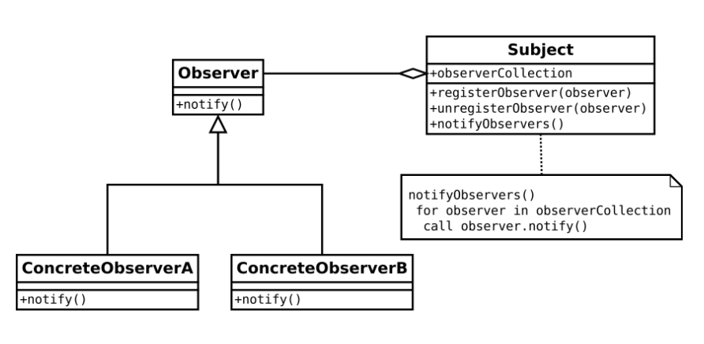
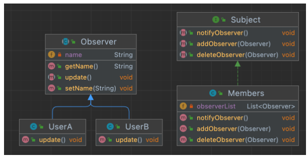
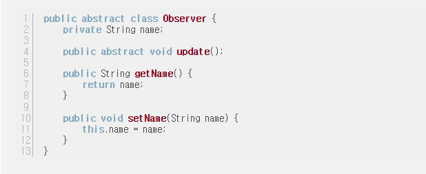
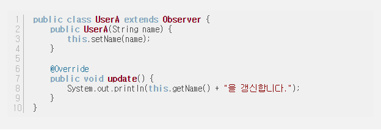
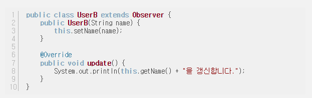
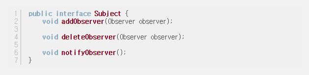
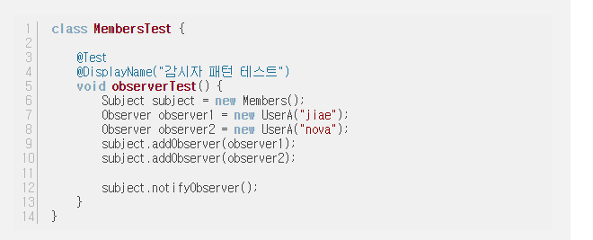

# 04. Observer Pattern

## Observer Pattern 이란?
### 정의
옵저버 패턴은 옵저버(관찰자)들이 관찰하고 있는 대상자의 상태에 변화가 있을 때마다 대상자가 직접 목록의 각 관찰자들에게 통지하고, 관찰자들은 알림을 받아 조치를 취하는 행동 패턴이다.    
옵저버 패턴은 다른 디자인 패턴들과 다른 일대다(one to many) 의존성을 가짐.  
Pub/Sub(발행/구독) 모델로도 알려져 있다.

### 장점 
1. 실시간으로 한 객체의 변경사항을 다른 객체에 전파할 수 있다.
2. 느슨한 결합(Loose Coupling)으로 시스템이 유연하고 객체간의 의존성을 제거할 수 있다.
```
느슨한 결함(Loose Coupling)
상호 의존성을 낮춰 하나의 컴포넌트 변경이 다른 컴포넌트에 영향을 덜 주는 상태를 뜻함

구현법
- 상호 의존성의 추상화
- 인터페이스 추상화
- 의존성 주입
- 인터페이스의 분리
```
### 단점
1. 너무 많이 사용할 경우 상태 관리가 힘들 수 있다.
2. 데이터 배분에 문제가 발생하면 큰 문제라 발전할 수 있다.

## Observer Pattern의 구현 원리
옵저버 또는 리스너라 불리는 하나 이상의 객체를 관찰 대상이 되는 객체에 등록   
각각의 옵저버들은 관찰 대상인 객체가 발생시키는 이벤트를 받아 처리

UML 다이어그램  

예시 코드 구조  


### 사용처
1. 이벤트 핸들링
    - GUI에서 버튼 클릭, 키 입력 등의 이벤트 발생시 이를 처리하는데 사용 
    - 이 때 버튼, 입력란 : 주체(Subject)
    - 어떤 동작을 취하는지 : Observer
2. MVC 아키텍쳐
    - 모델과 뷰 간의 통신에 사용
    - 모델(Subject)의 상태 변경 시 이를 관찰하는 뷰(Objserver)들은 자동 업데이트, 사용자에게 변경된 정보 제공
3. 주제-구독자(Subject-Subscriber) 모델
    - 발행-구독 시스템에서 발행자의 정보가 바뀔 시 구독자들에게 정보제공(스트리머-구독자 같은 느낌)
4. 종류 감시 및 알림   
    - 주식 시장, 날씨 예보 등의 상태의 변화에 알림을 주는 방식으로도 사용 가능    
5. 데이터베이스 및 네트워크 프로그래밍
    - DB, 네트워크 연결에서 데이터 변경, 도착 등을 감지하고 이에 대응하는 것에 사용 가능    

## 옵저버 패턴 구현 예시
### 주제 인터페이스
```
interface Subject {
	registerObserver() // 옵저버 등록
	removeObserver() // 옵저버 삭제
	notifyObserver() // 옵저버에게 업데이트 알림
}

class SubjectImpl implements Subject {
	registerObserver() { ... }
	removeObserver() { ... }
	notifyObserver() { ... }

	getState() // 주제 객체는 상태를 설정하고 알기위한 겟터,셋터가 있을 수 있다.
	setState()
}
```
### 옵저버 인터페이스와 구현체
```
interface Observer{ // 옵저버가 될 객체에서는 반드시 Observer 인터페이스를 구현해야함.
	update() // 주제의 상태가 바뀌었을때 호출됨
}

class ObserverImpl implements Observer {
	update() { 
		// 주제가 업데이트 될 때 해야하는 일
	}
}
```

출처 : https://velog.io/@hanna2100/%EB%94%94%EC%9E%90%EC%9D%B8%ED%8C%A8%ED%84%B4-2.-%EC%98%B5%EC%A0%80%EB%B2%84-%ED%8C%A8%ED%84%B4-%EA%B0%9C%EB%85%90%EA%B3%BC-%EC%98%88%EC%A0%9C-observer-pattern
## 옵저버 패턴 구현 예시2
1. Obeserver 추상 클래스  

2. Observer 구체 클래스 (UserA, UserB)  


3. Subject 인터페이스  

4. Subject 구현 Members 클래스  

5. 테스트 코드  

6. 결과
``` 
jiae를 갱신합니다.
nova를 갱신합니다.
```

출처 : https://hirlawldo.tistory.com/179