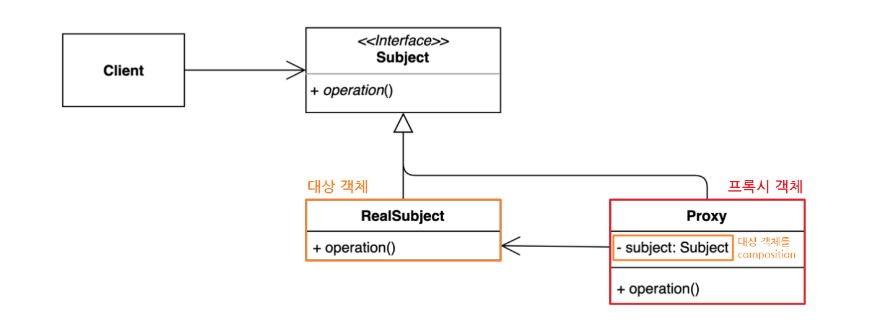
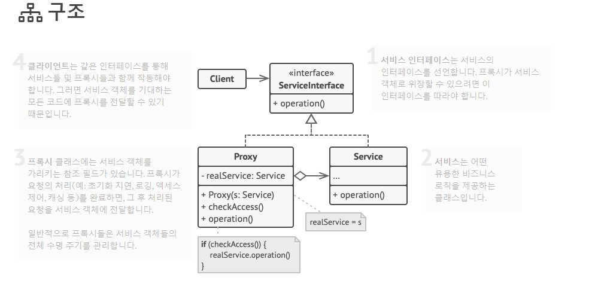
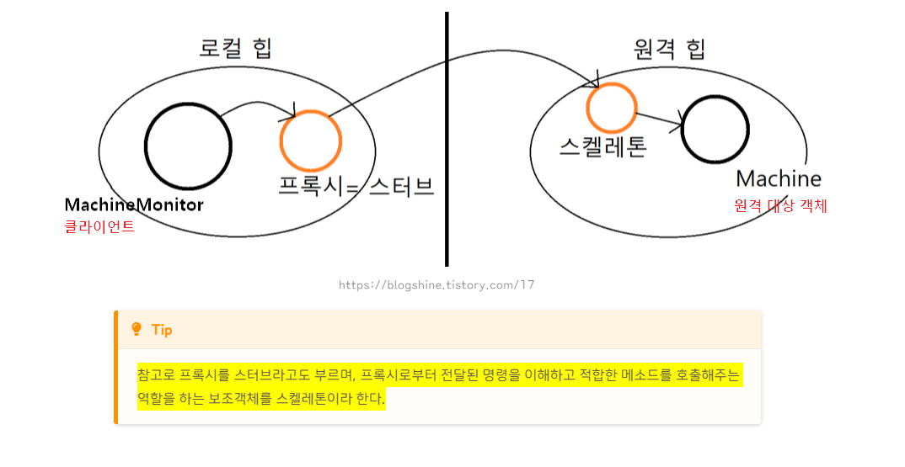

# Proxy Pattern && Proxy Server

## Proxy(대리인) Pattern 이란?
다른 객체에 대한 인터페이스를 제공하여 해당 객체에 대한 접근을 제어 혹은 부가적인 기능을 제공하는 패턴  
프록시는 실체 객체와 동일한 인터페이스를 가지며, 클라이언트는 프록시를 통해 실제 객체에 접근
즉 클라이언트가 객체에 직접적인 접근을 막고 간접적인 접근을 하게 하는 방법


### 장점
1. 보안(Security)  
    - 클라이언트가 작업을 수행할 권한이 있는지 확인하고, 결과가 긍정적일 때만 대상에 요청 전달
2. 캐싱(Caching) 
    - 프록시가 내부 캐시를 유지하여 데이터가 캐시에 아직 존재하지 않는 경우에만 대상에서 작업 실행하도록 한다.
    - 캐싱을 활용해 캐싱 데이터를 빠르게 재사용해서 응답
3. 데이터 유효성 검사(Data Validation)    
    - 프록시가 입력을 대상을 전달하기 전에 유효성 검사
4. 지연 초기화(Lazy initialization) : 대상의 생성 비용이 비싸다면 그것을 필요 할때까지 연기하여 사용 가능
5. 로깅(Logging) : 프록시는 메소드 호출과 상대 매개 변수를 인터셉트하고 이를 기록
6. 원격 객체(Remote objects) : 프록시는 원격 위치에 있는 객체를 가져와서 로컬처럼 보이게 함.


### 단점
1. 추상화 계층의 추가로 인해 일부는 주제에 직접 접근하고, 일부는 프록시에만 접근하는 상황이 생겨 일관성 없는 결과물이 나올 수 있다.
2. 객체를 생성할 때 한 단계를 더 거치는 것이기 때문에, 빈번한 객체 생성 시 성능 저하
3. 로직이 난해해져 가독성 떨어짐
4. 프록시 내부에서 객체 생성을 위해 스레드 생성, 동기화가 구현되어야 하는 경우 성능 저하 가능성이 있음.


### 사용처
0. 신용카드 - 현금 (프록시 이해를 위한 예시)
    - 신용 카드는 은행 계좌의 프록시이며, 은행 계좌는 현금의 프록시. 
1. **인터넷 프록시 서버**
    - 보안 및 웹 트래픽 관리 목적으로 프록시 서버 사용
    - 사용자들의 웹 요청 대신하여 웹 서버에 접근, 필요한 경우에만 데이터를 가져옴
    - 보안 검사, 캐싱, 액세스 제어 등 수행
2. 보안 프록시
    - 기업에서 보안 강화용으로 네트워크 트래픽 감시 및 필터링하는 보안 프록시 사용
    - 악성 웹 사이트 차단, 악성 코드 검출, 데이터 유출 방지 등의 기능 수행
3. 로깅 프록시
    - 응용 프로그램에서 메서드 호출이나 이벤트 로깅 위해 로깅 프록시 사용 가능
    - 디버깅, 성능 모니터링 등에 사용
4. 가상 프록시
    - 대규모 데이터, 복잡한 객체 생성 비용을 아끼기 위한 프록시
    - 가상 프록시로 객체를 대신해서 비용 절감
    - 대용량 이미지나 동영상 처리 등에 유용
5. 원격 프록시
    - 분산 시스템에서 객체가 다른 서버에 위치할 시, 클라이언트가 원격 프록시를 통해 해당 객체 접근 가능
    - 원격 서비스에 대한 투명한 접근 제공

## 프록시 패턴 구조

1. Subject: Proxy와 RealSubect를 하나로 묶는 인터페이스
    - 대상 객체와 프록시 역할을 동일하게 하는 추상 메소드 operation() 정의
    - 인터페이스가 있기 때문에 클라이언트는 Proxy 역할과 RealSubect 역할의 차이를 의식할 필요 x
2. RealSubject: 원본 대상 객체
3. Proxy : 대상 객체(RealSubject)를 중계할 대리자 역할
    - 프록시는 대상 객체 합성
    - 프록시는 대상 객체와 같은 이름의 메서드 호출 및 별도 로직 수행 할 수 있음



## 프록시 패턴 구현
### 기본형 프록시
```
interface ISubject {
    void action();
}

class RealSubject implements ISubject {
    public void action() {
        System.out.println("원본 객체 액션 !!");
    }
}
```

```
class Proxy implements ISubject {
    private RealSubject subject; // 대상 객체를 composition

    Proxy(RealSubject subject) {
        this.subject = subject;
    }

    public void action() {
        subject.action(); // 위임
        /* do something */
        System.out.println("프록시 객체 액션 !!");
    }
}

class Client {
    public static void main(String[] args) {
        ISubject sub = new Proxy(new RealSubject());
        sub.action();
    }
}
```

### 가상 프록시
```
class Proxy implements ISubject {
    private RealSubject subject; // 대상 객체를 composition

    Proxy() {
    }

    public void action() {
    	// 프록시 객체는 실제 요청(action(메소드 호출)이 들어 왔을 때 실제 객체를 생성한다.
        if(subject == null){
            subject = new RealSubject();
        }
        subject.action(); // 위임
        /* do something */
        System.out.println("프록시 객체 액션 !!");
    }
}

class Client {
    public static void main(String[] args) {
        ISubject sub = new Proxy();
        sub.action();
    }
}
```

### 보호 프록시
```
class Proxy implements ISubject {
    private RealSubject subject; // 대상 객체를 composition
    boolean access; // 접근 권한

    Proxy(RealSubject subject, boolean access) {
        this.subject = subject;
        this.access = access;
    }

    public void action() {
        if(access) {
            subject.action(); // 위임
            /* do something */
            System.out.println("프록시 객체 액션 !!");
        }
    }
}

class Client {
    public static void main(String[] args) {
        ISubject sub = new Proxy(new RealSubject(), false);
        sub.action();
    }
}
```

### 로깅 프록시
```
class Proxy implements ISubject {
    private RealSubject subject; // 대상 객체를 composition

    Proxy(RealSubject subject {
        this.subject = subject;
    }

    public void action() {
        System.out.println("로깅..................");
        
        subject.action(); // 위임
        /* do something */
        System.out.println("프록시 객체 액션 !!");

        System.out.println("로깅..................");
    }
}

class Client {
    public static void main(String[] args) {
        ISubject sub = new Proxy(new RealSubject());
        sub.action();
    }
}
```

### 원격 프록시


출처: https://inpa.tistory.com/entry/GOF-💠-프록시Proxy-패턴-제대로-배워보자 