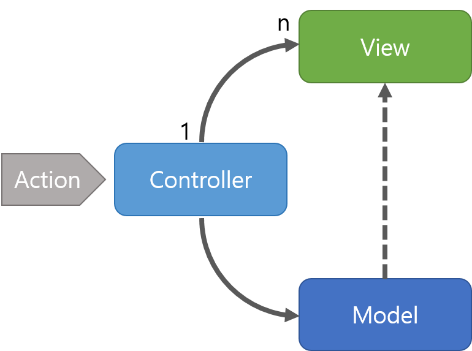

# 📌 MVC 패턴

모델(Model), 뷰(View) , 컨트롤러(Controller)로 이루어진 디자인 패턴

## 모델
애플리케이션의 데이터인 데이터베이스, 상수, 변수 등을 뜻합니다.

> ex) 사각형 모양의 박스 안에 글자 들어있을 때  
> 
> - 사각형 모양의 박스 위치 정보, 글자 내용, 글자 위치, 글자 포맷(utf-8)에 관한 정보 포함  
> - 뷰에서 데이터 생성하거나 수정하면 컨트롤러 통해 모델 생성하거나 갱신 

## 뷰
모델을 기반으로 사용자가 볼 수 있는 인터페이스
> - 모델이 가지고 있는 정보를 따로 저장하지 않음  
> - 단순히 사각형 모양 등 화면에 표시하는 정보만 가짐
> - 변경이 일어날 경우 컨트롤러에 전달

## 컨트롤러
하나 이상의 모델과 하나 이상의 뷰를 잇는 다리 역할
> - 이벤트 등 메인 로직 담당
> - 모델과 뷰의 생명주기 관리
> - 모델과 뷰에 변경사항 있을 경우, 이를 해석하여 각각의 구성 요소에게 알려줌

## ✔️ 특징
- Controller는 여러개의 View를 선택할 수 있는 1:n 구조를 가짐
- Controller는 View를 선택할 뿐 직접 업데이트 하지 않음 (View는 Controller를 알지 못한다.)

## ✔️ 장점
- 애플리케이션 구성 요소를 세 가지 역할로 구분하여 개발 프로세스에서 각각의 구성 요소에만 집중해서 개발할 수 있음
- 재사용성
- 확장성

## ✔️ 단점
- View와 Model 사이의 의존성이 높아, 애플리케이션 복잡해질수록 관계가 복잡해짐

## ✔️ MVC 패턴의 예 : Spring Framework
Spring Framework는 MVC 패턴을 이용한 대표적인 프레임워크로, 자바 플랫폼을 위한 오픈 소스 애플리케이션 프레임워크

### ✔️ Spring의 장점
- @RequestParam , @RequestHeader , @PathVariable 등의 애너테이션을 기반으로 사용자의 요청 값들을 쉽게 분석할 수 있으며, 사용자의 어떠한 요청이 유효한 요청인지를 쉽게 거를 수 있습니다.
    - 숫자를 입력해야 하는데 문자를 입력하는 경우
- 재사용 가능한 코드, 테스트, 쉽게 리디렉션할 수 있음

