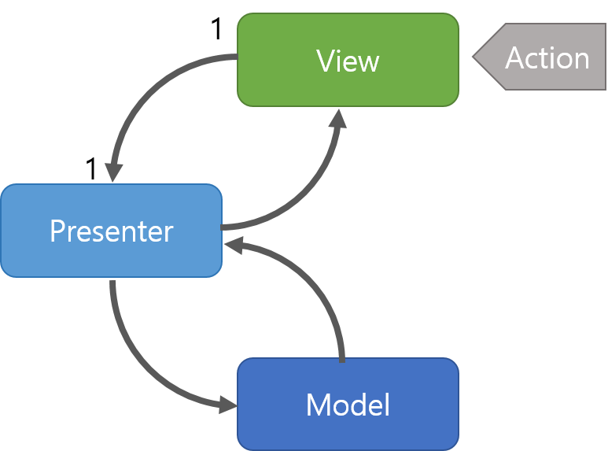

# 📌 MVP 패턴

MVC 패턴으로부터 파생되었으며 MVC에서 C에 해당하는 컨트롤러가 프레젠터(presenter)로 교체된 패턴

- `Model` : 어플리케이션에서 사용되는 데이터와 그 데이터를 처리하는 부분
- `View` : 사용자에게 보여지는 UI 부분
- `Presenter` : View에서 요청한 정보로 Model을 가공하여 View에 전달해 주는 부분. View와 Model을 붙여주는 접착제 역할

### ❓MVC 패턴과의 차이점

MVC는 Model과 View가 서로 연결되어 있어 의존관계를 갖게 됩니다.

하지만 MVP는 Model과 View 분리되어 있고 오직 Presenter를 통해서 상태나 변화를 알려줄 수 있습니다.

이렇게 View와 비지니스 로직이 완전히 분리가 되어 테스트가 용이해진다는 장점이 있습니다.

## ✔️ 특징
- Presenter는 View와 Model의 인스턴스를 가지고 있어 둘을 연결하는 접착제 역할
- Presenter와 View는 1:1 관계

## ✔️ 장점
- View와 Model의 의존성이 없음
- MVC 패턴의 단점이었던 View와 Model의 의존성을 해결 (Presenter를 통해서만 데이터를 전달 받기 때문에)

## ✔️ 단점
- 어플리케이션이 복잡해 질 수록 View와 Presenter 사이의 의존성이 강해짐