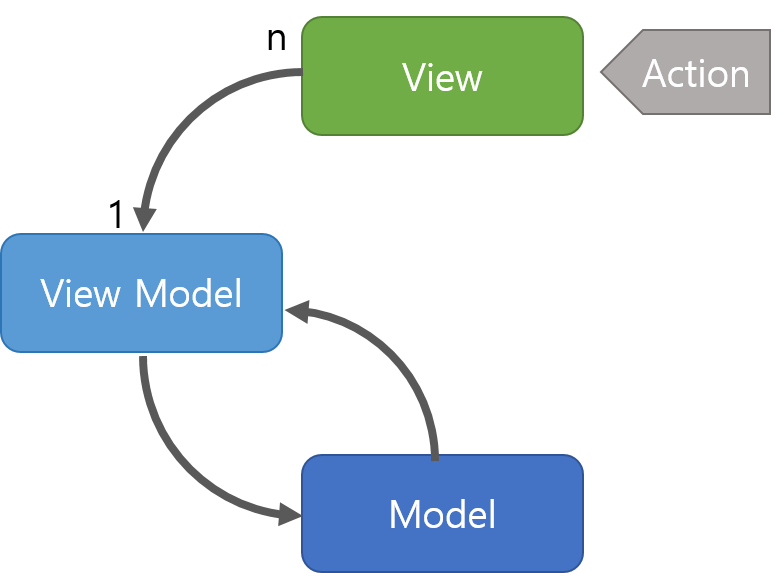

# 📌 MVVM 패턴

MVC 패턴의 C가 뷰모델(view model) 로 바뀐 패턴
- `Model` : 어플리케이션에서 사용되는 데이터와 그 데이터를 처리하는 부분입니다.
- `View` : 사용자에서 보여지는 UI 부분입니다.
- `View Model` : View를 표현하기 위해 만든 View를 위한 Model입니다. View를 나타내 주기 위한 Model이자 View를 나타내기 위한 데이터 처리를 하는 부분입니다.

## ✔️ 특징
- MVC 패턴과는 다르게 `커맨드`와 `데이터 바인딩`을 가짐
    - `커맨드` : 여러가지 요소에 대한 처리를 하나의 액션으로 처리할 수 있게 하는 기법
    -  `데이터 바인딩` : 화면에 보이는 데이터와 웹 브라우저의 메모리 데이터를 일치시키는 기법, 뷰모델을 변경하면 뷰가 변경됨 
- View와 View Model 사이의 의존성 없앰
- View Model과 View는 1:n 관계

## ✔️ 장점
- 각각의 요소들간의 의존성 없이 `독립적`이기 때문에 `모듈화`하여 개발이 가능
- View와 View Model 사이의 `양방향 데이터 바인딩`을 지원
- UI를 별도의 코드 수정 없이 `재사용` 가능
- `단위 테스팅`하기 쉬움

## ✔️ 단점
- View Model의 설계가 쉽지 않음

## ✔️ MVVM 패턴의 예 : 뷰(Vue.js)
뷰(Vue.js)는 MVVM 패턴을 가진 대표적인 프레임워크

### ✔️ Vue.js 특징
- 반응형 : watch, computed 등으로 쉽게 반응형적인 값들을 구축할 수 있음
    - 함수를 사용하지 않고 값 대입만으로도 변수가 변경됨
- 양방향 바인딩
- html을 토대로 컴포넌트를 구축할 수 있음
- 재사용 가능한 컴포넌트 기반으로 UI 구축 가능
