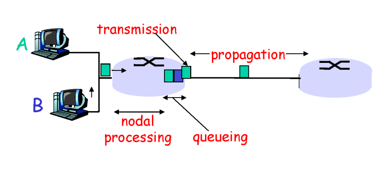

# 01. 컴퓨터네트워크 기본 1

# ✨INTRO✨

## 📌 네트워크 구조 형태

### ✔️ 가장자리(network edge)

- 응용프로그램(application) 및 호스트(hosts)

- 웹 서버와 같은 서버들

### ✔️ 가운데(network core)

- 라우터(routers)
  - 메세지를 전달 받아서 목적지를 향해 전달해 주는 역할

### ✔️ 연결

- 이러한 구성 요소들을 연결 해주는 링크들(communication links)
  - ex) 무선 링크(wifi)
  - 링크 종류는 다양함

# ✨Network edge✨

### ✔️ hosts(end systems)

- 프로그램 실행 응용 프로그램들
- ex) Web, email

### ✔️ client/server model

- client: 자기가 원할 때 링크로 연결을 해서 서버로 연결 받아 옴
- server: 항시 연결되어 있어서 클라이언트로부터 들어올 요청 기다림

### ✔️ peer-peer model

## 📌 데이터 통신 서비스 - Connection-oriented service

### ✔️ TCP: Connection-oriented service를 제공하는 통신 방법

❗신뢰성이 필요한 데이터 보낼 때 사용❗

- 전송 제어 프로토콜(Transmission Control Protocol)

- `Reliable(신뢰성 있는), in-order(순서) byte-stream data transfer`
  - 내가 보낸 메세지 그대로, 내가 보낸 순서 그대로 감
- `flow control` - 흐름 제어

  - sender가 보낸 속도를 조절해줌
  - receiver의 능력에 맞춰서 속도를 전달

- `congestion control` - 혼잡 제어

  - 중간에 네트워크 상황에 맞춰서 조절

- 🔑 사용하는 곳
  - 웹 브라우저 같은 곳 (ex- 네이버의 경우 뉴스를 보여줘하는데 데이터 유실 되면 안 됨)
  - HTTP(Web)
  - FTP(file transfer)
  - Telnet(remote login)
  - SMTP(email)

### ✔️ UDP: Connection-oriented service를 제공하는 통신 방법

❗신뢰성이 필요 없는 데이터 보낼 때 사용❗

- 사용자 데이터그램 프로토콜(User Datagram Protocol)
- `connectionless`, `unreliable data transfer`, `no flow control`, `no congestion control`

  - 아무것도 안 해줌!
  - 데이터 유실되든, 데이터 터져 나가든~ 상관 없을 때 사용

- 보내는 입장에서 자기 마음대로 보낼 수 있다는 것이 장점
- 도착한다는 보장이 없다는 것이 단점

- 🔑 사용하는 곳
  - 실시간 전화 같은 곳 (ex- 전화 보내는 데이터 몇 개 유실 되어도 괜찮음)
  - streaming media
  - teleconferencing
  - DNS
  - Internet telephony

## 📌 프로토콜(Protocol)

### ✔️ 프로토콜이란?

- 전달자와 수신자 사이의 암묵적인 방식, 약속
- 정말 중요한 메세지를 주고 받기 위한 서로간의 준비 동작과 같음
- ex) 대화 시작 - 잘 지냈니?

- 인터넷의 모든 통신은 프로토콜에 의해 통합됨

# ✨Network Core✨

- 라우터들의 집합
- 과연 어떤 방식으로 출발지에서 도착지까지 라우터가 전달하냐?

## 📌 메세지 전달 방식

### ✔️ circuit switching (회선 교환)

- 출발지에서 목적지까지 가는 길을 미리 예약한 뒤, 특정 사용자만 사용하도록 만든 것
- ex) 유선 전화망

### ✔️ packet-switching (패킷 교환)

- **`인터넷에서 사용하는 방식`**
- 유저가 보내는 메세지를 패킷 단위로 받아서 그때 그때 올바른 방향으로 보내는 것
- ex) A, B 순서로 한 라우터에 들어온다면 들어온 순서대로 목적지에 각자 보내줌

## 📌 **circuit switching** vs **packet-switching**

    

#### <가정>

- 가운데 회색원: 라우터
- 왼쪽 네모: 각각의 유저
- 1 Mbps link: 라우터에서 나가는 링크
  - 1Mbps: 초당 1 메가 비트의 크기의 데이터를 한꺼번에 보낼 수 있는 케이블 (link bandwidth)
- 100Kbps/sec 속도로 데이터를 보낸다고 한다면

### ✔️ circuit switching (회선 교환) 방식의 경우

- 최대 10명의 유저까지 수용할 수 있음
  - 11명 안 됨

### ✔️ packet-switching (패킷 교환) 방식의 경우

- 몇 명까지 가능한 개념이 없음
  - 제약이 없음

❗ 그런데 10명 이상 몰리면?

- 실제로 사용자들이 인터넷 사용하는 패턴
  - 웹 서버에서 데이터를 보내면 유저가 계속해서 서버와 상호작용하지 사용하지 않음
  - ex) 유저가 네이버 뉴스를 본다고 했을 때 뉴스를 클릭하면 웹에서 데이터를 보내준뒤 사용자는 계속해서 그 데이터를 클릭하거나 상호작용하지 않고 보낸 데이터를 확인하고 읽는 시간이 있음
    - 사실상 데이터가 사용되지 않는 시간
- 10명이 정확히 동시에 몰리지 않는 이상 데이터 요청이 분산되어서 문제가 생기지 않음

## 📌 packet-switching 단점

    

### ✔️ processing delay

- 패킷을 받았을 때, 라우터는 이것이 패킷인지, 에러가 없는지 검사를 함
- 그리고 어디로 보내야 하는지(목적지) 확인해서 보내는 일을 해야 하는데 이때 딜레이가 생기고, 이것이 `processing delay`

### ✔️ queueing delay

- 전송되는 속도보다 유저가 몰리는 속도가 더 높다면 줄이 생김
- 즉, 나가는 속도보다 들어오는 속도가 더 빠를 때, 라우터 안의 queue에 임시 저장함
- 이때 각각의 패킷은 자기 순서가 올 때까지 기다려야 하는데 이렇게 기다리는 시간이 `queueing delay`

### ✔️ Transmission delay

- queue 제일 앞에 서 있다가 나갈 때 걸리는 딜레이
- 패킷 속의 첫 번째 비트가 링크로 올라가는 시간부터, 마지막 비트가 링크로 올라갈 때까지 걸리는 시간
- `패킷 크기/link bandwidth`
  - link bandwidth가 작으면 작을수록 Transmission delay가 커짐

### ✔️ Propagation delay

- 한 패킷의 마지막 비트가 링크에 올라와서 다음 라우터까지 도달할 때까지 걸리는 시간
- 속도는 단순히 빛의 속도
- 물리적인 링크의 길이/빛의 속도
  - 단순히 물리적인 링크의 길이가 길면 오래 걸리고, 작으면 적게 걸림
  - 빛의 속도는 건드릴 수 없기 때문

## 📌 packet-switching의 딜레이 줄이는 법

### ✔️ processing delay

- 라우터 성능을 개선

### ✔️ queueing delay

- 제일 골치 아픈 애임
- queue는 조절할 수 없음
  - 사람이 몰리냐 안 몰리냐에 따른 것이기 때문에
- 네트워크 상에서 발생하는 가장 흔한 딜레이임
- 그런데 queue의 크기가 한계가 있음
  - 큐가 넘치는 상황이 되면 패킷 유실이 됨
  - 패킷 유실의 90% 이상은 queueing delay에서 생김

#### ❗TCP는 reliable인데 queueing delay로 패킷 유실이 되면? ❗

- 최악의 상황일 경우 유실은 일어나기 마련이라 재전송해야 함

1. 직접 라우터가 재전송하는 법
2. 아예 처음부터 재전송하는 법
   - TCP는 이 방법을 사용
   - 네트워크 엣지는 지능적임(intelligent), 네트워크 코어는 전달만 함(Dumb Core)

### ✔️ Transmission delay

- link bandwidth 늘리기

### ✔️ Propagation delay

- 신의 영역(빛의 속도 빠르게 할 수 없음)
