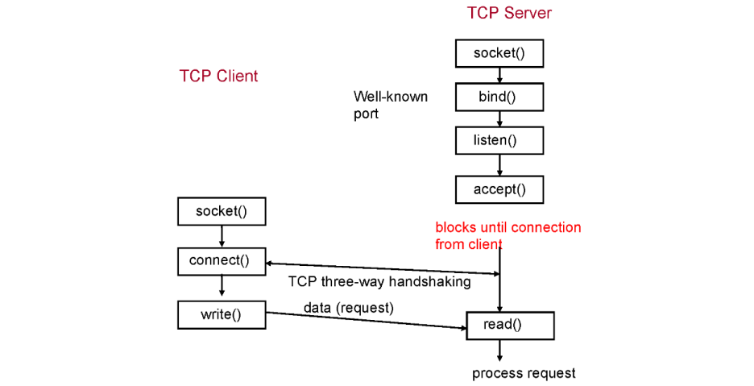
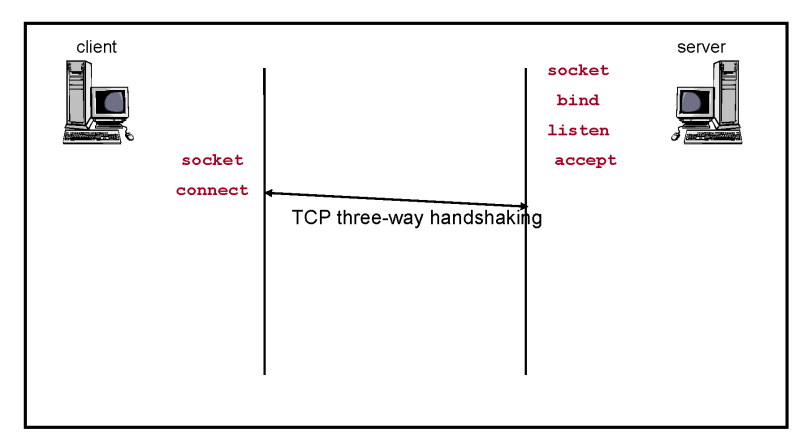
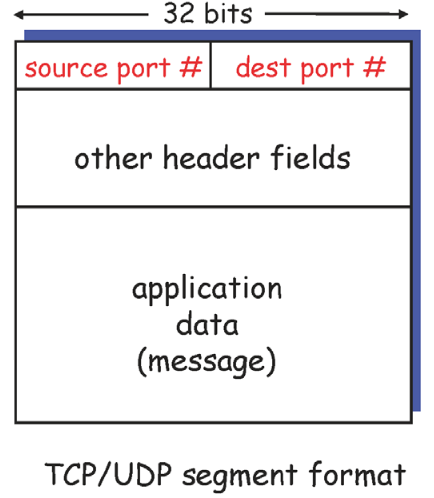
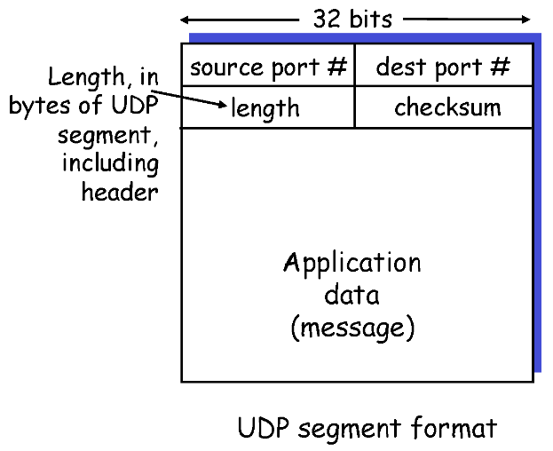

# 02. 애플리케이션계층 1

# ✨Socket✨

## 📌 Socket이란?

### ✔️ 개요

사용자/개발자 입장에서 네트워크는 Application Process들의 통신

다른 컴퓨터에 있는 프로세스에 정보를 보내고 싶으면, OS가 제공하는 인터페이스 중 목적에 맞는 인터페이스를 찾아 메세지를 적으면 전송이 됨

- OS가 제공해주는 API(인터페이스) 중, 소켓(Socket)은 프로세스 간의 통신을 위한 API

우리는 OS가 제공해주는 기능을 사용하기 때문에 OS 내부에 구현되어 있는 것만 사용 가능

- OS 안에는 Application layer, transport layer, network layer가 구현되어 있음

Socket은 Application layer와 OS 간의 인터페이스고, Application layer에서는 OS가 제공하는 Transport layer의 프로토콜을 사용할 수 밖에 없음

- TCP/UDP만 사용 가능

### ✔️ Socket

즉, Socket이란 OS가 제공하는 프로세스 간의 통신을 위한 API이며 사용자 브라우저와 서버 사이의 동적인 양방향 연결 채널을 구성함

- 한 번 소켓 구성이 완료되면 Application은 네트워크 전송을 위해 소켓에 데이터 전달, 소켓에서 데이터 수신(다른 호스트가 네트워크를 통해 전송)이 가능해짐

## 📌 Socket Type

### ✔️ 1. 소켓 스트림(SOCK_STREAM)

`TCP 사용한 소켓`

- 신뢰성 있는 전송(Reliable delivery)
- 순서 보증(In-order guaranteed)
- 연결 지향적(Connection-oriented)
- 양방향(Bidirectional)

### ✔️ 2. 소켓 데이터그램(SOCK_DGRAM)

`UDP 사용한 소켓`

- 신뢰성 X (Unreliable delivery)
- 순서 보증 X (No order guarantees)
- 연결 지향 X(No notion of "connection")
- 보내고 받기 가능

## 📌 Socket Function, API

Big Picture: Socket Functions(API) (TCP Case)

<div align='center'>
    
</div>

### ✔️ 1. 웹서버가 socket()으로 소켓을 생성

- 그냥 function, API

### ✔️2. bind() 수행

- 방금 생성한 소켓을 특정 포트에 bind하기 위해
- ex) 웹서버 같은 경우 80번에 돌아가니까 80에 bind, 이런 식으로 포트 번호가 적혀 있을 것

### ✔️ 3. listen() 수행

- 서버니까 듣는 용도임

### ✔️ 4. accept() 수행

- 클라이언트로부터 요청을 받을 준비가 됐으니 클라이언트한테 요청 보내라는 것

### ✔️ 5. block됨

- 4까지 수행하면 서버는 멈춤
- 클라이언트로부터 connection이 들어올 때까지

### ✔️ 6. 어떤 클라이언트가 socket() 수행

- 동작을 취하기 위해 하는 행동

### ✔️ 7. connet() 수행

- 클라이언트가 원하는 어떤 서버의 프로세스에게 connect하기 위해 connet() 수행
- 서버 측의 accept()는 클라이언트 connect()가 수행되기를 기다렸다가, 커넥션이 들어오면 데이터를 주고 받음

이 과정이 끝나면 TCP와 소켓 둘 사이에 단단한 연결고리가 형성됨

이후로는 과정이 굉장히 간단해짐

- 클라이언트 소켓에 메세지를 쓰면 서버 소켓에 마법처럼 메세지가 튀어 나옴(반대의 경우에도)
- WHY? 둘이 특별한 관계를 맺었기 때문에

이렇게 한 번 관계를 맺고 나면 read(), write()의 연속

### ✔️ close()

- 할 말 다 끝나면 cloes() 하면 됨

# ✨Socket API Detail✨

## 📌 생성 및 시작

### ✔️ socket()

```c
int socket(int domain, int type, int protocol);
```

- 2번째 파라미터: 소켓 생성시 UDP 소켓인지, TCP 소켓인지 결정
- 리턴값: 방금 생성한 소켓의 아이디 인덱스 혹은 파일 디스크립터라고 불리는 아이디 값

### ✔️ bind()

```c
int bind(int sockfd, struct sockaddr* myaddrf, int addrlen);
```

- socket()에서 생성한 소켓의 아이디를 사용해서(리턴값), 이 소켓의 특정 port에 bind하겠다는 것
- 1번째 파라미터: 방금 생성한 소켓의 인덱스 아이디가 들어감

### ✔️ listen()

```c
int listen(int sockfdr, int backlog);
```

- 방금 생성한 소켓을 listen 용도로 사용할 것
- 만일 request가 동시에 여러 개 들어올 경우, 지정한 개수까지 큐에 담아 놓고 순서대로 처리하겠다는 것
- 2번째 파라미터에 10이라고 적으면 10개까지 최대한 동시에 들어오는 걸 처리해주겠다

### ✔️ accept()

```c
int accept(int sockfd, struct sockaddr* cliaddr, int* addrlen);
```

- 준비 끝, 클라이언트로부터 연결 기다림.
- 2번째 파라미터(레퍼런스 포인트)
  - accept()라는 시스템 콜은 수행이 되면 block하고 있다가 클라이언트로부터 connection 요청이 들어오면 이제 수행이 되면서 리턴이 됨
  - 리턴 될 때, 두 번째 파라미터 요소 안에 클라이언트의 IP와 포트 넘버가 저장됨
  - 그래서 서버도 클라이언트의 주소와 클라이언트 IP 주소와 포트 넘버를 알게 됨

## 📌 연결 설정

### ✔️ connect()

```c
int connect(int sockfd, struct sockaddr* servaddr, int addrlen) ;
```

- connect()는 생성된 소켓을 원하는 서버의 소켓과 connect를 하겠다는 것

## 📌 TCP 소켓 연결 설정 요약

<div align='center'>
    
    <br>1. 서버가 먼저 socket() 통해서 소켓을 TCP로 생성
    <br>2. 서버가 bind()를 통해서 특정 포트에 bind
    <br>3. 서버가 listen() 통해서 listen 용도로 지정
    <br>4. 서버가 accept() 통해서 기다리겠다 선언
    <br>5. 클라이언트가 socket() 통해서 소켓을 TCP로 생성
    <br>6. 클라이언트가 connect()를 통해 연결 수행
</div>

### ✔️ 왜 클라이언트는 bind()라는 function 사용 안 해?

- bind()는 특정 소켓을 어떤 포트에 bind 해 주는 개념
- 클라이언트는 특정 포트에 bind 할 필요? X
- Ex) 웹 서버 프로세스는 무조건 포트 번호를 80번 포트를 사용해야 하지만, 클라이언트 프로세스는 1111을 쓰든 1234를 쓰든 상관 없음
- 특정 번호를 지정하고 싶으면 bind() 써도 됨(아예 사용 못 하는 건 아님)

## 📌 Sample Code

### ✔️ Server

```c
#include <stdio.h>
#include <stdlib.h>
#include <errno.h>
#include <string.h>
#include <sys/types.h>
#include <netinet/in.h>
#include <sys/socket.h>
#include <sys/socket.h>
#include <sys/wait.h>
#define MYPORT 3490
#define BACKLOG 10 /* how many pending connections queue will hold */

//The Internet-specific
//TCP/IP 프로토콜을 위한 소켓 주소 구조체 정의
struct sockaddr_in {
    short sin_family;   //주소 체계, 항상 AF_INET 값 사용
    u_short sin_port;   //포트 번호, 0~65535의 범위를 가지는 숫자
    struct in_addr sin_addr;    //IP 주소
};

main()
{
    int sockfd, new_fd; /* listen on sock_fd, new connection on new_fd */
    struct sockaddr_in my_addr;    //소켓 주소 구조체의 형태를 가지는 내 주소
    struct sockaddr_in their_addr; /* connector addr */
    int sin_size;

    //실제 코드에서 제일 처음 등장하는 API = socket()
    //socket()의 2번째 파라미터인 SOCK_STREAM을 통해 TCP 소켓으로 설정 했음을 알 수 있음
    //socket()이 성공적으로 생성되면 음수 값이 아닌 제대로 된 값이 나옴
    //이것이 소켓 파일 디스크립터 혹은 소켓 아이디(sockfd = 소켓)
    if ((sockfd = socket(PF_INET, SOCK_STREAM, 0)) == -1) {
        perror("socket");
        exit(1);
    }

    my_addr.sin_family = AF_INET;
    my_addr.sin_port = htons(MYPORT); /* short, network byte order */
    my_addr.sin_addr.s_addr = htonl(INADDR_ANY) ;
    /* INADDR_ANY allows clients to connect to any one of the host's IP address */

    //두번째로 나오는 건 bind()
    //방금 생성한 소켓(sockfd)을 IP와 특정 포트에 매핑시킴
    //my_addr: 소켓 address internet이라는 구조체, 여기에 정보를 집어 넣음
    if (bind(sockfd, (struct sockaddr *)&my_addr, sizeof(struct sockaddr)) == -1) {
        perror("bind");
        exit(1);
    }

    //listen(), BACKLOG = 10이니까 최대 10개까지 받겠다
    if (listen(sockfd, BACKLOG) == -1) {
        perror("listen");
        exit(1);
    }

    while (1) {
        sin_size = sizeof(struct sockaddr_in);
        //accept() 호출 되면 클라이언트에서 connection 요청 들어올 때까지 멈춤
        if ((new_fd = accept(sockfd, (struct sockaddr*)&their_addr, &sin_size)) == -1) {
            perror("accept");
            continue;
        }
        printf("server: got connection from %s\n", inet_ntoa(their_addr.sin_addr));
    }
}
```

### ✔️ Client

```c
#include <stdio.h>
#include <stdlib.h>
#include <errno.h>
#include <string.h>
#include <sys/types.h>
#include <netinet/in.h>
#include <sys/socket.h>
#include <sys/socket.h>
#include <sys/wait.h>

main()
{
    //마찬가지로 socket()으로 소켓 생성
    if ((sockfd = socket(PF_INET, SOCK_STREAM, 0)) == -1) {
        perror("socket");
        exit(1);
    }

    their_addr.sin_family = AF_INET;
    their_addr.sin_port = htons(Server_Portnumber);
    their_addr.sin_addr = htonl(Server_IP_address);

    //소켓 생성 후 바로 connect()를 사용해서 서버의 어떤 프로세스와 connection 요청
    //두 번째 파라미터에 서버의 주소가 들어감
    if (connect(sockfd, (struct sockaddr*) & their_addr, sizeof(struct sockaddr)) == -1) {
        perror("connect");
        exit (1);
    }
}
```

## 📌 연결 해체

### ✔️ close()

```c
int close(int sockfd);
```

- 데이터 교환이 다 끝난 후에는 최종적으로 close()라는 콜을 사용해서 방금까지 사용했던 소켓을 해제
- 해제 후에는 다른 프로세스가 해당 포트를 사용할 수 있음

<br>
<br>

# 03. 전송계층

# ✨Multiplexing & demultiplexing✨

<div align='center'>
    
</div>

### ✔️ Multiplexing

- 컴퓨터 내부의 네트워크 프로세스들은 각자의 소켓이 있고, 이 소켓을 통해서 트랜스포트 계층으로 메시지가 내려옴
- 트랜스포트 계층은 메시지가 어디서 내려오든지 간에, 메시지를 받아서 일괄적으로 세그먼트로 만들고, 세그먼트를 하위 계층으로 내려줌
- 여러 소켓을 통해 내려오는 메시지를 받고, 그때마다 세그먼트를 만들어 하위 계층으로 내려보내는 것이 `multiplexing`
- 즉, 멀티로 들어오는 메시지를 모아 일괄적으로 세그먼트로 만들어서, 하위 계층으로 내려보내는 것

### ✔️ Demultiplexing

- 하위 계층에서 올라온 세그먼트를 받아서, 세그먼트의 데이터 부분 메시지를 꺼낸 뒤, 여러 프로세스 중에 해당 메시지를 받아야 되는 프로세스에게 정확히 올려주는 것이 `demultiplexing`
  - 즉, 하위 계층에서 올라온 세그먼트를 여러 프로세스 중 하나로 올려 보내는 것
- ​애플리케이션 메시지(세그먼트 데이터 부분)를 꺼내서 실제 목적지에 해당하는 프로세스로 메시지를 올려줘야 하는데, 세그먼트의 헤더에 적힌 정보로 어떤 소켓으로 올릴지(어떻게 demultiplexing 할지)를 판단
  - 결국, 어떤 소켓으로 올려 보낼까를 의미함

## 📌 Multiplexing vs demultiplexing

- `multiplexing`은 <u>sender</u> 측의 전송 계층에서 수행
- `demultiplexing`은 <u>receiver</u> 측의 전송 계층에서 수행

# ✨demultiplexing 작동 방식✨



### ✔️ 세그먼트

메시지를 담는 데이터 부분 + 부가적인 정보를 담는 헤더 부분으로 이루어져 있음

실제로 데이터 부분은 헤더 부분에 비해서 엄청나게 크기가 큼

헤더 내에 정보를 적기 위한 여러 개의 필드가 존재함

- 그 중 중요한 필드가 위 그림에 나와있는 `source port`와 `dest port` (필드는 16비트)
  - `source port`: 자신의 포트 넘버
  - `dest port`(destination port): 목적지 포트 넘버
- 이 두 필드를 이용해서 demultiplexing을 수행

## 📌 Connectionless Demux(비연결형 역다중화)

### ✔️ UDP

UDP 소켓은 2가지 요소로 demultiplexing 수행

1. 목적지 IP 주소(데스티네이션 IP)
2. 목적지 포트 번호(데스티네이션 포트)

호스트가 UDP 세그먼트 수신 시 세그먼트 내의 목적지 포트번호를 조사한 후 해당 포트번호를 갖는 소켓에 UDP 세그먼트를 전달

IP 데이터그램들의 source IP 주소 또는 source port 번호가 다르더라도 동일한 목적지 IP 주소와 목적지 포트 번호를 가지면 같은 소켓으로 감 (= 같은 프로세스로 감)

- Source 부분이 달라도 Destination 부분의 정보만 같으면 됨

### ✔️ 예시


위 그림의 경우

클라이언트 프로세스인 P3과 P4는 서버의 프로세스인 P1과 의사소통 하고 싶어 함

P3에서 P1으로 가는 dest port와 P4에서 P1으로 가는 dest port가 6428로 동일

따라서 같은 P1으로 감

## 📌 Connection-oriented Demux(연결지향형 역다중화)

### ✔️ TCP

TCP 소켓은 4가지 요소로 demultiplexing 수행

1. 출발지 IP 주소(소스 IP)
2. 출발지 포트 번호(소스 포트)
3. 목적지 IP 주소(데스티네이션 IP)
4. 목적지 포트 번호(데스티네이션 포트)

이 4개 중 하나라도 다르면, 다른 소켓으로 올라감

### ✔️ 예시


서버로 들어가는 세그먼트 세 개의 공통점은 데스티네이션 IP(3번)과 데스티네이션 포트(4번)가 80으로 동일함

그런데, 서버에 와서 demultiplexing 해보면 다 다른 소켓으로 올라감

- 그 이유는 호스트에서 보내는 세그먼트들의 소스 IP(1번), 소스 포트(2번)가 서로 달라서 다른 소켓으로 demultiplexing됨
- 이게 바로 TCP에서 얘기하는 connection-oriented
  - P2에서 쏘는 건 무조건 P6으로 감
  - 이걸 연결 됐다고 표현
  - 반면에 UDP의 경우 어떤 누구든 받을 수 있는데, 이건 어떤 누구와도 연결되지 않았다고 보기 때문에 connection 개념이 없음

### ✔️ 다른 예시

실제로 네이버에 접속한다면

TCP connection을 만들고 통신한다는 얘기 = 네이버 서버가 클라이언트 각각을 위한 고유의 소켓을 생성해놓는다는 것

그래서 해당 소켓을 통해서 받는 메시지는 무조건 특정 유저(유저 A, B, C, ...)의 메시지

#### <u>TCP는 각각의 클라이언트를 위해 소켓을 생성/관리하기 때문에, 자원을 많이 소모</u>

# ✨UDP✨

## 📌 UDP 특징

UDP가 제공해 주는 것은 바로 unreliable delivery, unordered delivery

이건 아무것도 제공해주지 않는 거 아닌가? `NO!!`

실제로는 전송 계층이 제공하는 아주 기본적인 서비스는 제공함

## 📌 UDP: 세그먼트 헤더

### ✔️ UDP, TCP, IP 세 프로토콜의 헤더 정보

이 세 가지의 헤더 정보는 다 알고 있어야 프로토콜의 동작을 이해할 수 있음

- 헤더 정보 매우 매우 중요

### ✔️UDP 헤더



#### UDP 세그먼트 헤더의 필드는 4개뿐

=> 동작 단순함을 유추 가능

- `source port`(출발지 포트 번호)
- `dest port`(목적지 포트 번호 )
- `length`(세그먼트의 총 길이)
- `checksum`(세그먼트의 데이터 전송 중 에러 발생했는지 판단하는 필드)

#### port 번호

- 0번부터 2<sup>16</sup>-1번까지 존재
- port 번호를 이용해 multiplexing/demultiplexing을 수행

#### checksum

- checksum 필드를 사용하여 에러를 판단하고, 에러가 생겼다면 해당 세그먼트를 올리지 않고 바로 드랍시킴
- UDP를 통해 메시지를 받으면 해당 메시지에는 에러가 없다는 것임

### ✔️ 요약

UDP가 아무것도 안 해주는 것 같지만 최소한의 일을 함

- multiplexing/demultiplexing
- 에러 체크
