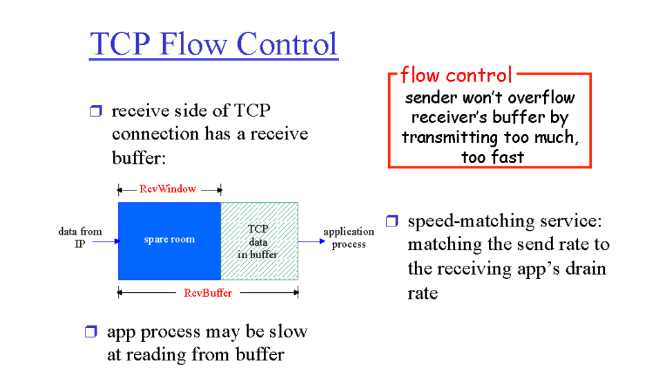
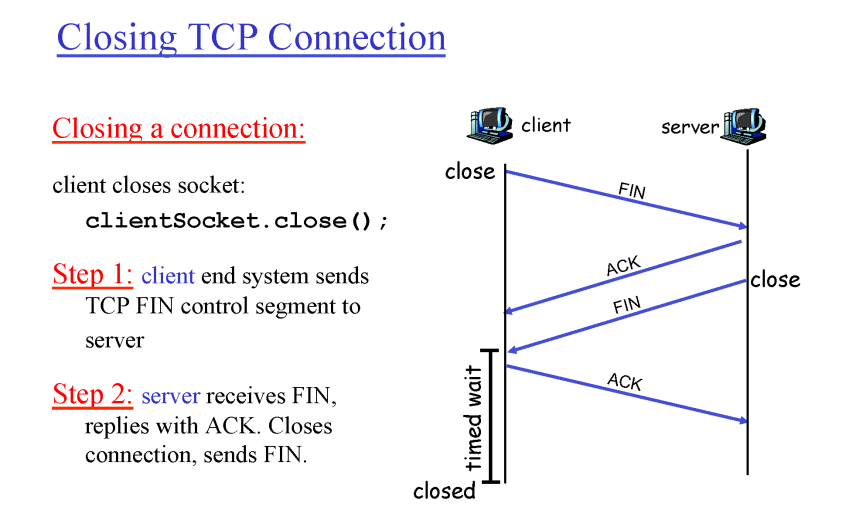
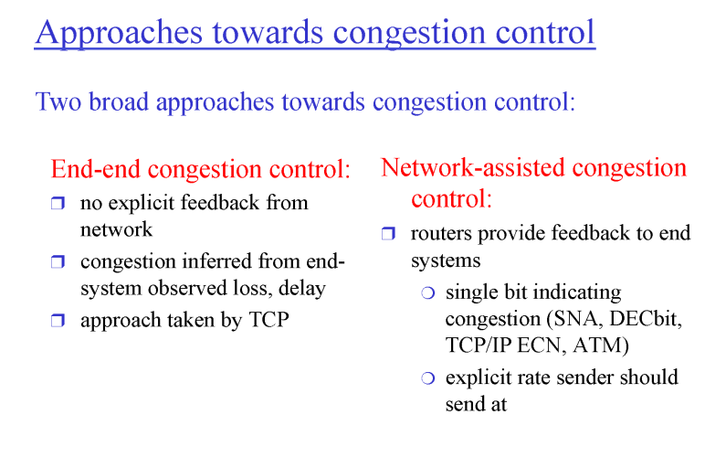
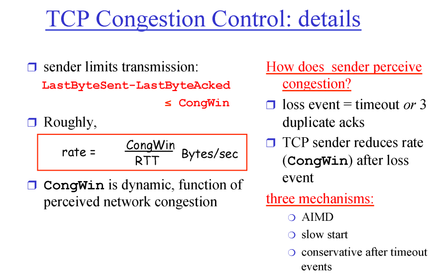
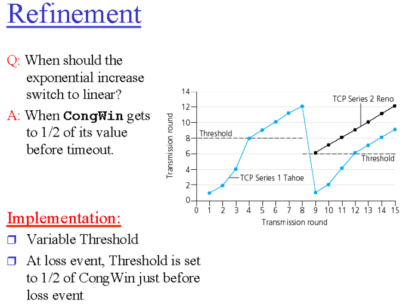
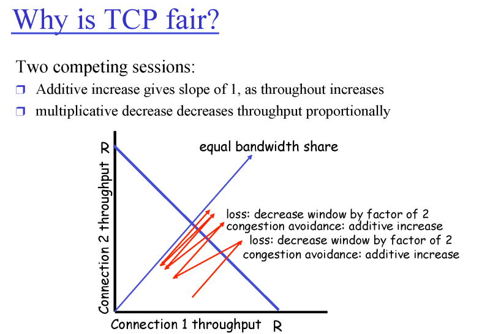

# Transport Layer(전송계층)

- [Transport Layer(전송계층)](#transport-layer전송계층)
- [Pipelined Protocols](#pipelined-protocols)
  - [Go-Back-N](#go-back-n)
  - [selective repeat](#selective-repeat)
- [정리](#정리)
- [TCP segment structure](#tcp-segment-structure)
  - [Timeout](#timeout)
  - [TCP Reliable data transfer](#tcp-reliable-data-transfer)
  - [TCP 권고사항](#tcp-권고사항)
- [TCP Flow Control](#flow-control)
- [TCP connection management](#connection-management)
  - [TCP-3-way-handshake](#TCP-3-way-handshake)
  - [Closing-TCP-Connection](#Closing-TCP-Connection)
- [Principles of congestion control](#Principles-of-congestion-control)  
- [TCP Coingestion Control details](#TCP-Coingestion-Control-details)
  - [TCP Slow Start more](#TCP-Slow-Start-more)
  - [TCP Fairness](#TCP-Fairness)
# Pipelined Protocols

 2f4789b102664cbda0ad696c6395d8ed/Untitled.png>)

## Go-Back-N

 2f4789b102664cbda0ad696c6395d8ed/Untitled 1.png>)

- Window size
  - 한번에 얼마만큼의 packets을 보낼 것인지
  - window안에 있는 애들은 buffer안에 저장해야함
- 여기서의 ACK 성격
  - cumulative ACK : 쌓아놓는다는 소리.
    - ACK 11이면 한번에 11까지 받았다는 것.
    - 가장 먼저 보내는 패킷 send base에 timer가 있음
      - e.g. window size가 4면 0,1,2,3이 보내질 때 0한테 timer가 있다는 뜻
         2f4789b102664cbda0ad696c6395d8ed/Untitled 2.png>)
- Receiver
  - 번호 순서대로 sequence number를 처리함.
    - sender한테 0을 받았으면 그 다음은 무조건 1받을 때까지 기다림. 만약에 2가 더 먼저오면 그거는 버리고 1이 올때까지 기다린다.
       2f4789b102664cbda0ad696c6395d8ed/Untitled 3.png>)
- 만약 window size가 4고 중간에 6이 유실됨
  - 6이 send base일 때 6에서 터지니까 다시 4개가 돌고서 6으로 Go-Back하는 거임

## selective repeat

- 문제가 있을 때 재전송 해주지만 선택된 패킷만 재전송
  - 잘 전송된 패킷은 buffer에 저장해주고 타이머 해제됨
  - 2가 터지고 3은 전송이 잘됐으면 전송을 ACK3이런 식으로 전송해줌
  - 그리고 2는 재전송
  - 2가 잘 받아져서 2,3,4,5가 다 받아지면 패킷을 application layer로 전송
  - 그리고 그 다음 window로 넘어감
     2f4789b102664cbda0ad696c6395d8ed/Untitled 4.png>)

<aside>
💡 **딜레마**

</aside>

- window size가 3이면 sequence number가 0,1,2,3을 쓴다고 가정(window size : N, sequence number : N+1)
- 근데 만약에 첫번째 패킷의 모든 애들이 에러가 남(0,1,2) → 3 대기중
- 그러면 재전송을 0부터 다시함 → sequence #는 0
- 리시버는 3이 대기하고 있으니까 3다음 번호로 0을 넣어줌
  - 중복패킷이 아닌 새로운 패킷으로 인식해버린다.

⇒ 해결책 : sequence number 범위를 늘리면 해결됨

- 얼만큼으로?

 2f4789b102664cbda0ad696c6395d8ed/Untitled 5.png>)

---

# 정리

- point-to-point
  - 한쌍의 소켓의 통신을 책임짐
- reliable, in-order byte stream
  - 하나도 유실되지 않고 순서대로 간다
- pipelined
  - 한꺼번에 쏟아붓는다.
- send & received buffers
  - 누가 sender고 receiver고 나눠져있지 않음
- full duplex data
  - 데이터가 양방향으로 진행한다는 얘기
- connection-oriented
- flow controlled
  - receiver의 용량만큼 부어주는거
- condition controller

 2f4789b102664cbda0ad696c6395d8ed/Untitled 6.png>)

# TCP segment structure

 2f4789b102664cbda0ad696c6395d8ed/Untitled 7.png>)

 2f4789b102664cbda0ad696c6395d8ed/Untitled 8.png>)

- 각 포트가 16bit(포트 번호 범위 0~2^16-1)

 2f4789b102664cbda0ad696c6395d8ed/Untitled 9.png>)

<aside>
💡 A가 B한테 ‘C’를 보내려고 하는 상황

</aside>

- **시퀀스 번호**
  - 바이트 순서 번호
- **ACKs**
  - cumulative ACK
  - ACK10→ 9번까지 받았으니까 이제 10 주라는 뜻(Go-Back하고 의미 다름)
  - B가 보내는게 에코인지 아닌지 구별 불가

## Timeout

- 시간제한을 어떻게 정할까?

  - RTT (Round Trip Time) : segment를 보내고 돌아오는 시간
    - 시간 제한을 RTT로 정해보자
      - 경로마다 RTT값이 다름(거리마다 다르고, Queue delay가 다름)→RTT를 기준으로 잡기가 중구난방이라 힘들다.
  - Estimated RTT : 보정된 RTT값
    - 너무 타이트할 때도 있음
       2f4789b102664cbda0ad696c6395d8ed/Untitled 10.png>)
  - Dev RTT : Estimated RTT에 시간을 더해줌

  ## TCP Reliable data transfer

  - timer 1개 사용
    - 타이머가 터지면 딱 그거 하나만 재전송
       2f4789b102664cbda0ad696c6395d8ed/Untitled 11.png>)

  1. 상황

     segment 1 : 92~99

     segment 2 : 100~119

     - B는 둘 다 잘 받아서 ACK 120기다림
     - sender가 response기다리던 중에 1번 세그먼트가 timer가 터짐
     - 1번 재전송해서 120번 기다리는 리시버에게 날라가면 버려짐
     - 그리고 ACK120번이 B에서 A로 날라감
     - 그러면 119까지는 잘 처리된거니까 A 비움
        2f4789b102664cbda0ad696c6395d8ed/Untitled 12.png>)

  1. 상황
     - 2와 거의 동일한데 1번 세그먼트가 유실된 상황
     - 2와 비슷하게 동작
        2f4789b102664cbda0ad696c6395d8ed/Untitled 13.png>)
        2f4789b102664cbda0ad696c6395d8ed/Untitled 14.png>)

## TCP 권고사항

- delay를 해라 → 한번에 다 담아서 보내라고
- **fast retransmit :** timer가 터지기 전에 유실을 알 수 있음
  - 특정번호의 ACK가 계속 들어오면 유실인것임 → 동일 번호가 4번이상 반복되면 유실로 판단해줌⇒ **3 duplicate ACK**
  - 없어도 되는 기능. 필수는 아님

## flow-control
receive buffer가 받을 수 있는 만큼 send buffer가 보내주는 것이 flow control   
(recieve buffer 크기에 의해 결정되므로 receiver가 중요)  
TCP seg의 header에 정보가 담김  

 
 
극단적인 상황으로 receive buffer가 빈공간이 없으면 HDR에 recv buf에 0이 담겨서 보내짐. 이 때 send buf가 아무 행동도 취하지 않으면 계속 교착 상태에 빠지기 때문에 send buf가 data를 비운 채로 seg를 보내줌.

## connection-management

### TCP-3-way-handshake
  
HDR에 SYNbit가 담기며 처음 통신시작할 때 1로 해서 보냄 (통신을 하고 싶다는 신호)  
receiver는 SYNBIT(=1), Seq(=y), ACKBIT(=1), ACKnum = x+1(sender가 보낸 Seq +1)를 client에게 보냄  
client가 ACKbit(=1) , ACKnum(=y+1)을 보내며 통신 시작(이 때 이미 SYNBIT는 0)  
3번째 과정에서는 **데이터가 포함될 수 있음**

### Closing-TCP-Connection

  
4번째 ACK가 확실히 server에 수신됨을 화인하기 위해 timed wait 과정이 있음.   
만일 이 과정이 없다면 4번째 ACK를 서버가 수신하지못할 시 무한정으로 FIN을 client에게 보내게 됨(client는 이미 통신을 끊어서 받을 수 없음)

## Principles-of-congestion-control
TCP라는 것은 대이터 유실 시 재전송 하기 때문에 실제보다 많은 데이터량을 보내게 됨.  
 따라서 네트워크가 막혔을 때 TCP 방식은 더 네트워크 상태를 악화시키게 된다.  
따라서 네트워크가 막혔을 때 자기가 보내는 데이터량을 줄여야 내 자신을 위해서도 전체를 위해서도 좋음. 
  
 
하지만 네트워크 상황이 좋은지 알 방법이 없음. 그래서 두 가지 방식이 존재.  
1. End-end congestion control (통신하는 두 대상이 유추해서 알려줌) 현재 O
    1. 아주 정확하지는 않음(유추하므로)
2. Network-assisted congesetion control (네트워크가 줌) -> 현재 X

## TCP Congestion Control  
### 3 main phases (Window size를 늘려나가는 과정)      
1. Slow Start  
    실제로는 exponential 하게 증가. 하지만 작은거에서 점점 커진다는 의미에서는 맞음.  
2. Additive increase  
    Linear하게 늘려나감.  
3. Multiplicative decrease  
    막혔다 싶으면 줄이긴 줄이되 1/2만큼 줄임. 

MSS(Maximum Segment Size) = 500Byte(변화하는 단위)  
  
늘였다 줄였다 하기 때문에 실제로 파일 전송받을 때, 전송속도가 왔다갔다 하는 이유

### TCP-Coingestion-Control-details

### TCP-Slow-Start-more
  
파랑색은 TCP Tahoe 방식. 1980년대 나왔고 현재는 더 이상 쓰지 않음.   
패킷 유실 감지(1. timeout 2. 3duplicate ACK)시 그 시점에서 Threshold를 절반으로 설정하고 처음부터 slow start.  
 
검은색은 TCP Reno 방식. 3duplicate ACK로 패킷 유실 감지시 절반으로 줄이고 Linear increase 사용. timeout시 slow start 다시 시작.

처음 Threshold는 구현하는 사람 마음. 정할 수도 없음. 

### TCP-Fairness
결국에는 모든 TCP가 fair하게 됨.  
  
하지만 TCP 그 자체 끼리 공평하다는 내용이기 때문에 TCP통신을 많이 연 사람이 더 많이 가져가는 구조임.