# 📌Network Layer

어떻게 이동하는 지에 대해 설명한 것. 

## ✔️ Router에서 하는 일
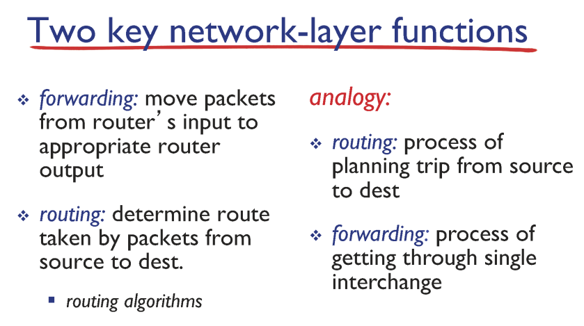
  
### 1. routing  
    패킷이 출발지에서 목적지로 전달되는 경로를 결정하는 과정
### 2. forwarding  
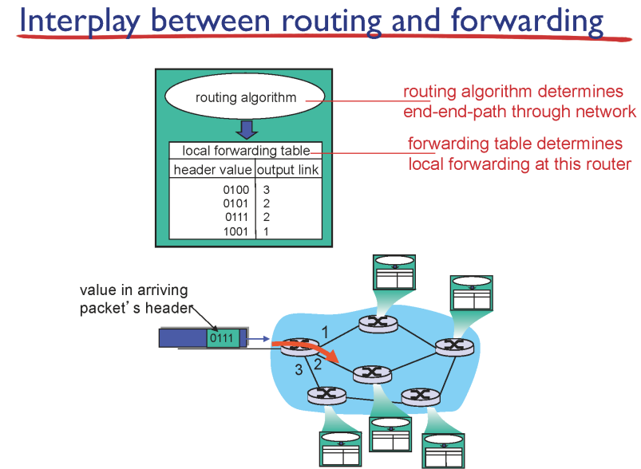
    * packet의 목적지가 header에 적혀있는데 이것을 보고 전달. 
    * forwarding table에 내용이 있어서 이것을 보고 매칭시켜서 링크로 전달
    * routing algorithm이 forwarding table을 만듬, 주소범위로 표현되어 있음
#### Longeset prefix matching  
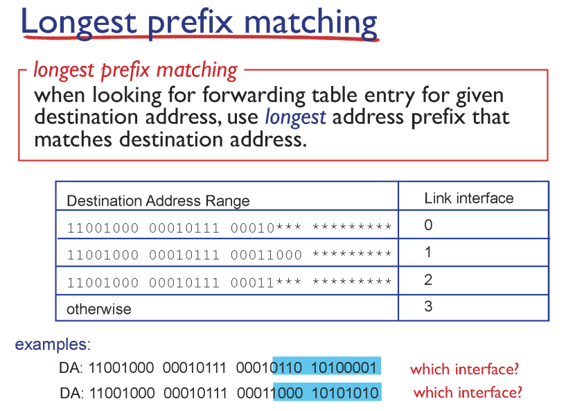
가장 길게 매칭되는 entry와 매칭시킴(앞에서부터 봐서 prefix)

## ✔️ IP datagram format

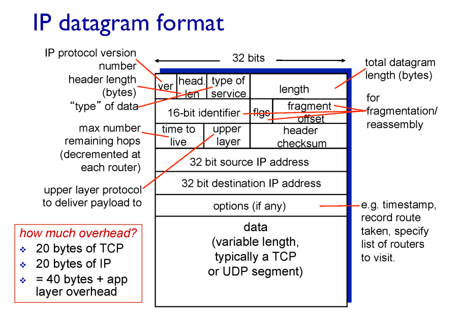

1. `VER (Version)` 
    - IP 프로토콜의 버전을 의미
    - IPv4와 IPv6가 현재 사용되고 있으며, 4자리 비트로 이루어져 있음
    - IPv4의 경우 0100, IPv6의 경우 0110으로 표기됨
2. `HLEN(Header Length)`
    - 헤더의 길이를 알려주는 부분
    - 가장 마지막에 포함되는 옵션의 길이에 따라 옵션이 없으면 20 바이트, 최대로 추가되면 60 바이트
    - 위의 그림에선 32 비트인 것처럼 그려지지만, 경우에 따라 옵션 필드가 없을 수도, 훨씬 클 수도 있음
3. `Service Type`
    - 해당 데이터그램의 지연, 우선순위, 신뢰성, 처리량 등의 정보를 담고 있는 필드
    - 8비트로 이루어져 있음
4. `Total Length`
    - 헤더와 데이터 부분을 합한 데이터그램의 전체 길이
5. `TTL(Time to Live)`
    - 수명을 알려주는 필드
    - 데이터그램이 네트워크 상에서 다양한 이유로 목적지에 도착하지 못하고 네트워크를 떠도는 일이 생길 수 있음
    - 이런 일이 늘어나면, 네트워크 흐름을 방해할 수 있고, 상위 계층을 혼란시킬 수 있기 때문에 수명을 다한 데이터그램은 자동으로 폐기됨
6. `Upper Layer`
    - 네트워크 계층의 상위 계층인 전송 계층이 사용하는 프로토콜에 대한 정보를 담고 있음
    - 8비트로 구성
    - 대표적으로 UDP는 17, TCP는 6, ICMP는 1을 사용
    - 리시버 측에서 사용
7. `Header Checksum`
    - 헤더에 오류가 있는지 확인하기 위한 16비트로 이루어진 필드
    - 데이터 링크 계층에서의 Error Control과 같은 역할
8. `Source/Destination IP Address`
    - 각각 32비트로 구성
    - 송신과 수신자의 IP 주소가 기록되어 있음

## ✔️ IP Address(IPv4)

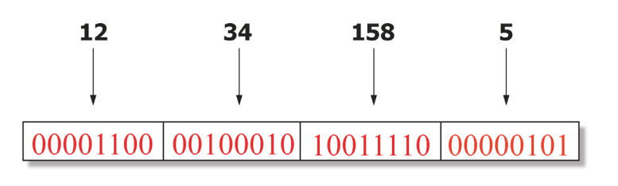

- `32 비트`의 주소 체계를 가진다.
- 2^32 개의 IP 주소를 가질 수 있다.
- 사람이 읽기 좋게 8비트씩 끊어서 10진수로 변환(0~255) 하여 주소를 읽는다.
- 라우터와 기계들은 32비트만 본다.
- IP주소는 호스트에 들어있는 네트워크 인터페이스 자체를 지칭한다.

컴퓨터 안에 네트워크 인터페이스 카드, nic라고 불리는 게 있음. 예를 들어 램 카드를 끼우는 것도 다 인터페이스. 그래서 IP 주소는 네트워크 인터페이스를 지칭하는 주소이다.

보통 네트워크 인터페이스 카드 한 개를 사용하기 때문에, IP 주소가 한 개 이다. 컴퓨터에 네트워크 인터페이스 카드를 여러 개 끼우면 IP 주소를 여러 개 가질 수 있는데, 이런 대표적인 예가 라우터이다. 라우터는 인터페이스를 여러 개 두면서, 각각 다른 네트워크에 연결돼 있고, 각각 IP 주소를 갖는다.

## ✔️ Grouping Related Hosts

네트워크들은 라우터로 연결되어 있음

단순하게 IP주소를 배정하는 방법은 막무가내로 배정하면 쉬움.

### 🚨 BUT 문제점?

## ✔️ Scalability Challenge

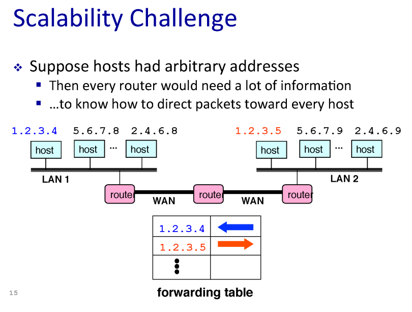

라우터 안에 들어있는 forwarding table이 엄청 커지는 문제점 발생

호스트 별로 방향이 다 다르기 때문

→ 현재 IP주소는 이렇게 마구잡이로 배정하지 않음

## ✔️ Hierarchical Addressing : IP Prefixes

계층화를 시켜놓음

32비트 IP주소는 두 공간으로 나눌 수 있음

- 네트워크 ID(24비트)
- 네트워크에 속한 호스트ID(8비트) : 같은 네트워크에 속한 호스트 들은 같은 네트워크ID를 가진다
- 네트워크ID = 서브넷 ID = prefix

## ✔️ Subnet Mask

서브넷 마스크란, 어디까지가 네트워크 아이디인지 나타낸 것

IP주소와 서브넷 마스크는 항상 같이 다님

## ✔️ Scalability Improved

- 같은 네트워크에 속하는 host들은 같은 subnet을 가짐 → forwarding table이 단순해짐
- 1.2.3.0/24 는 왼쪽 네트워크
- 5.6.7.0/24는 오른쪽 네트워크
- 새로운 host 추가할 경우, 새로운 forwarding-table entry 추가할 필요 없이, prefix만 같도록 하여 IP 주소를 배정하면 된다.

## 과거의 IP주소 배정: Classful Addressing

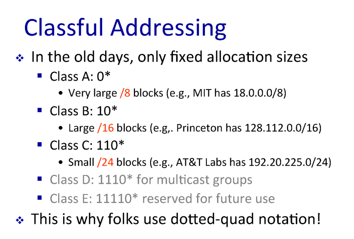

예전에는 IP 주소 prefix 자체의 클래스를 나눠놨습니다. 그래서 위 그림과 같이 클래스a, 클래스 b, 클래스 c가 존재했습니다.

class a에 해당하는 IP 주소 뭉태기들은 prefix가 /8, class b는 /16, class c는 /24 이런 네트워크 주소를 가졌습니다. 네트워크 아이디가 앞에 8, 16, 24 비트라는 얘기죠. 그러니까 클래스 a의 경우 /8에 해당하는 주소를 배정받으면 호스트를 나머지 부분인 2의24승만큼 이론상으로 보유할 수 있게 됩니다.

a의 특징은 무조건 앞에는 0으로 시작합니다. 그래서 2의 7승인 128개의 기관이 이 클래스a라는 어드레스 공간을 획득할 수 있습니다. 전 세계에 기관들이 수백만 개 엄청나게 많을 텐데 그 중에 딸랑 128개의 기관만이 클래스 a를 획득할 수 있다는 것 자체도 문제가 됩니다. 또한 host를 다 못 씁니다 이거는 엄청나게 큰 공간인데, 한 기관이 이걸 쓸 수 있는 크기가 아닙니다. 이로인해 추가적인 낭비가 발생합니다. 클래스 c는 2의 24승 개의 기관에 줄 수 있으니까 양이 많습니다. 그러나 255개까지 호스트를 처리할 수 있어서 너무 적어 문제가 됩니다.

## Classless Inter-Domain Routing(CIDR)

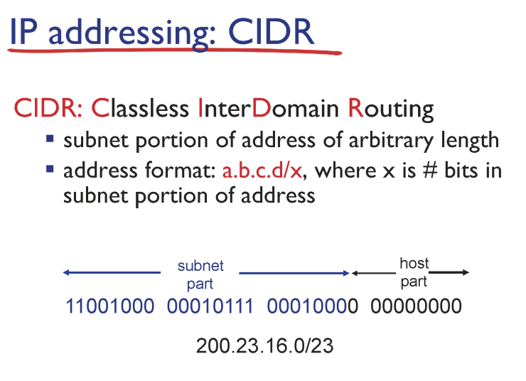

클래스 없는 개념의 주소 공간

예전에 나온 클래스 개념의 배정 시스템이 너무나 비효율적이라 없애고 나온 게 바로 이 클래스가 없는 개념의 주소 공간 배정입니다. 그래서 Classless Inter-Domain Routing해서 이걸 줄여서 CIDR라고 불리는데, 핵심적인 단어는 classless 입니다. 그래서 더 이상 이 8비트 단위로 prefix가 끊어지는 게 아니라, 자유롭게 끊어지게 됩니다.

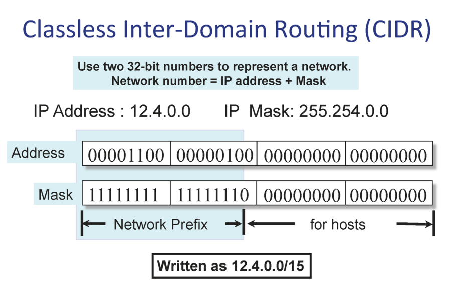

이 예에서 보면 prefix가 15비트 입니다. 그러니까 이런 게(12.4.0.0/15) 가능합니다.

그래서 과거에 이런 클래스 개념일 때는 이 클래스c짜리 prefix를 갖고 있었기 때문에, 네트워크 안에 있는 라우터들의 포워딩 테이블 크기가 컸습니다.

왜냐하면 포워딩 테이블 엔트리는 네트워크에 존재하는 prefix만큼 갖고 있습니다. 그래서 prefix가 줄면 네트워크 안에 들어있는 라우터들의 포워딩 테이블 크기 자체도 줄어들게 됩니다.

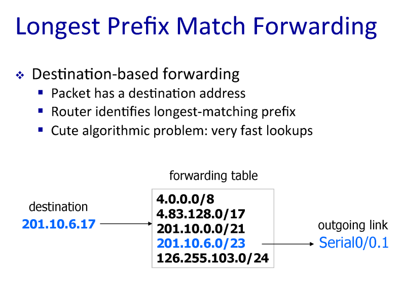

가장 정확하게 일치하는 prefix와 매칭된다.

## ✔️ Subnet

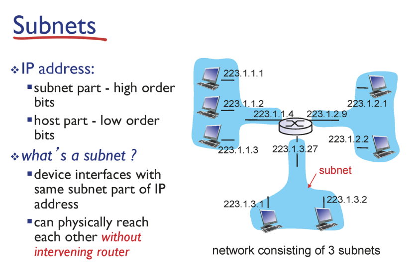

서브넷이나 네트워크나 비슷한 의미인데 서브넷은 같은 서브넷 id, 같은 prefix를 가진 IP 주소, 같은 prefix를 가진, 인터페이스 디바이스의 집합입니다. 또는 라우터를 거치지 않고 접근이 가능한 호스트들의 집합입니다. 예를 들면 이미지의 왼쪽 애들은 서브넷 id, prefix가 223.1.1 입니다. 그래서 여기 애들은 다 223.1.1 가졌습니다.

라우터가 IP 주소를 인터페이스 개수만큼 가지니까, 오히려 라우터는 IP 주소를 호스트 보다 많이 가집니다. 라우터 지금 인터페이스가 IP 주소 3개의 prefix가 다릅니다. 즉, 라우터는 하나의 서브넷에 속한 게 아니라 여러 개의 서브넷의 교집합 입니다. 그래서 이 교집합을 통해서만 다른 집합으로 갈 수 있습니다.

이 예시의 경우 subnet의 개수는 `6개` 입니다

- 223.1.1
- 223.1.2
- 223.1.3
- 223.1.7
- 223.1.8
- 223.1.9

## ✔️ IPv6
- 16바이트(128비트)로 구성

**Why IPv6?**

- IPv4 will be exhausted!! (IPv4가 고갈날 까봐 생김.)
- IPv4는 2^32 = 4 billion 개의 IP 주소를 가짐

## ✔️ Network Address Translation(NAT)

### (IPv4 고갈 안 나는 이유)

IP주소 고갈 문제를 해결하는 트릭 같은 것 → 근본적인 해결 방법은 아님

IP주소의 재사용 통해 여러 사람이 같은 주소를 사용함으로써 주소 공간 문제를 해결하는 것

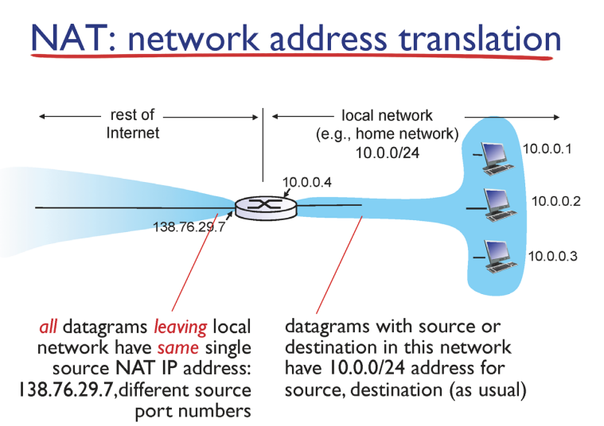

그래서 NAT 방식에서는, 네트워크 내부에서는 유일한 IP 주소를 사용합니다. 그래서 10.0.0.1, 10.0.0.2. 내부에서는 유일합니다. 그러나 내부에서만 유일하기 때문에 또 다른 네트워크의 내부에서 이 IP 주소를 사용할 수 있습니다.

그래서 이러한 IP를 가진 패킷이 외부로 나갈 때는 NAT 기능을 하는 이 게이트웨이 라우터의 IP 주소(전 세계적으로 유일)로 바꿔줍니다. 받는 사람 측에서는 라우터에서 메시지가 온 줄 압니다.

그럼 다시 리턴 패킷을 보낼 때 라우터로 보낼 것 입니다. 그러면 리턴 패킷이 들어올 때는 방금 이 변환 작업을 그대로 반대로 해주게 됩니다. 이게 바로 NAT의 동작 입니다.

게이트웨이 라우터는 NAT를 동작하고 있고, 게이트웨이 라우터에 IP 주소는 여러개 입니다. 왜냐하면 인터페이스 개수만큼 있으니까 IP 주소가 여러 개 있습니다.

그런데 이 그림 같은 경우에는 이 게이트웨이 라우터는 인터페이스가 두 군데고, 각자 IP 주소를 가지며, 서브넷 두 개의 멤버입니다.

그런데 서브넷이라는 건 뭐냐면, 같은 prefix, 같은 네트워크 아이디를 갖는 애들의 집합 입니다. 그럼 결국에는 라우터의 한 인터페이스는 오른쪽 서브넷의 prefix를 가질 수밖에 없죠.

그렇기 때문에 여기 오른쪽에서 10.0.0 이런 prefix를 가진다면, 마찬가지로 이 인터페이스도 10.0.0이라는 prefix를 가지게 됩니다. 그러나 왼쪽 서브넷은 또 주소가 다릅니다.

## ✔️ Dynamic Host Configuration Protocol(DHCP)

**1. 사전 지식.**

네트워크 환경에 들어가서 IP 주소를 보면, 192.168.1.47. 항상 같이 다니는 서브넷 마스크는 255.255.255.0. 라우터는 192.168.1.1. 그리고 DNS라는 탭이 있습니다. 우리가 인터넷을 하기 위해서 가장 기본적으로 알고 있어야 되는 정보들입니다. 인터넷에 연결되기 위해서는 각자 IP와 서브넷 마스크가 있어야 합니다. 그래서 어디까지가 prefix인지, 네트워크 아이디인지 알려준다고 했는데, 지금 255.255.255.0니까 서브넷의 ID가 192.168.1.0/24 가 됩니다.

**2. 그림과 함께 설명**

외부로 패킷을 보내기 위해서 전달해야 할 라우터의 IP 주소가 "네트워크 세팅"에 적혀있습니다. Destination에 구글 적어서, 라우터한테 보내야 갑니다. 라우터가 없으면 포워딩, 포워딩 테이블, 라우팅도 없게 됩니다. 라우터는 주소를 보면 같은 네트워크에 있습니다. 그리고 같은 네트워크 중에서 보통 첫 번째입니다. (아닌 경우도 있습니다.)

그리고 이 DNS는 우리가 웹 브라우저를 열어가지고 www.naver.com을 검색하면 그때 패킷이 바로 네이버로 가는 게 아니라, 네이버의 IP 주소를 알아야 합니다. 그 IP 주소를 알기 위해서 로컬 네임 서버의 IP 주소가 DNS 탭에 적혀 있습니다. 그런데 DNS 주소는 라우터 주소랑 같습니다. 즉, 로컬 네임 서버 프로세스가 라우터에서 동작하고 있습니다.

Dynamic Host Configuration Protocol(DHCP)에서 가장 중요한 단어는 host configuration 즉, 우리가 노트북 사용할 때 제일 처음에 config하는 그런 일을 해주는 프로토콜 이라는 겁니다. dynamic하게 한다는 얘기는 동적으로 알아서 이런 정보들을 장소마다 다르게 받아와 주는겁니다. 반대로 자신만의 고정된 IP와 라우터를 쓰는 경우도 있습니다. Static IP라고 직접 설정을 하기도 합니다.

> How does host get IP address?
> 
> 
> 1. 직접설정 한다.
> 
> 2. DHCP가 자동으로 설정해 준다.

## 2. DHCP Client-Server Scenario

> goal: 호스트가 빠르게 network에 접글할수 있게 도와준다.
> 
> - 사용중이면 알아서 추가 사용 갱신
> - 이미 사용했던 IP 주소가 있으면 다시 재사용
> - 모바일에서 DHCP 자동으로 지원.

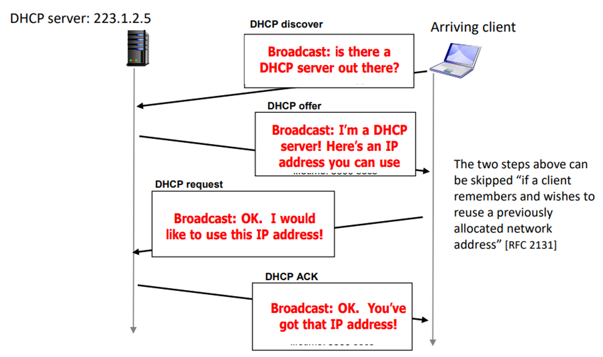

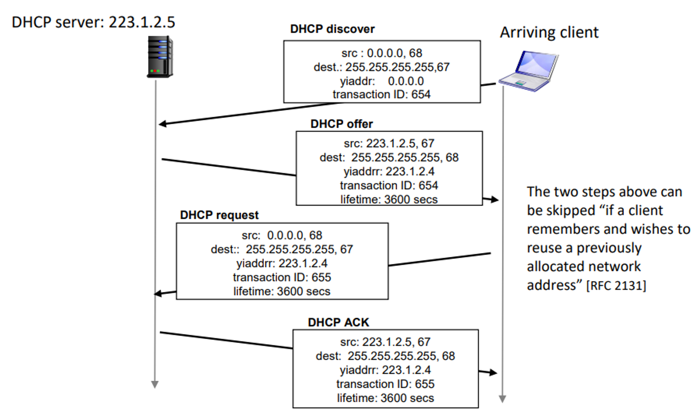

DHCP discover은 broadcast로 DHCP 서버가 있는지 요청 하는 것 입니다. DHCP discover 메시지를 보면 소스 주소는 아직 IP 주소를 할당 받지 못했기 때문에 0.0.0.0 입니다. 그리고 목적지는 IP가 255.255.255.255 이거 32 bit로 봤을 때는 전부 다 1 입니다. 그러니까 모든 address 비트가 1인 경우 broadcast 입니다.

broadcast는 서브넷에 있는 모든 멤버들에게 보내는 것 입니다. DHCP 서버는 포트 넘버는 67번 입니다. 그리고 transaction ID는 offer와 request를 위해서 ip 대신으로 우리를 특정하기 위해 랜덤하게 부여받는 번호입니다. 그러면 이 DHCP discover 메시지를 이 서브넷에 있는 모든 멤버들이 받습니다.

그런데 이 DHCP discover 메시지를 이 서브넷에 존재하는 모든 호스트들이 받지만, DHCP 서버만 받아들이고 나머지는 드랍하게 됩니다. 왜냐하면 67번 포트를 향해서 메시지가 보내지는데, DHCP 서버가 돌고 있는 멤버만 67번 포트를 열어서 listen하고, 나머지는 포트를 열지 않고 서버를 돌리지 않고 있기 때문입니다. 그래서 중간에 67번 포트가 없어서 드랍됩니다.

그래서 67번 포트를 열고 기다리고 있는 DHCP 서버만 이 discover 메시지를 받아서 offer를 줍니다. offer 메시지에 source IP와 포트 넘버는 서버 자신 이고, destination은 broadcast 입니다. 왜냐하면 아직 우리는 IP를 할당 받지 않았기 때문에 broadcast를 하고, transaction ID와 68번 포트가 열려있는 것으로 우리를 특정짓게 됩니다.

offer에 담긴 의미는 앞으로 너는 내가 부여한 새로운 주소를 지금부터 1시간 동안 사용을 할 수 있다는 offer를 주는 겁니다. 그럼 우리는 이 offer를 받아서, 이 offer가 마음에 들면 offer를 수락합니다. 수락한다는 의미로 다시 이 offer에 대한 request를 보내야 합니다.

이 offer에 대한 request 보낼 때, 소스는 아직 이름이 없습니다. 왜냐면 아직까지 이 IP도 확정된 게 아니기 때문입니다. 그래서 소스 주소는 0.0.0.0이고, 보내준 IP를 사용하고 싶다는 의미로 아까의 transaction ID에서 하나 플러스 1 시켜서 request의 의미로 보내게 됩니다. 그래서 이게 응답이 오면 우리는 이제부터 이 IP 주소를 우리의 IP로 사용하게 되고 통신이 가능해 집니다. offer에는 부여할 IP 주소뿐만 아니라, 라우터 IP, DNS IP도 들어 있습니다.

offer만 받아도 될 것 같은데 offer에 request하는 이유가 있습니다. discover 메시지는 "도와주세요." 라고 요청한 것입니다. 그런데 보통의 경우는 서브넷 안에 DHCP 서버가 한 개 있지만, 어떤 경우는 서버가 여러 개 있을 수도 있습니다. 만약 서버가 두 개면 각각 두개의 offer가 옵니다. 그 후 offer들 중에 한개를 선택하게 됩니다.

discover 메시지의 destination이 다 255.255.255.255인 것에 대해서 추가 설명하자면 여기 DHCP request의 destination도 broadcast 입니다. destination에다가 offer를 보낸 DHCP 서버 주소 쓰면 안 되는 이유는 내부에 DHCP 기능을 하는 서버가 여러 개 있을 수가 있어서 우리한테 준 offer가 선택이 안 됐다는 걸 간접적으로 알려주기 위해서 저렇게 하는 것 입니다.

## ✔️ IP Fragmentation & Reassembly

각 링크별로 링크가 한꺼번에 한 번에 보낼 수 있는 그 데이터 유닛의 맥시멈 사이즈가 정해져 있습니다. 그걸 우리가 MTU, maximum transfer unit이라고 불리는데 이 MTU는 링크 레이어 기술마다 다 다릅니다. 예를 들어 인터넷, 와이파이, 3g 아니면 옵틱, 광 케이블 이런 애들이 다 링크이고 MTU가 다 다릅니다.

MTU의 예를 들면 4000바이트짜리 패킷을 sender가 보냈는데, 특정 링크에서 처리할 수 있는 maximum transfer unit이 예를 들면 1500 바이트라면 보내지지 않습니다. 문제 해결을 위해 현재 인터넷 버전 IPv4에서는 처리할 수 있는 MTU보다 더 큰 사이즈의 패킷이 들어오게 되면 거기서 바로 분리합니다.

MTU 사이즈에 맞는 독립적인 사이즈의 프레임으로 바뀌어서 진행이 됩니다. 그래서 얘네들은 각자 이제 서로 다른 패킷이 되고 마지막에 합체해서 다시 원래 패킷으로 돌아옵니다. 이런 fragmentation, assembly 작업을 위해서 필요한 것들이 ID, flag, offset 입니다.

Sender가 IP 패킷을 생성해서 헤더가 있고 데이터가 있습니다. 위 그림은 헤더 필드 중에 하나가 4000 바이트짜리인 패킷 length 입니다. ID는 패킷별로 안겹치게 sender가 정하게 됩니다.

이 패킷이 사이즈는 4000, ID는 x이고 숫자 입니다. 그리고 이 flag는 첫번째 fragment 뒤로 추가 fragment 오는지 의미합니다. flag가 처음 만들어졌을 때는 fragment가 안 된 거니까 0 입니다. 그리고 마지막 fragement는 fragment가 끝난 것 이니까 0 입니다.

예를 들어 이 4천 바이트짜리 패킷이 MTU 1500인 링크를 만났다고 가정하겠습니다. 이 4000 바이트는 헤더와 데이터를 포함한 전체를 의미 합니다. 헤더 크기가 20바이트 입니다. 그러면 실제적으로 데이터는 3980바이트 이므로 링크의 MTU 1500 보다 크므로 나눠져야 합니다.

그리고 offset은 만약에 fragment 된 경우에 첫 번째 시작 부분이 전체 패킷에서 어느 정도의 위치를 차지하는지를 나타냅니다. 즉, offset은 두번째 fragement는 원래 기존의 데이터에서 잘려져서 시작할 것 인데 잘린 부분이 어디인지를 의미합니다. 아래의 그림에서 추가설명을 하겠습니다.

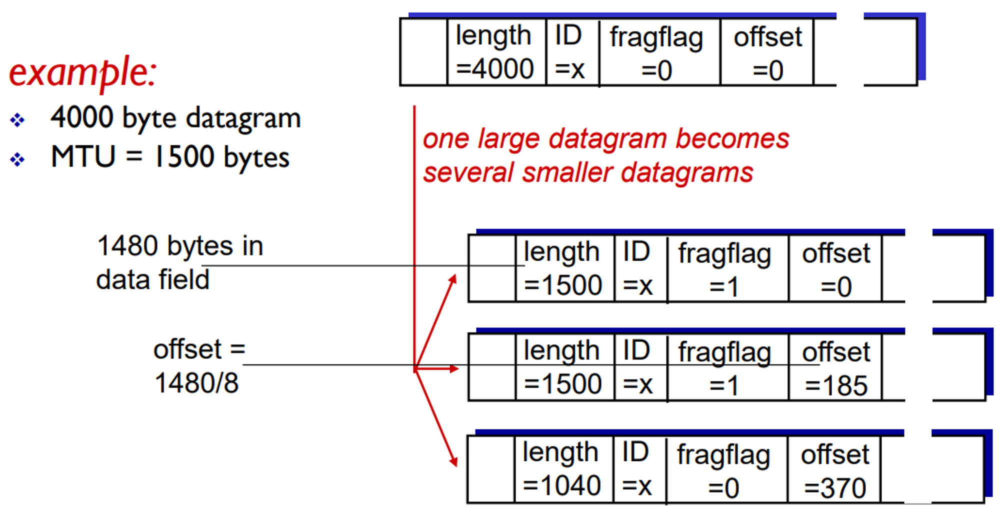

첫 번째 fragment 보면, length는 1500으로 MTU 사이즈에 맞게 첫 번째가 나오고 ID는 x 입니다. flag는 1로 바뀝니다. 내 뒤에 fragment 된 게 있다는 것 입니다. 그리고 나의 offset은 나는 제일 앞이니까 0이 됩니다.

그리고 두번 째 fragment가 또 다른 패킷으로 딱 변하고, length: 1500, ID = x, flag = 1 입니다. offset은 원래 데이터 사이즈는 3980 바이트 였는데, 쪼개가지고 첫 번째 fragment에 1480바이트 들어갔습니다. 다음 fragment도 1480 바이트 들어갔죠. 그러니까 1480을 적으면 되는데, 필드 비트 수 줄이기 위해 8을 나눠서 적어줍니다. 그래서 3비트가 줄게 됩니다.

Fragment의 이러한 정보로 나중에 병합이 가능합니다. 그러니까 이게 어떤 방식으로 분리를 했는지 기록해놓는 것 입니다. 추가로 만약에 분리돼서 독립적인 패킷이 되서 가는데 중간에 하나가 없어지면 reassembly(재결합)이 안됩니다. 예를 들면 첫 번째랑 세 번째는 갔는데 두 번째가 사라진 경우 입니다. reassembly(재결합)가 안 되면 패킷이 완성이 안 됐으니까, 위로 못 올립니다. 그런데 reassembly가 안 되니까, 없는 패킷이 됩니다. 그래서 나중에 TCP에서 타이머 터지고, 위에서 알아서 재전송을 합니다.

## ✔️ Internet Control Message Protoco(ICMP)

- 호스트와 라우터 간 네트워크 레벨에서 데이터 전송과 관련된 문제를 전달하기 위해 사용하는 프로토콜
- 용도
  - 오류 보고
  - 네트워크 성능을 평가하기 위한 진단 도구

**ICMP message: type, code plus first 8 bytes of IP datagram causing error**

타입 11번 TTL : TTL이 0이되서 버렸다고 알려줘야 한다.

## ✔️ Traceroute

- 인터넷을 통해 거친 경로 표시, 구간의 정보 기록, 인터넷 프로토콜 네트워크를 통해 패킷의 전송 지연을 측정하기 위한 컴퓨터 네트워크 진단 유틸리티

## ✔️ Transition From IPv4 to IPv6

- **Tunneling(터널링)** : IPv4와 IPv6를 같이 사용할수 있게 하는 기술

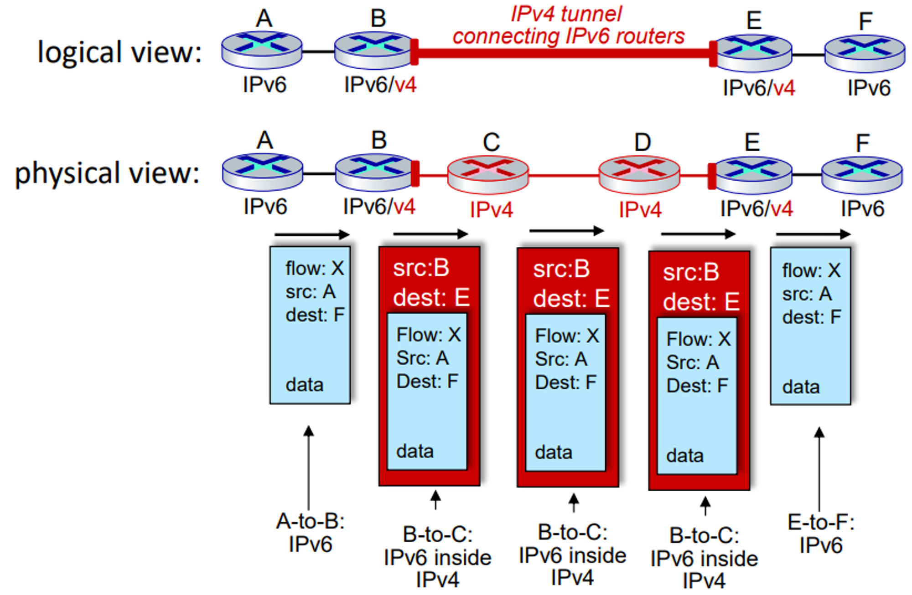

----

## ✔️ Routing Algorithms

### 1. Link-state algorithm

- 다익스트라 알고리즘 기반

### 2. Distance-vector algorithm

- 벨만-포드 방정식 (dynamic programming) 기반

> 위 그림에 따르면 라우터는 자신과 연결된 라우터 하나의 비용만 계산을 할 수 있다.
> 

