# 05. 링크 계층

## ✨링크란?✨

### 📌 용어

#### ✔️ 노드(node)

호스트와 라우터

#### ✔️ 링크(link)

통신 경로를 따라 인접 노드들을 연결하는 통신 채널

### 📌 Link Layer가 하는 가장 중요한 일?

하나의 노드의 패킷이 올라와서 다른 노드로 갈 때, 해당 노드로만 가는 것이 아니라 파장이기 때문에 연결되어 있는 모든 곳으로 퍼진다.
이때, 다른 곳에서도 해당 노드로 패킷을 보내기 위해 올려 놓으면 마찬가지로 이것도 파장이라 연결된 모든 곳에 퍼짐.
이렇게 되면 충돌(Collision)이 일어나는데, 해당 노드는 어떤 메세지도 듣지 못하게 됨.

Link Layer는 이런 `충돌을 발생하지 않도록` 한다.

### 📌 종류

유선, 무선, LANs

### 📌 Link Layer는 어디에 구현되어 있나?

네트워크 인터페이스 카드(Network Interface Card, NIC)

### 📌 전달 과정

네트워크 계층에서 내려온 IP 패킷이 NIC로 전달 됨

=> NIC에서 외부로 나갈 때 링크의 전송 단위인 프레임(frame)내의 데이터 부분으로 들어와서 전송되는 방식

## ✨Multiple Access Protocols✨

### 📌 broadcast medium

Host와 Gateway 간에 전용선이 있는 것이 아니라, 공용선 혹은 `broadcast medium`이라는 것을 통해서 연결되어 있음.

즉, 하나의 Gateway에 수많은 Host가 연결되어 있음

- `broadcast medium`: broadcast의 특징이 있는 매체
  - ex) 사람이 말을 할 때, "공기"는 `broadcast medium`이다

### 📌 Medium Acess Control(MAC)

매체에 대한 접근을 잘 조절해서 충돌이 일어나지 않도록 해결하고자 하는 것

### 📌 이상적인 MAC access protocol

1. 한 노드가 전송하려고 할 때, 해당 노드가 bandwidth를 모두 사용함
2. N개의 노드가 데이터를 전송하려고 할 때, 1/N씩 공평하게 사용함
3. 분산적 컴퓨팅이 되어야 함(분산 처리)
4. 동작이 단순해야 함(단순 처리)

## ✨ MAC protocols 분류 ✨

### 📌 channel partitioning

#### ✔️ `TDMA`(time division multiple access): 시간 분할 배정

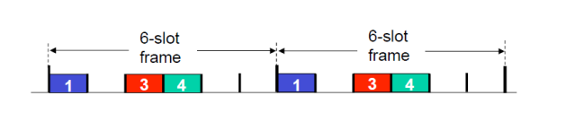

- 공유하고 있는 자원을 모두 시간적으로 배정하고, 자기 차례가 왔을 대만 사용 가능
- 자원이 낭비되는 문제가 있음(사람이 적으면 비효율)
  - 그림에서는 1, 3, 4만 사용하는데 2, 5, 6에게도 시간을 배분했기 때문에 낭비 됨
- 사용하는 사람이 많으면 효율적

#### ✔️ `FDMA`(frequency division multiple access): 주파수 분할 배정

- 개념은 TDMA랑 똑같음. 다른 건 시간 대신 주파수라는 것뿐
- TDMA랑 똑같은 장단점 보유

### 📌 random access

> 자기가 보내고 싶을 때 보내자!

- 현실에서 많이 쓰임
- 랜덤하게 필요한 연결이 있으면 연결함
  - 충돌이 일어날 수밖에 없음
  - 그 해결 방식 중 하나가 `CSMA`

#### ✔️ CSMA(carrier sense multiple access)

`listen before transmit`: 말하기 전에 듣는다.

- 전송 전 다른 frame이 전송 중인지 확인 후 전송

  - ex) 5명이 얘기를 할 때, broadcast medium인 공기를 통하는데 이때 한 명이 얘기할 때는 나머지 넷이 얘기를 안 하고 듣다가 이야기가 끝나면 다른 사람이 얘기하는 건 일종의 protocol. 같은 얘기임

- 그러나 먼저 전송을 시작해도, 다른 Host들은 각자 자신들에게 도달하기 전까지 이미 전송 시작한 곳이 있음을 모름
- 이 상황에서 다른 Host에서 listen을 해서 보내도 된다고 판단이 들면 이 Host도 전송을 시작함.
- 즉, 기다리던 두 Host가 동시(완벽한 동시는 아니지만)에 시작하면 충돌이 일어남
  - Propagation Delay 때문
  - 충돌을 완전히 막을 수는 없기 때문에(Propagation Delay을 0으로 만들 수 없음 - 빛의 속도 건들지 못 하기 때문) 그 충돌로 인한 피해를 최소화 하기 위해 나온 것이 `CSMA/CD`

#### ✔️ CSMA/CD(collision detection)

- 충돌이 감지되면 모든 host가 frame 전송을 멈춤
- 대기 random time을 두배씩 늘려가면서 재전송
- Host가 많을수록 대기 시간이 늘어날 수밖에 없음.

### 📌 Taking turns

- 많이 쓰이지 않음

#### ✔️ polling(여론 조사)

- master node를 통해 관리함(너 지금 전송한 데이터 있니?)
- master node가 작동을 멈추면 다 같이 멈춘다는 치명적인 문제가 있음

#### ✔️ token passing

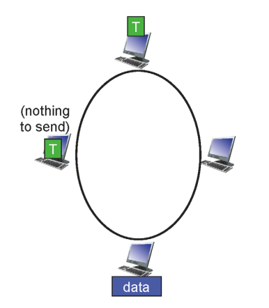

- token을 돌리면서 돌아가면서 token을 가진 Host만 전송
- token을 분실하는 경우 전체가 망한다는 문제가 있음
  - 현실에서 쓰이지 않음

## ✨LANs✨

`Local Area Network`: 공유되는 미디엄으로 이어진 집합

### 📌 Ethernet

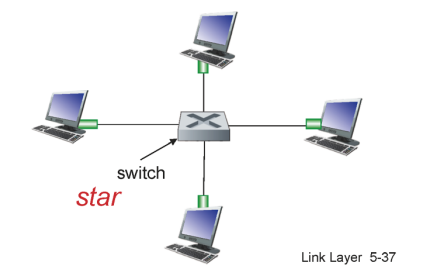

- 현실에서 정말 많이 사용됨
- 충동을 효과적으로 해결하기 위한 프로토콜
- 위 그림은 오늘날에 많이 사용하는 Ethernet.

#### ✔️ frame 구조

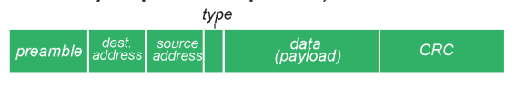
- type: 데이터가 어떤 상위 계층의 프로토콜인지 알려주는 (보통 IP 프로토콜)
- data: 데이터
- CRC: 에러 체크에 사용하는 부가적인 정보

#### ✔️ 특징

- `CSMA/CD` 사용
- 충돌이 일어나지 않으면 전송 성공했다고 봐도 됨

Q. 그런데 만약 충돌이 발생했는데 충돌 감지를 못 한다면?

A. 이런 경우는 있으면 안 됨

<예시>

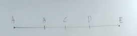

- A가 E한테 frame 전송 (오른쪽으로 퍼져나감)
- E가 B한테 frame 전송 (왼쪽으로 퍼져나감)

이때 가장 최악의 시나리오

    1. A가 E에 도달하기 직전에 E가 carrier sense를 함
    2. E는 아무것도 안 들림
    3. E가 전송 시작
    4. E가 frame 보내자마자 충돌 감지해서 A, E 중단
    5. A는 E에서 이미 출발한 frame의 조각이 A에 도착을 해야 충돌이구나 하고 상황판단을 함
    6. 그런데 이 frame 조각이 A에 도착하기 직전에 A에서 E로 전송되던 frame이 모두 전송이 된다면?
    7. 이때, A는 자신이 보낸 frame이 전송되기까지 충돌이 없었기 때문에 충돌이 감지되지 않아서 재전송이 일어나지 않음

- 문제점: Propagation Delay
- 해결 방안: frame size의 최소값을 설정 (LAN의 길이)
  - A야 너가 말을 좀 더 길게 해!
  - 실제로 이더넷에서 frame 최소값은 64byte로 지정되어 있음

### 📌 address

MAC: Medium Access Control

#### ✔️ MAC address

- 48bit
  - 앞 24bit: 제조사 번호
  - 뒤 24bit: 인터페이스의 고유번호

Ex) 사람에 비유

| 사람     | 네트워크    |
| -------- | ----------- |
| 이름     | Host name   |
| 주소     | IP address  |
| 주민번호 | MAC address |

이름, 주소는 바꿀 수 있는 것처럼 Host name, IP address는 바꿀 수 있지만

주민번호는 바꿀 수 없는 것처럼 MAC address는 절대 바뀌지 않음

### 📌 ARP

`address resolution protocol`

> GWR(GateWay Router)의 IP address는 아는데, 아직 모르는 MAC address를 알아오기 위한 프로토콜

Ex) A에서 구글로 데이터 전송할 때
<A의 MAC frame>

- source address는 A의 MAC address 적음. (본인 거니까 가능)

- dest address는 구글의 GWR(GateWay Router)의 MAC address를 적어야 함

  - GWR IP는 아는데 MAC address는 모름
  - GWR IP를 이용해서 MAC address를 알아야 함

- 호스트 내부에는 ARP table이 있음
  - `ARP table` : IP 주소와 MAC 주소의 매핑을 쭉 적어 놓은 것
    - 여기에 GAR IP 주소에 해당하는 GAR MAC 주소가 적혀 있음
- 이때 이 테이블을 채워 넣게 하는 것이 ARP
  - ARP request라는 frame을 모든 사람에게 보내서 dest 주소에 적힌 게 본인일 때 응답을 해 줌
  - TTL(Time To Live) 유효시간 존재

## ✨Addressing: routing to another LAN✨

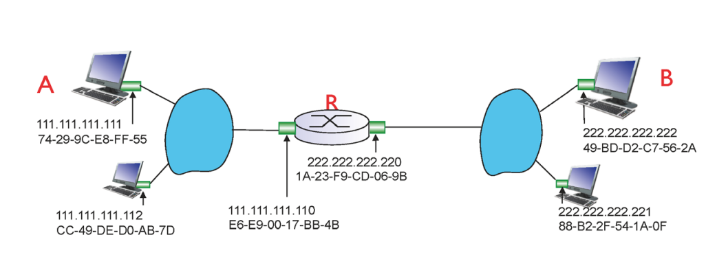

A는 다른 네트워크에 속한 B로 패킷을 보내려고 함.

중간에 R이라는 라우터는 양쪽 서브넷에 동시에 속한 디바이스임

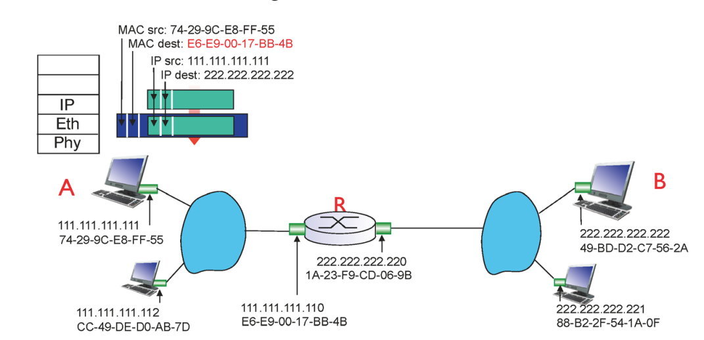

A가 패킷을 생성해서 보내려고 함

목적지는 B의 IP 주소

패킷에 프레임으로 실어서 보낼 건데, IP src는 A의 IP 주소, IP dest는 B의 IP 주소.

그리고 ARP 테이블 참조해서 보낼 곳의 MAC dest 주소를 알아냄 (여기서는 R의 받는 부분 MAC 주소)

CSMA/CD 사용해서 listen 하고 충돌 확인 후 충돌이 없다면 전송

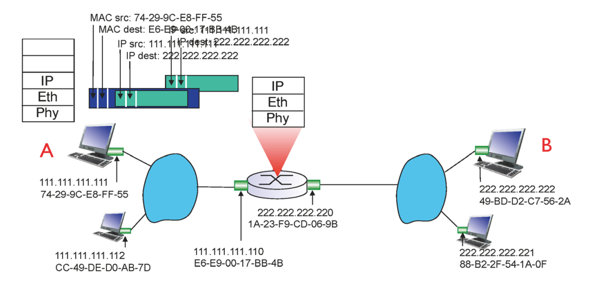

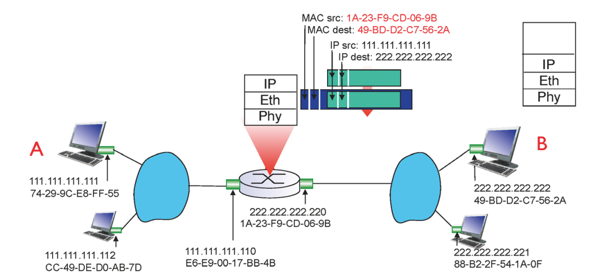

R에서 프레임 받고

똑같이 MAC src, IP src, IP dest 적고, ARP 테이블 참조해서 B의 MAC 주소 알아냄

CSMA/CD 해서 전송

B 도착

## ✨switch✨

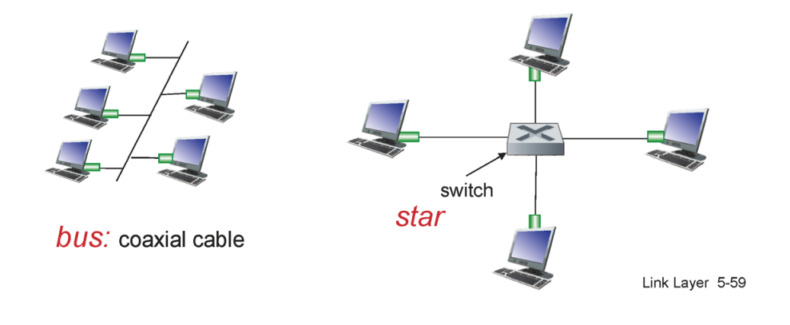

왼쪽은 과거에 사용했던 패턴, 오른쪽은 현재 사용 패턴

과거에는 새로운 컴퓨터를 연결하기 위해서 복잡했음

현재는 새로운 컴퓨터를 연결하기 위해서 그냥 포트만 꽂으면 됨(케이블을 꽂으면 됨) => 이게 바로 스위치 개념

### 📌 switch의 특징

#### ✔️ `collision domain` 분리시켜줌

- 왼쪽의 경우 시그널이 다 퍼져 나가는데, switch를 사용한 오른쪽의 경우 각각을 분리시키기 때문에 퍼져나가지 않음
- 왼쪽은 전체가 collision domain이라면 오른쪽은 collision domain이 분리되어 있음

#### ✔️ 호스트들은 switch를 볼 수 없음

- host 입장에서 switch는 없는 존재(그냥 연결만 하는 애임)
- host들은 그냥 CSMA/CD를 할 뿐

### 📌 동시에 여러 개 전송하면?

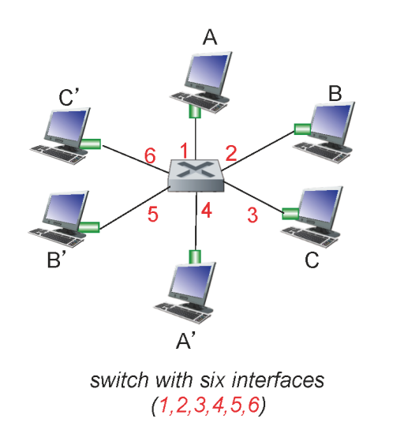

<예시>

- A => A'
- B => B'

#### ✔️ 동시에 보내고 싶을 때 동시에 가능함

WHY? collision domain 분리되어 있으니까

#### ✔️ Switch는 교통 정리 기능도 함

A랑 B랑 모두 동시에 A'에 보내고 싶을 때 A 먼저 보내고 B 다음에 보내주는 역할도 함

#### Q. 그런데 switch가 어떻게 `A'`이 몇 번 포트인 줄 알고 보내줘?

A. switch 내부에 `switch table`이 있음. 이걸 보고 보내줌. switch table은 self-learning을 통해 채움.

### 📌 self-learning

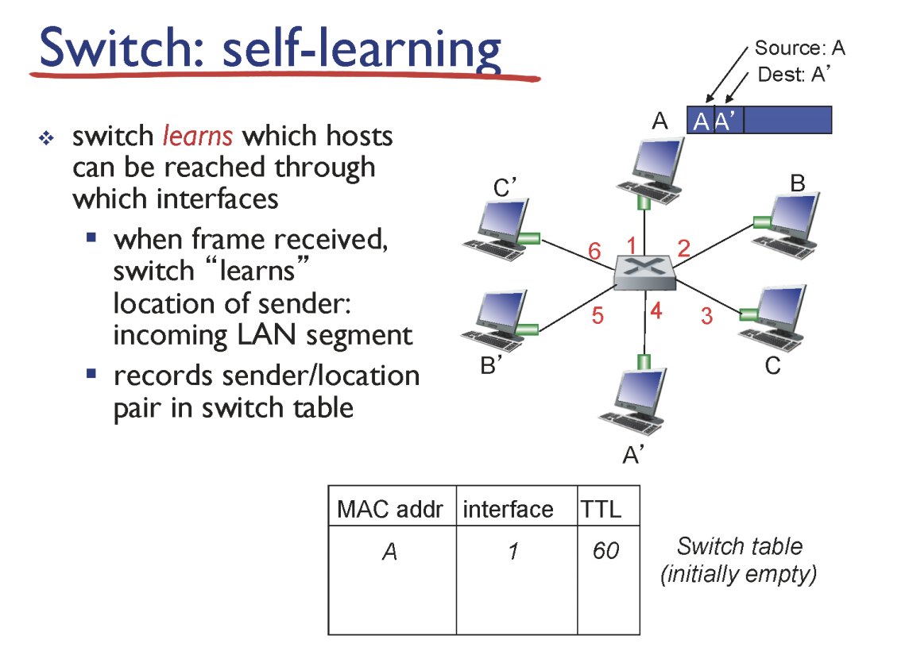

#### ✔️ self-learning?

switch table 채우는 법

- A에서 A'로 보내고 싶다고 switch에 보내면, switch에서는 A가 1번에 있구나를 알게 됨.
  - 여기서 A는 switch로 보냈다고 했지만... 사실 A는 switch 개념이 없어서 A'으로 가는 건데 switch가 중간에 받은 것.
- switch table에 A-1를 기록
- A'를 swtich table에서 찾아보는데 없으므로, 1번 빼고 다 퍼짐.
- A'에서 A로 보내고 싶다고 switch에 보내면, switch에서는 A'이 4번에 있구나를 알게 됨.
- switch table에 A'-4를 기록
- A를 swtich table에서 찾아보니 있으므로, 1번으로 전달

### 📌 규격화된 네트워크

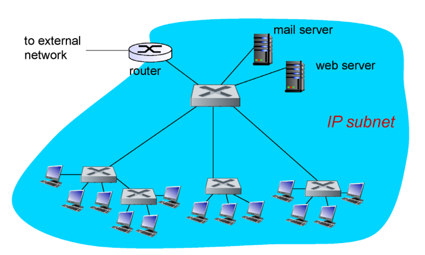

확장을 할때, 같은 서브넷을 이용하면 라우터가 아닌 switch를 이용해 확장도 가능함(선택 가능)

### 📌 switch vs router

#### ✔️ router

- 네트워크 계층
- 라우팅 알고리즘을 통해 포워딩 테이블을 관리함
- IP Address

#### ✔️ switch

- 링크 계층
- self-learning을 통해 스위치 테이블을 관리함
- 특이점: switch 본인은 MAC address가 없음
  - host에게 보이지 않고, 도우미 역할만 수행함

## ✨Data center networks✨

#### ✔️ Data center

각종 데이터를 모아두는 시설

서버를 적게는 수백 대, 많게는 수만 대 동시 운영

온라인 사업에 필수적인 설비를 제공하고, 고객과 기업 정보를 보관하는 시설

- Data center는 switch로 연결되어 있다.
  - switch를 계층화시킴
