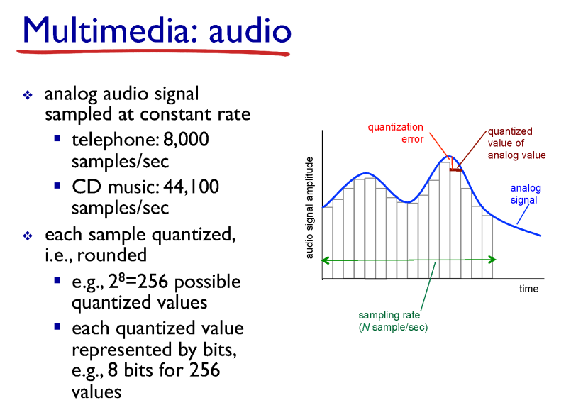
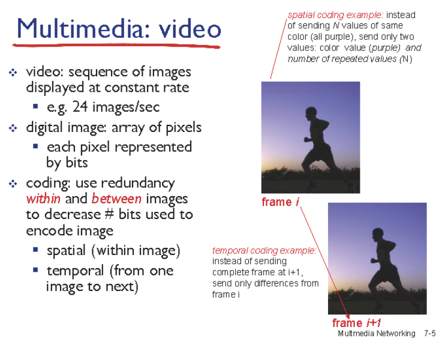
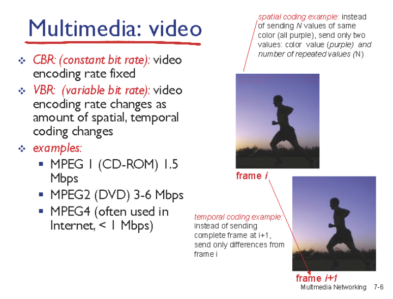
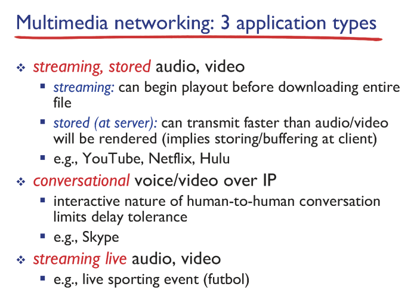
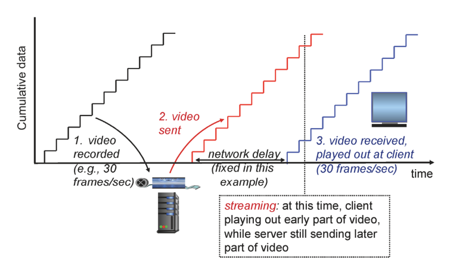
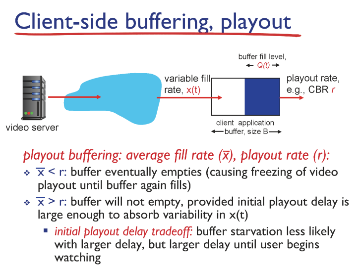
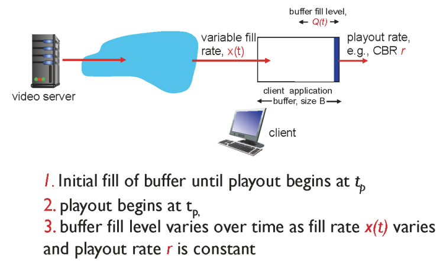
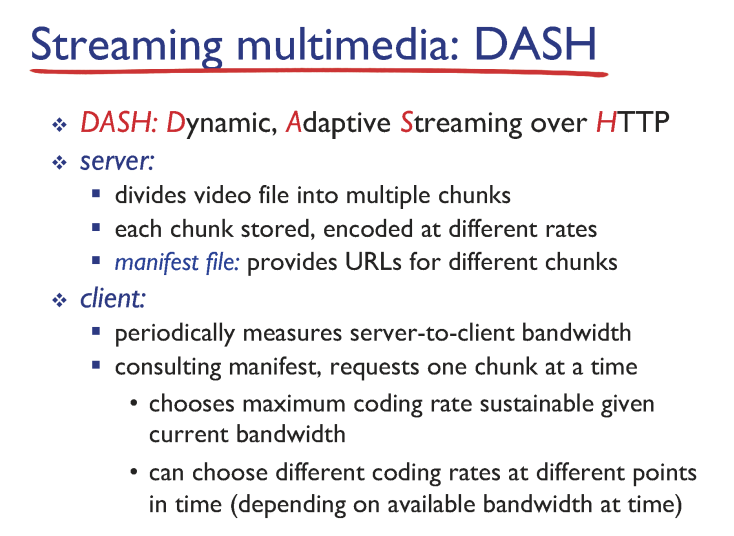
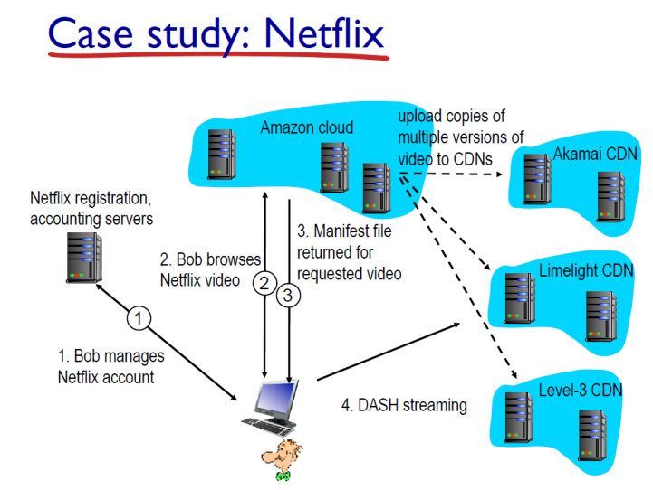

## Multimedia networking applications

### Multimedia: audio

- sampling: 아날로그 신호를 디지털 신호로 바꾸는 과정
- 샘플링 과정에서 항상 오차가 발생
- 오차를 줄이는 방법은 아날로그 값을 디지털 값으로 바꿀때
- 샘플링하는 데이터 크기와 주기가 오차를 결정

### Multimedia: video

- 각 frame을 저장할 때 각 pixel이 어떤 값을 가지고 있는지 저장
- coding rate 높을수록 화질이 좋은 것

## streaming stored video

- network delay 가 일정하지 않는 jitter 문제 발생
- 이러한 문제 해결을 위해 첫번째 프레임을 받고나서 바로 플레이하지 않고 기다렸다가 플레이 → 버퍼링

- playout rate보다 variable fill rate가 더 커야 끊기지 않고 재생됨

## DASH
- "HTTP를 통한 "동적 적응 스트리밍(Dynamic Adaptive Streaming over HTTP)"의 약자
- 비디오를 작은 조각으로 나누고 다양한 품질 수준에서 해당 조각을 인코딩
- 이로 인해 다른 품질 수준으로 비디오를 스트리밍하고 비디오의 중간에서 품질 수준을 변경할 수 있음

