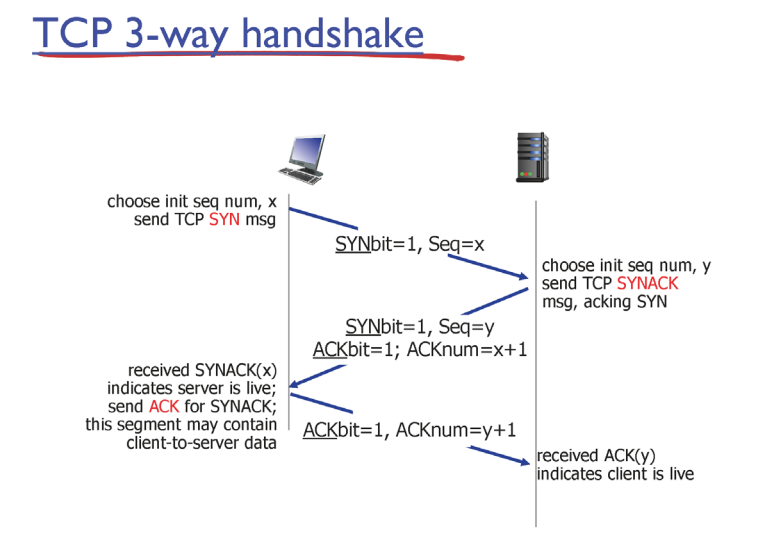

# 07.TransportLayer_3

## flow control
receive buffer가 받을 수 있는 만큼 send buffer가 보내주는 것이 flow control   
(recieve buffer 크기에 의해 결정되므로 receiver가 중요)  
TCP seg의 header에 정보가 담김  

 
 
극단적인 상황으로 receive buffer가 빈공간이 없으면 HDR에 recv buf에 0이 담겨서 보내짐. 이 때 send buf가 아무 행동도 취하지 않으면 계속 교착 상태에 빠지기 때문에 send buf가 data를 비운 채로 seg를 보내줌.

## connection management

### TCP 3-way handshake
  
HDR에 SYNbit가 담기며 처음 통신시작할 때 1로 해서 보냄 (통신을 하고 싶다는 신호)  
receiver는 SYNBIT(=1), Seq(=y), ACKBIT(=1), ACKnum = x+1(sender가 보낸 Seq +1)를 client에게 보냄  
client가 ACKbit(=1) , ACKnum(=y+1)을 보내며 통신 시작(이 때 이미 SYNBIT는 0)  
3번째 과정에서는 **데이터가 포함될 수 있음**

### Closing TCP Connection

  
4번째 ACK가 확실히 server에 수신됨을 화인하기 위해 timed wait 과정이 있음.   
만일 이 과정이 없다면 4번째 ACK를 서버가 수신하지못할 시 무한정으로 FIN을 client에게 보내게 됨(client는 이미 통신을 끊어서 받을 수 없음)

## Principles of congestion control
TCP라는 것은 대이터 유실 시 재전송 하기 때문에 실제보다 많은 데이터량을 보내게 됨.  
 따라서 네트워크가 막혔을 때 TCP 방식은 더 네트워크 상태를 악화시키게 된다.  
따라서 네트워크가 막혔을 때 자기가 보내는 데이터량을 줄여야 내 자신을 위해서도 전체를 위해서도 좋음. 
  
 
하지만 네트워크 상황이 좋은지 알 방법이 없음. 그래서 두 가지 방식이 존재.  
1. End-end congestion control (통신하는 두 대상이 유추해서 알려줌) 현재 O
    1. 아주 정확하지는 않음(유추하므로)
2. Network-assisted congesetion control (네트워크가 줌) -> 현재 X