## 네트워크 보안 요소

- confidentiality : 보내는 사람과 받는 대상만 메세지를 이해할 수 있는가
- authentication : 보낸 사람, 받는 사람이 인증 되었는가
- message integrity : 보낸 사람의 메세지가 변형 없이 받는 사람에게 전달되는가
- access and availability : 24시간 내내 서비스를 제공 가능한가

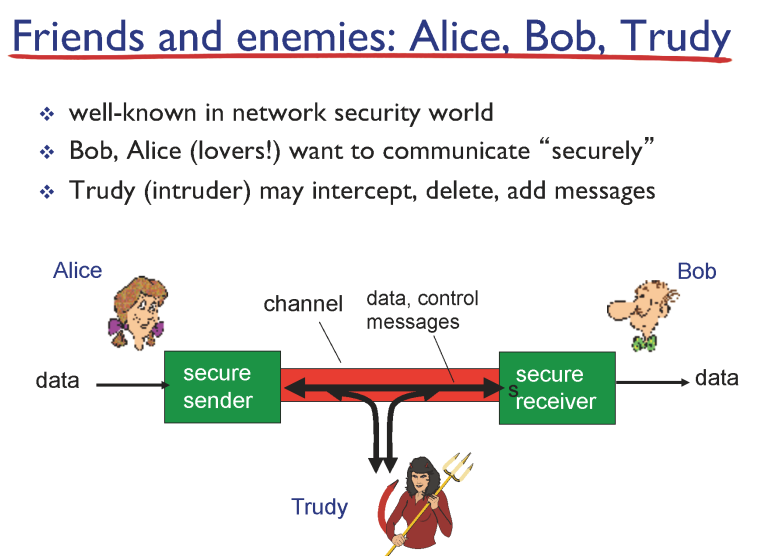

Trudy 가 중간에 데이터와 메세지를 변형 하려고 함.

ip packet의 헤더에 있는 source, destination address 등 다 볼 수 있음

- TOR : ip packet의 최종 destination을 숨겨줘서 익명성을 보장해주지만, 속도가 매우 느림

- 내가 어떤 사이트에 접속했을 때 warning이 뜨는 경우는 어떻게 알고 alert를 띄워주는 걸까?
    - 국가에서 블랙리스트 서버에 접근하는 유저에게 alert 띄워주는 것
    - 해외에 있는 open proxy를 사용해 우회할 수 있음
        - 근데 이렇게 우회하는 서버까지도 막을 수 있음

- 어떤 사이트에 접속 → 해당 사이트와 TCP connection → HTTP Request 요청 → 서버가 요청을 받음
- 이때 나가는 패킷의 destination id를 보고, TCP connection 허용시킴 → 커넥션 이루어진 후 HTTP Request 요청 시 Response에 Warning.html을 담아서 사용자에게 보냄 → 사용자는 해당 사이트에서 보낸 것으로 생각함 → 실제 사이트와의 연결은 타임아웃으로 끊어짐

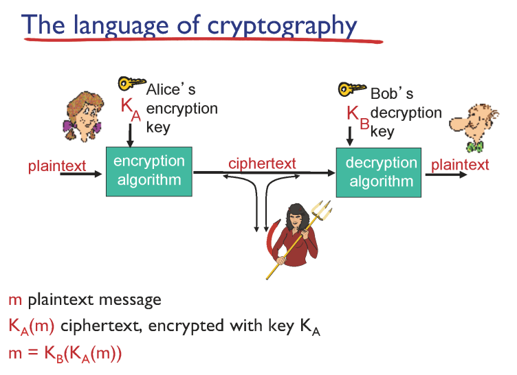

trudy가 알 수 없게 ciphertext로 바꾸는 과정 → 암호화

## Symmetric key cryptography
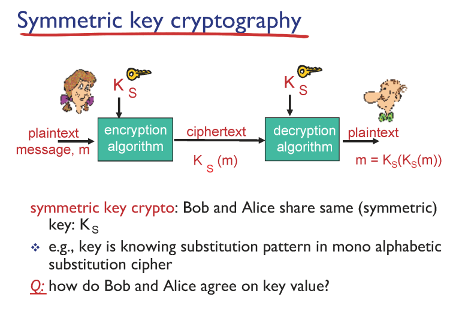

- 암호화 복호화 키가 동일
- 같은 키를 공유해야 함 → 만난 적이 없을 경우엔 공유하기 어려움

사전에 미리 만나지 않아도 되는 방법은 없을까?

## Public Key Cryptography
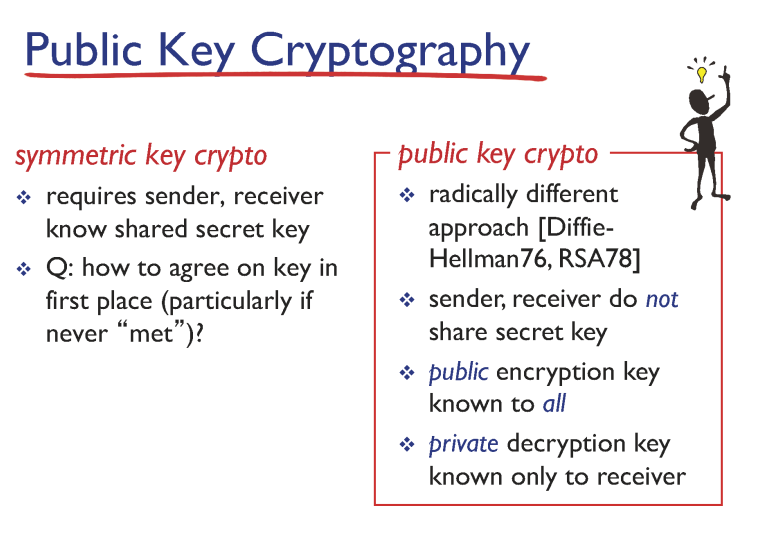

- 모든 사람은 각자 public key, private key를 가지고 있음

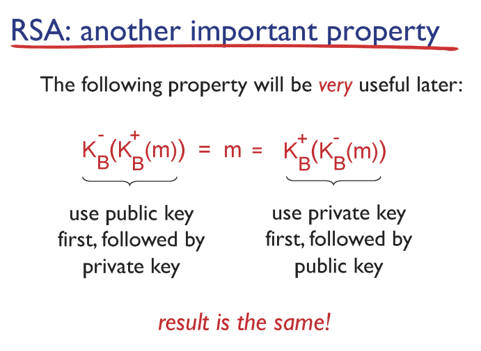

어떤 키를 먼저 적용시키던 간에 순서에 관계없이 동일한 결과가 나온다.

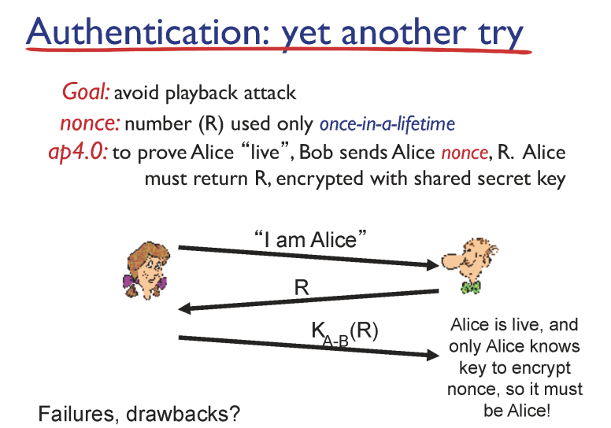

Alice가 진짜 Alice인지 증명하려면?

Bob이 Alice에게 랜덤 넘버를 주고, 둘만 공유하는 키로 사용함.

## Digital Signatures
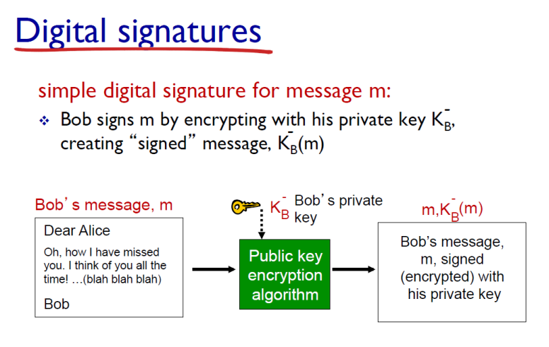

- Digital Signature : 메세지가 중간에 변형되지 않았다는 것을 증명

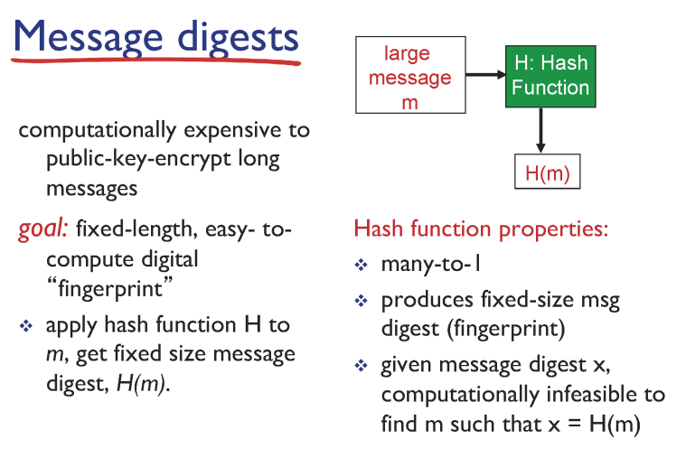

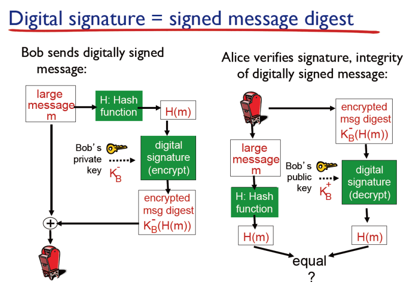

메세지의 해시값을 암호화하여 같이 보내면, public key를 이용한 메세지와 같은지 비교함

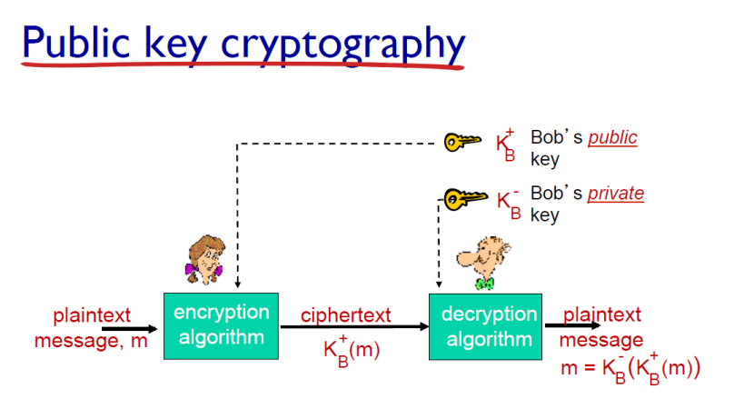

근본적으로 public key가 진짜 public key인지 확신할 수 있어야 함.

 → 공인기관으로 부터 발행한 인증서를 통해 인증할 수 있음

## SSL
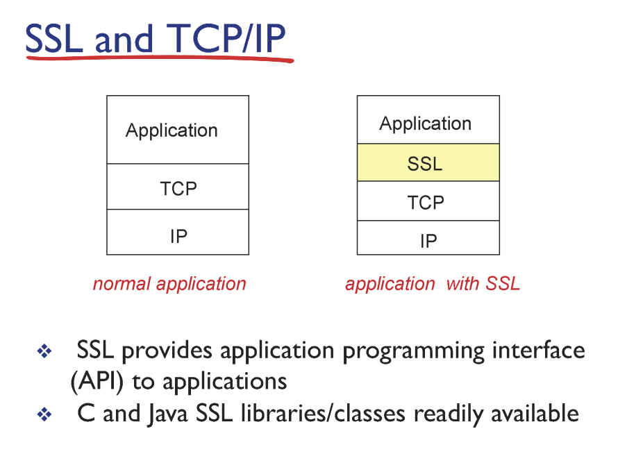

- TCP, IP에서 보안 기능을 제공해주지 않기 때문에, SSL이라는 개념이 등장함
- `Secure Socket Layer (SSL)` : 웹사이트와 브라우저 사이(또는 두 서버 사이)에 전송되는 데이터를 암호화하여 인터넷 연결을 보호하기 위한 표준 기술
- `HTTPS` : HTTP를 SSL을 통해 데이터를 전송

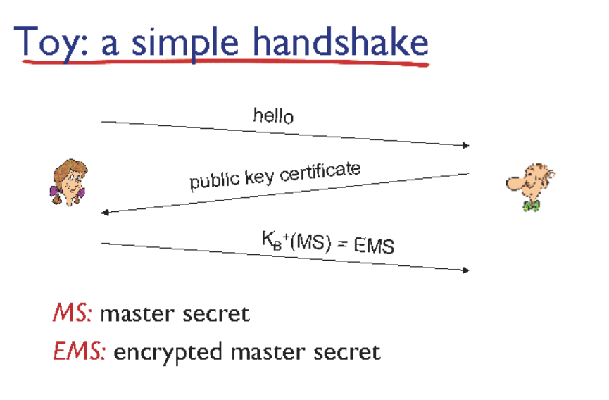

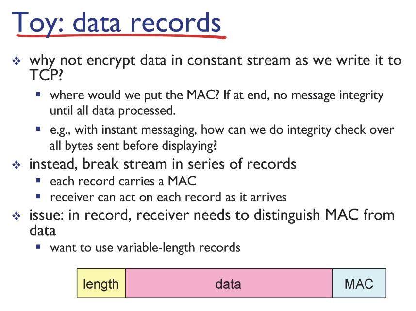

- 공격자가 메세지를 재배치 하거나 중간에 끊어버리는 것을 막기 위해, sequence 정보도 MAC(Message Authentication Code)에 같이 저장함.

TCP connection 생성 → 메세지 보냄 → certification 인증서 통해 public key 확인 → secret key 정하고 → 각각 다른 4가지 역할 하는 키 생성 → 데이터 통신

- type은 데이터, seq는 순서

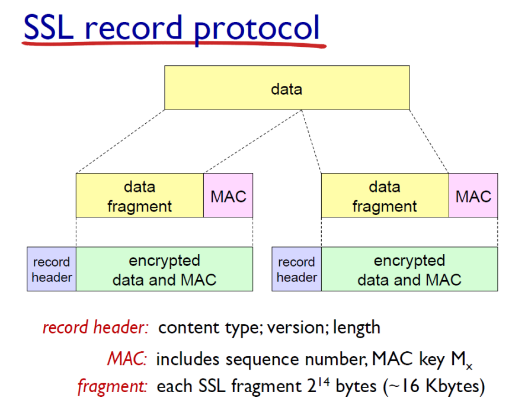

애플리케이션 계층에서 전달 계층으로 보낼 때,  MAC 을 포함한 전체 데이터를 암호화하여 보냄

## Firewalls

게이트웨이에서 외부로 출입하는 패킷을 감시

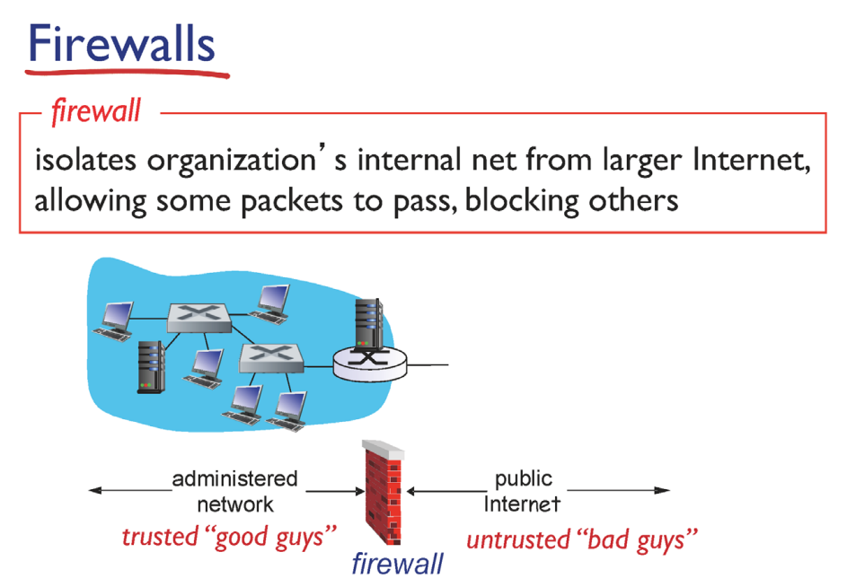

어떤 패킷을 통과시킬지 결정하는 정책은 네트워크 운영자가 결정함

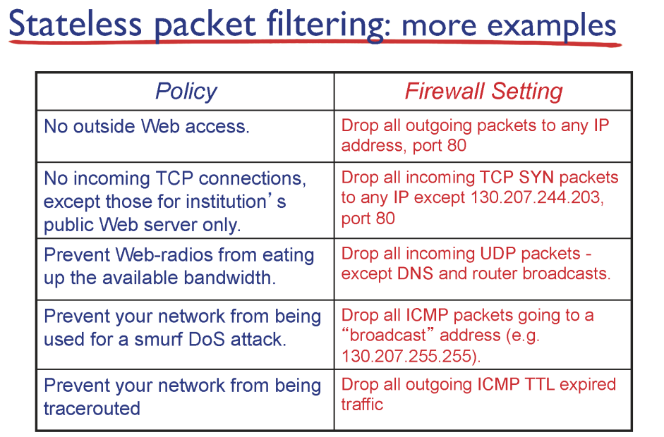

이러한 여러 정책들을 구현할 수 있음

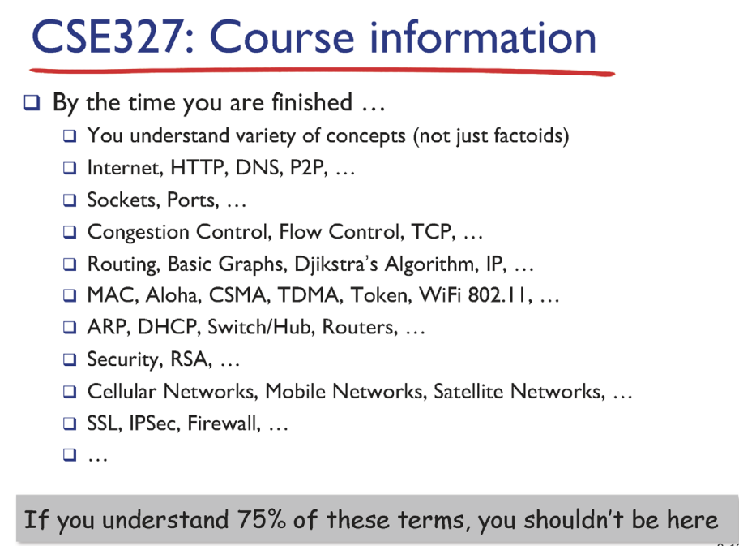