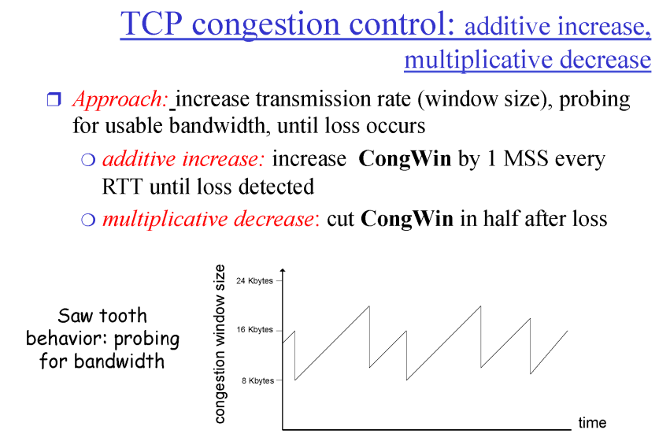

# TransportLayer_4

## TCP Congestion Control  
### 3 main phases (Window size를 늘려나가는 과정)      
1. Slow Start  
    실제로는 exponential 하게 증가. 하지만 작은거에서 점점 커진다는 의미에서는 맞음.  
2. Additive increase  
    Linear하게 늘려나감.  
3. Multiplicative decrease  
    막혔다 싶으면 줄이긴 줄이되 1/2만큼 줄임. 

MSS(Maximum Segment Size) = 500Byte(변화하는 단위)  
  
늘였다 줄였다 하기 때문에 실제로 파일 전송받을 때, 전송속도가 왔다갔다 하는 이유

### TCP Coingestion Control: details

### TCP Slow Start (more)
  
파랑색은 TCP Tahoe 방식. 1980년대 나왔고 현재는 더 이상 쓰지 않음.   
패킷 유실 감지(1. timeout 2. 3duplicate ACK)시 그 시점에서 Threshold를 절반으로 설정하고 처음부터 slow start.  
 
검은색은 TCP Reno 방식. 3duplicate ACK로 패킷 유실 감지시 절반으로 줄이고 Linear increase 사용. timeout시 slow start 다시 시작.

처음 Threshold는 구현하는 사람 마음. 정할 수도 없음. 

### TCP Fairness
결국에는 모든 TCP가 fair하게 됨.  
  
하지만 TCP 그 자체 끼리 공평하다는 내용이기 때문에 TCP통신을 많이 연 사람이 더 많이 가져가는 구조임.