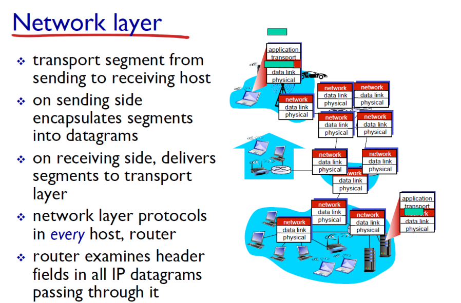

# NetworkLayer_1

어떻게 이동하는 지에 대해 설명한 것. 

### Router에서 하는 일

  
### 1. routing  
    패킷이 출발지에서 목적지로 전달되는 경로를 결정하는 과정
### 2. forwarding  

    * packet의 목적지가 header에 적혀있는데 이것을 보고 전달. 
    * forwarding table에 내용이 있어서 이것을 보고 매칭시켜서 링크로 전달
    * routing algorithm이 forwarding table을 만듬, 주소범위로 표현되어 있음
#### Longeset prefix matching  

가장 길게 매칭되는 entry와 매칭시킴(앞에서부터 봐서 prefix)