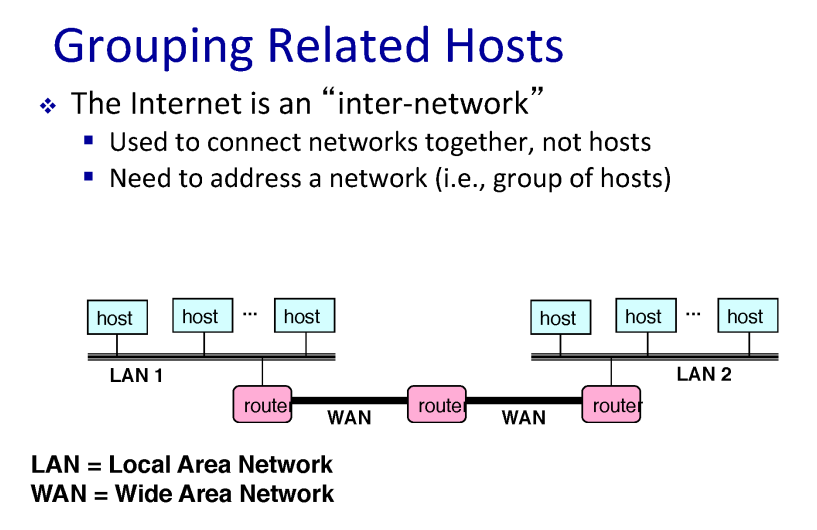
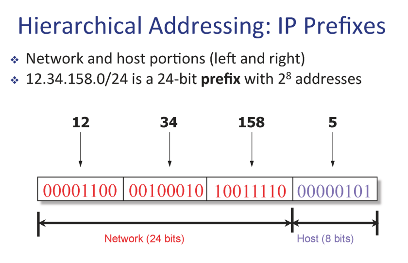
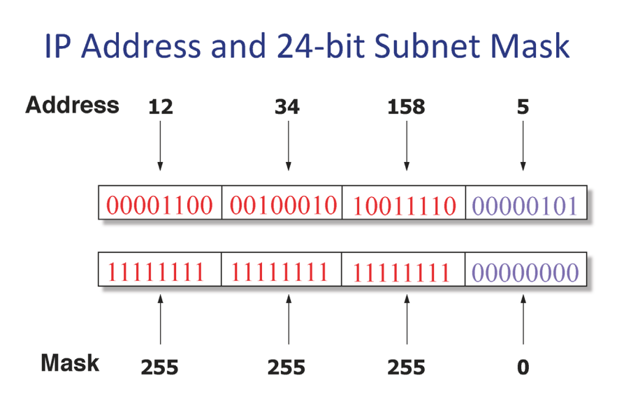
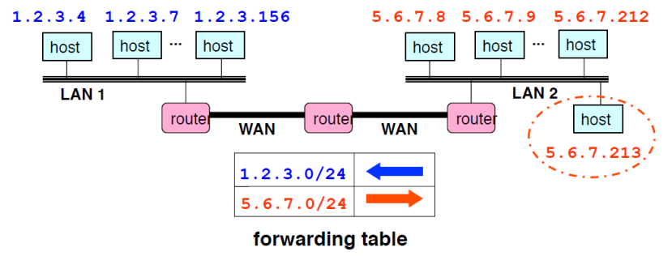
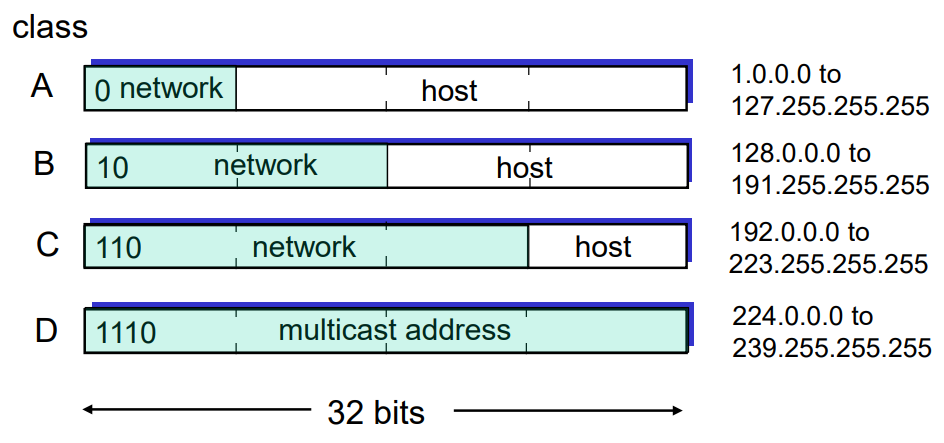
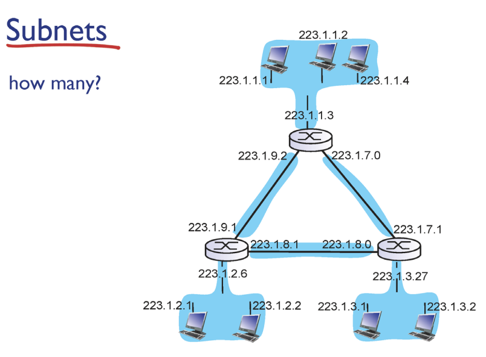

# IP datagram format

1. `VER (Version)` 
    - IP 프로토콜의 버전을 의미
    - IPv4와 IPv6가 현재 사용되고 있으며, 4자리 비트로 이루어져 있음
    - IPv4의 경우 0100, IPv6의 경우 0110으로 표기됨
2. `HLEN(Header Length)`
    - 헤더의 길이를 알려주는 부분
    - 가장 마지막에 포함되는 옵션의 길이에 따라 옵션이 없으면 20 바이트, 최대로 추가되면 60 바이트
    - 위의 그림에선 32 비트인 것처럼 그려지지만, 경우에 따라 옵션 필드가 없을 수도, 훨씬 클 수도 있음
3. `Service Type`
    - 해당 데이터그램의 지연, 우선순위, 신뢰성, 처리량 등의 정보를 담고 있는 필드
    - 8비트로 이루어져 있음
4. `Total Length`
    - 헤더와 데이터 부분을 합한 데이터그램의 전체 길이
5. `TTL(Time to Live)`
    - 수명을 알려주는 필드
    - 데이터그램이 네트워크 상에서 다양한 이유로 목적지에 도착하지 못하고 네트워크를 떠도는 일이 생길 수 있음
    - 이런 일이 늘어나면, 네트워크 흐름을 방해할 수 있고, 상위 계층을 혼란시킬 수 있기 때문에 수명을 다한 데이터그램은 자동으로 폐기됨
6. `Upper Layer`
    - 네트워크 계층의 상위 계층인 전송 계층이 사용하는 프로토콜에 대한 정보를 담고 있음
    - 8비트로 구성
    - 대표적으로 UDP는 17, TCP는 6, ICMP는 1을 사용
    - 리시버 측에서 사용
7. `Header Checksum`
    - 헤더에 오류가 있는지 확인하기 위한 16비트로 이루어진 필드
    - 데이터 링크 계층에서의 Error Control과 같은 역할
8. `Source/Destination IP Address`
    - 각각 32비트로 구성
    - 송신과 수신자의 IP 주소가 기록되어 있음

# IP Address(IPv4)

- `32 비트`의 주소 체계를 가진다.
- 2^32 개의 IP 주소를 가질 수 있다.
- 사람이 읽기 좋게 8비트씩 끊어서 10진수로 변환(0~255) 하여 주소를 읽는다.
- 라우터와 기계들은 32비트만 본다.
- IP주소는 호스트에 들어있는 네트워크 인터페이스 자체를 지칭한다.

컴퓨터 안에 네트워크 인터페이스 카드, nic라고 불리는 게 있음. 예를 들어 램 카드를 끼우는 것도 다 인터페이스. 그래서 IP 주소는 네트워크 인터페이스를 지칭하는 주소이다.

보통 네트워크 인터페이스 카드 한 개를 사용하기 때문에, IP 주소가 한 개 이다. 컴퓨터에 네트워크 인터페이스 카드를 여러 개 끼우면 IP 주소를 여러 개 가질 수 있는데, 이런 대표적인 예가 라우터이다. 라우터는 인터페이스를 여러 개 두면서, 각각 다른 네트워크에 연결돼 있고, 각각 IP 주소를 갖는다.

# Grouping Related Hosts

네트워크들은 라우터로 연결되어 있음

단순하게 IP주소를 배정하는 방법은 막무가내로 배정하면 쉬움.

### 🚨 BUT 문제점?

# Scalability Challenge

라우터 안에 들어있는 forwarding table이 엄청 커지는 문제점 발생

호스트 별로 방향이 다 다르기 때문

→ 현재 IP주소는 이렇게 마구잡이로 배정하지 않음

# Hierarchical Addressing : IP Prefixes

계층화를 시켜놓음

32비트 IP주소는 두 공간으로 나눌 수 있음

- 네트워크 ID(24비트)
- 네트워크에 속한 호스트ID(8비트) : 같은 네트워크에 속한 호스트 들은 같은 네트워크ID를 가진다
- 네트워크ID = 서브넷 ID = prefix

# Subnet Mask

서브넷 마스크란, 어디까지가 네트워크 아이디인지 나타낸 것

IP주소와 서브넷 마스크는 항상 같이 다님

# Scalability Improved

- 같은 네트워크에 속하는 host들은 같은 subnet을 가짐 → forwarding table이 단순해짐
- 1.2.3.0/24 는 왼쪽 네트워크
- 5.6.7.0/24는 오른쪽 네트워크
- 새로운 host 추가할 경우, 새로운 forwarding-table entry 추가할 필요 없이, prefix만 같도록 하여 IP 주소를 배정하면 된다.

# 과거의 IP주소 배정: Classful Addressing

예전에는 IP 주소 prefix 자체의 클래스를 나눠놨습니다. 그래서 위 그림과 같이 클래스a, 클래스 b, 클래스 c가 존재했습니다.

class a에 해당하는 IP 주소 뭉태기들은 prefix가 /8, class b는 /16, class c는 /24 이런 네트워크 주소를 가졌습니다. 네트워크 아이디가 앞에 8, 16, 24 비트라는 얘기죠. 그러니까 클래스 a의 경우 /8에 해당하는 주소를 배정받으면 호스트를 나머지 부분인 2의24승만큼 이론상으로 보유할 수 있게 됩니다.

a의 특징은 무조건 앞에는 0으로 시작합니다. 그래서 2의 7승인 128개의 기관이 이 클래스a라는 어드레스 공간을 획득할 수 있습니다. 전 세계에 기관들이 수백만 개 엄청나게 많을 텐데 그 중에 딸랑 128개의 기관만이 클래스 a를 획득할 수 있다는 것 자체도 문제가 됩니다. 또한 host를 다 못 씁니다 이거는 엄청나게 큰 공간인데, 한 기관이 이걸 쓸 수 있는 크기가 아닙니다. 이로인해 추가적인 낭비가 발생합니다. 클래스 c는 2의 24승 개의 기관에 줄 수 있으니까 양이 많습니다. 그러나 255개까지 호스트를 처리할 수 있어서 너무 적어 문제가 됩니다.

# Classless Inter-Domain Routing(CIDR)

클래스 없는 개념의 주소 공간

예전에 나온 클래스 개념의 배정 시스템이 너무나 비효율적이라 없애고 나온 게 바로 이 클래스가 없는 개념의 주소 공간 배정입니다. 그래서 Classless Inter-Domain Routing해서 이걸 줄여서 CIDR라고 불리는데, 핵심적인 단어는 classless 입니다. 그래서 더 이상 이 8비트 단위로 prefix가 끊어지는 게 아니라, 자유롭게 끊어지게 됩니다.

이 예에서 보면 prefix가 15비트 입니다. 그러니까 이런 게(12.4.0.0/15) 가능합니다.

그래서 과거에 이런 클래스 개념일 때는 이 클래스c짜리 prefix를 갖고 있었기 때문에, 네트워크 안에 있는 라우터들의 포워딩 테이블 크기가 컸습니다.

왜냐하면 포워딩 테이블 엔트리는 네트워크에 존재하는 prefix만큼 갖고 있습니다. 그래서 prefix가 줄면 네트워크 안에 들어있는 라우터들의 포워딩 테이블 크기 자체도 줄어들게 됩니다.

가장 정확하게 일치하는 prefix와 매칭된다.

# Subnet

서브넷이나 네트워크나 비슷한 의미인데 서브넷은 같은 서브넷 id, 같은 prefix를 가진 IP 주소, 같은 prefix를 가진, 인터페이스 디바이스의 집합입니다. 또는 라우터를 거치지 않고 접근이 가능한 호스트들의 집합입니다. 예를 들면 이미지의 왼쪽 애들은 서브넷 id, prefix가 223.1.1 입니다. 그래서 여기 애들은 다 223.1.1 가졌습니다.

라우터가 IP 주소를 인터페이스 개수만큼 가지니까, 오히려 라우터는 IP 주소를 호스트 보다 많이 가집니다. 라우터 지금 인터페이스가 IP 주소 3개의 prefix가 다릅니다. 즉, 라우터는 하나의 서브넷에 속한 게 아니라 여러 개의 서브넷의 교집합 입니다. 그래서 이 교집합을 통해서만 다른 집합으로 갈 수 있습니다.

이 예시의 경우 subnet의 개수는 `6개` 입니다

- 223.1.1
- 223.1.2
- 223.1.3
- 223.1.7
- 223.1.8
- 223.1.9