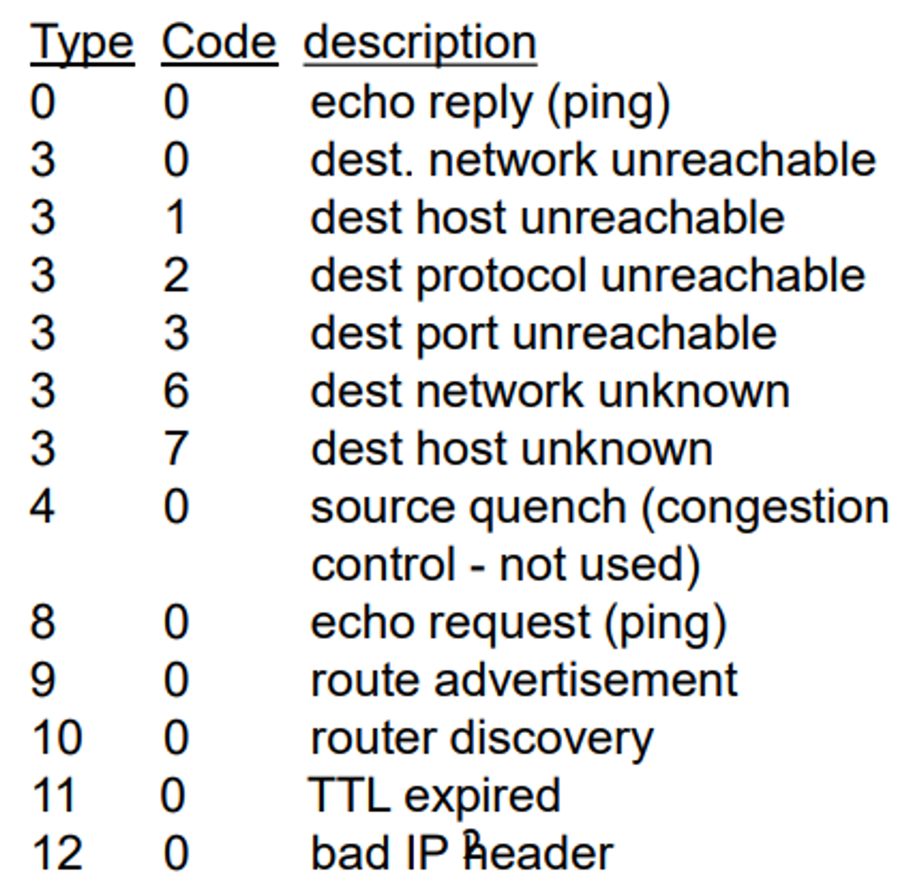
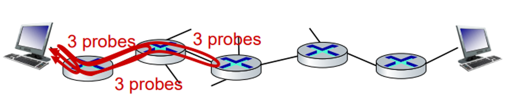
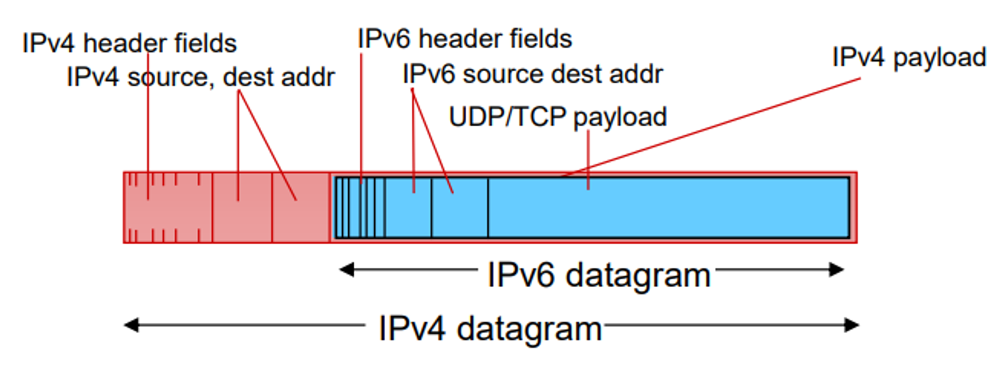
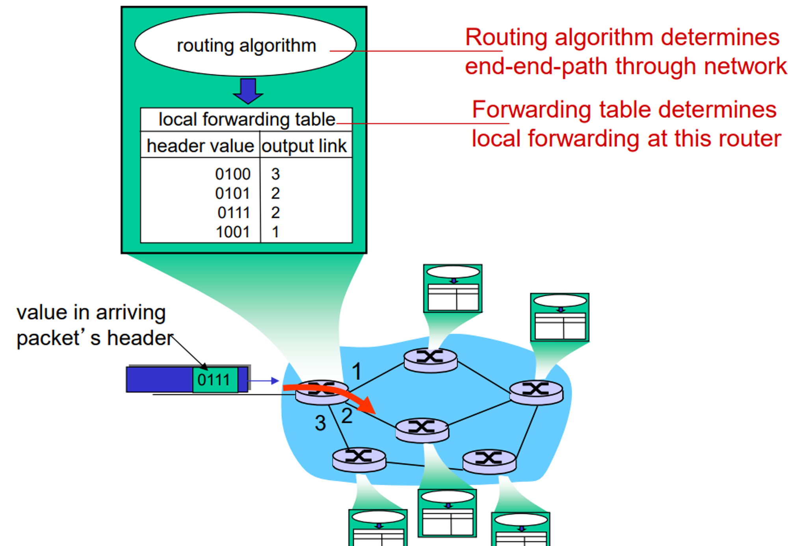
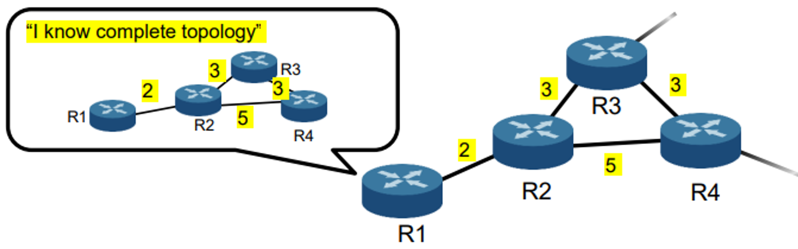
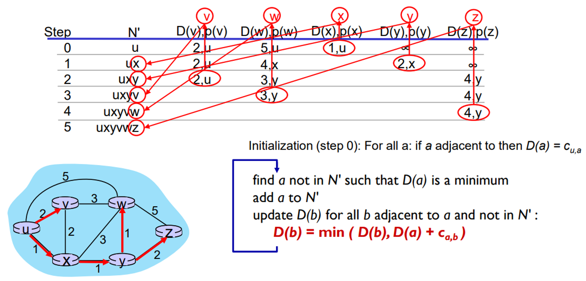
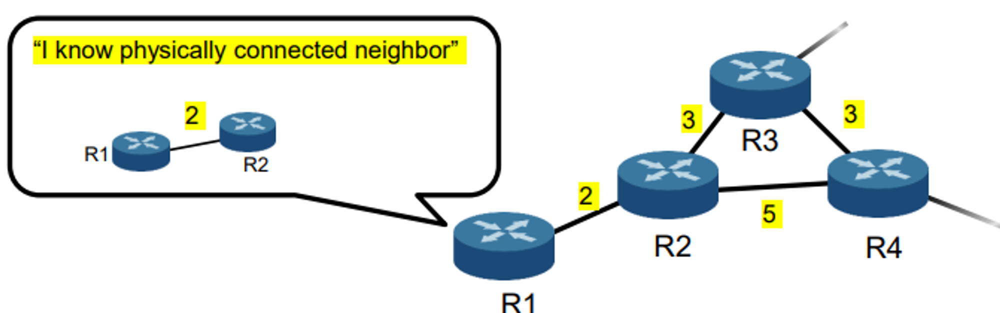
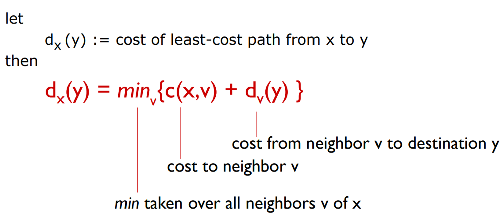
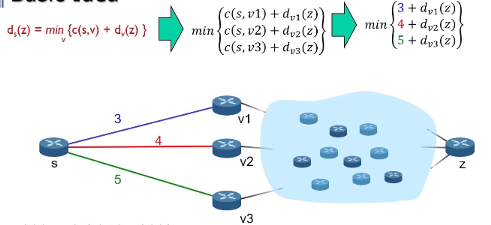

## 1. Internet Control Message Protoco(ICMP)

> Used by hosts and routers to communicate network-level information
> 
> - error reporting: unreachable host, network, port, protocol (에러 메세지)
> - echo request/reply (used by ping) (리퀘스트 확인하기)

**ICMP message: type, code plus first 8 bytes of IP datagram causing error**

타입 11번 TTL : TTL이 0이되서 버렸다고 알려줘야 한다.

## 2. Traceroute & ICMP

목적지까지 가는데 정보를 찾아주는 유틸리티.

> source sends sets of UDP segments to destination
> 
> - 1st set has TTL =1, 2nd set has TTL=2, etc.
> 
> **datagram in nth set arrives to nth router:**
> 
> - router discards datagram and sends source ICMP message (type 11,
> 
> code 0)
> 
> - ICMP message possibly includes name of router & IP address
> 
> **When ICMP message arrives at source: record RTTs**
> 

## 3. Transition From IPv4 to IPv6

> Not all routers can be upgraded simultaneously
> 
> - no “flag days”
> - how will network operate with mixed IPv4 and IPv6
> 
> routers?
> 
> **Tunneling: IPv6 datagram carried as payload in IPv4 datagram among IPv4 routers (“packet within a packet”)**
> 
> (터널링 : IPv4와 IPv6를 같이 사용할수 있게 하는 기술)
> 
> - tunneling used extensively in other contexts (4G/5G)

---

## 1. Interplay Between Routing and Forwarding

라우팅 알고리즘을 통해서 포워딩 테이블이 생성 됩니다.

## 2. Link-state algorithm

- Based on dijkstra’s algorithm

## 3. Distance-vector algorithm

- Based on bellman-ford equation (dynamic programming)

> 위 그림에 따르면 라우터는 자신과 연결된 라우터 하나의 비용만 계산을 할 수 있다.
> 

