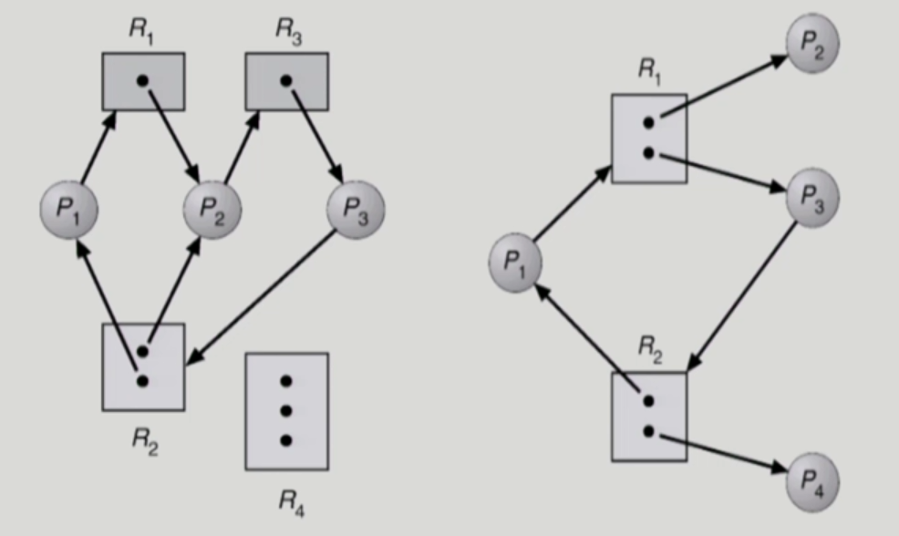
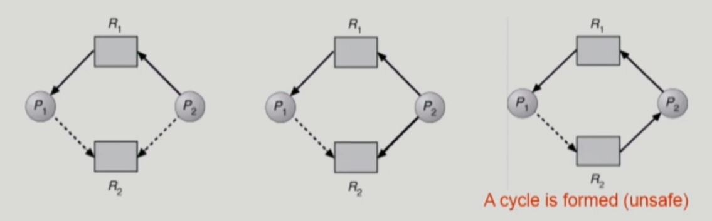
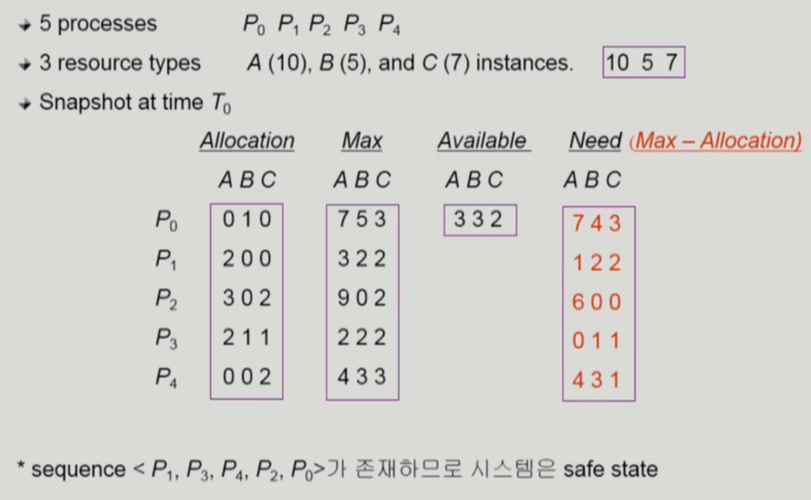

# 운영체제 7. Deadlock
- [Deadlock 기초 개념](#Deadlock_기초_개념)
- [Deadlock 발생의 4가지 조건](#Deadlock_발생의_4가지_조건)
- [Deadlock 처리방법](#Deadlock의_처리_방법)
- [Deadlock 현실예시](#DeadLock_Example)

## Deadlock_기초_개념

### Deadlock
    - 일련의 프로세스들이 서로가 가진 자원을 기다리며 block된 상태
### Resource (자원)
    - 하드웨어, 소프트웨어 등을 포함하는 개념 ex) I/O device, CPU cycle, memory space, semaphore 등
    - 프로세스가 자원을 사용하는 절차
    1) Request : 자원 요청
    2) Allocate : 자원 획득
    3) Use : 자원 사용
    4) Release : 자원 반납

## Deadlock_발생의_4가지_조건

### 1. Mutual exclusion (상호 배제)
매 순간 하나의 프로세스만이 자원을 사용 가능

### 2. No preemption (비선점)
프로세스는 자원을 스스로 내어놓을 뿐 강제로 빼앗기지 않음

### 3. Hold and wait (보유대기)
자원을 가진 프로세스가 다른 자원을 기다릴 때 보유 자원을 놓지 않고 계속 가지고 있음

### 4. Circular wait (순환대기)
- 자원을 기다리는 프로세스 간에 사이클이 형성되어야 함
ex) 프로세스 P_0,  P_1, P_2, P_N이 있을 때
P_0는 P_1이 가진 자원을 기다림, P_1은 P2가 가진 자원을 기다림, ..., P_N-1은 P_N이 가진 자원을 기다림, P_N은 P_0이 가진 자원을 기다림

## Resource-Allocation graph (자원할당그래프)
  
#### Vertex
    - Process P = {P1, P2, ... , Pn}
    - Resource R = {R1, R2, ..., Rn}
#### Edge
    - request edge Pi -> Rj (스레드가 자원을 요청)
    - Assignment edge Rj -> Pi (자원을 할당받은 상태)

#### Deadlock 판별법
1. 그래프에 cycle이 없으면 **Deadlock**이 아니다.
2. 그래프에 cycle이 있으면  
    1. 자원당 instance 한 개만 있으면 **Deadlock**  
    2. 자원당 several instance 시 Deadlock 일 수도 아닐 수도 있다.
    3. 예시에서 왼쪽은 **Deadlock**, 오른쪽은 Deadlock이 아니다.

## Deadlock의_처리_방법 
(번호가 작을수록 강한 방법)

### 1. Deadlock Prevention
자원 할당 시 Deadlock의 4가지 필요 조건 중 어느 하나가 만족되지 않도록 하는 것  
1. #### Mutual Exclusion  
    - 공유해서는 안되는 자원의 경우 반드시 성립해야 함
2. #### Hold and Wait
    - 프로세스가 자원을 요청할 때 다른 어떤 자원도 가지고 있지 않아야 한다.
    - 방법 1. 프로세스 시작 시 모든 필요한 자원을 할당받게 하는 방법
    - 방법 2. 자원이 필요한 경우 보유 자원을 모두 놓고 다시 요청    
3. #### No Preemption
    - process가 어떤 자원을 기다려야 하는 경우 이미 보유한 자원이 선점됨
    - 모든 필요한 자원을 얻을 수 있을 때 그 프로세스는 다시 사용된다.
    - State를 쉽게 save하고 restore할 수 있는 자원에서 주로 사용 (CPU, memory)
4. #### Circular Wait
    - 모든 자원 유형에 할당 순서를 정하여 정해진 순서대로만 자원 할당
    - 예를 들어 순서가 3인 자원 Ri를 보유 중인 프로세스가 순서가 1인 자원 Ri을 할당받기 위해서는 우선 Ri를 release해야 한다.    

==> **Utilization 저하, throughput 감소, starvation 문제** 

**throughput(처리율)** : 통신에서 네트워크 상의 어떤 노드나 터미널로부터 또 다른 터미널로 전달되는 단위 시간당 디지털 데이터 전송으로 처리하는 양  
**starvation** : 특정 프로세스의 우선 순위가 낮아서 원하는 자원을 계속 할당받지 못하는 상태
### 2. Deadlock Avoidance
    - 자원 요청에 대한 부가적인 정보를 이용해서 Deadlock의 가능성이 없는 경우에만 자원을 할당  
    - 시스템 state가 원래 state로 돌아올 수 있는 경우에만 자원 할당  
    - 가장 단순하고 일반적인 모델은 프로세스들이 필요로 하는 각 자원별 최대 사용량을 미리 선언하도록 하는 방법
#### safe state
-시스템 내의 프로세스들에 대한 safe sequence가 존재하는 상태
#### safe sequence
- 프로세스의 sequence <P1, P2, ..., Pn>이 safe하려면 Pi(1<=i <= n)의 자원 요청이 "가용 자원 + 모든 Pj(j < i)의 보유 자원"에 의해 충족되어야 함.
- 조건을 만족하면 다음 방법으로 모든 프로세스이 수행을 보장
    - Pi의 자원 요청이 즉시 충족될 수 없으면 모든 Pj( j < i )가 종료될 때까지 기다린다.
    - Pi-1이 종료되면 Pi의 자원요청을 만족시켜 수행한다.

#### Deadlock을 피하는 2가지 알고리즘 
    - Single instance per resource types
        - Resource Allocation Graph algorithm 사용
    - Multiple instance per resource types
        - Bankers' Algorithm 사용   

### Resource Allocation Graph algorithm        
#### Claim edge Pi -> Rj  
    - 프로세스 Pi가 자원 Rj를 미래에 요청할 수 있음을 뜻함(점선으로 표시)
    - 프로세스가 해당 자원 요청시 request edge로 바뀜 (실선)
    - Rj가 release되면 assignment edge는 다시 claim edge로 바뀐다.
request edge의 assignment edge 변경시 (점선을 포함하여) cycle이 생기지 않는 경우에만 요청 자원을 할당한다.
- Cycle 생성 여부 조사시 프로세스의 수가 n일 때  O(n^2) 시간이 걸린다.

  

### Bankers's Algorithm 
  
굉장히 보수적으로 잡음 Available이 Need보다 작으면 주지 않는 매커니즘

### 3. Deadlock Detection and recovery
Deadlock 발생은 허용하되 그에 대한 detection 루틴을 두어 Deadlock 발견시 recover

### Recovery
    - Process Termination
        - 데드락 연루된 프로세스를 전부 죽이는 것
        - 데드락이 없애질 때까지 하나씩 프로세스를 죽여보는 것
    - Resource Preemption
        - 비용을 최소화할 victim 선정
        - saft state로 rooblack하여 process를 restart
        - Starvation 문제
            1. 동일한 프로세스가 계속해서 victim으로 선정되는 경우
            2. cost factor에 roolback 횟수도 같이 고려

### 4. **Deadlock Ignorance** 
- Deadlock을 시스템이 책임지지 않음
- UNIX를 포함한 대부분의 OS가 채택

Deadlock은 자주 발생하지 않기 때문에, 미연에 방지하는데 많은 오버헤드를 들이는 것이 현대 시스템에서는 비효율적 따라서 4번 채택. 문제 생길시 사용자가 직접 process를 죽이는 등의 방법으로 해결.

### DeadLock_Example
#### 싱글톤 패턴 (Singleton patton) 사용  
싱글톤이 공유 자원이며 이 싱글턴에 값을 쓰거나 읽기 위해 잠금을 사용하는 스레드들이 경쟁하면서 교착 발생 가능
#### 서블릿 클래스 내에서 멤버 변수 정의 등  
서블릿 컨테이너는 싱글처럼 서블릿 객체를 재활용. 따라서 웹 요청을 처리하는 과정에서 멤버 변수에 읽고 쓰기를 반복하는 경우 발생 가능(단위 테스트 때 발생 x, 실제 운영 때 발생)  
단위 테스트 때는 스레드들이 경쟁하지 않는 환경으로 멤버 변수 훼손 원인 제거되어 있어서 발생 x, 운영 때 여러 스레드들이 제대로 경쟁하면서 서블릿 클래스의 멤버 변수를 훼손하는 동시 사용의 순간이 등장하기 때문
#### DB에서의 고착 상태 
어러 세션들이 공유 자원인 테이블을 공유하면서 빈번히 테이블에 레코드를 쓰거나, 읽거나, 갱신하거나 삭제  
이 과정에서 자원의 무결성을 보장하기 위해 동기 매커니즘 실행하는 데, 이 동기 매커니즘(트랜잭션) 을 동시에 실행하는 경우 교착 상태에 빠질 수 있음  
대부분의 DB는 자체 해결 매커니즘 내장 -> 오라클의 경우 교착 상태를 판단하는 데 60초를 기준 시간으로 삼음. 60초가 지나면 관련 세션들 중 일부를 끊어 문제를 해결.