# 운영체제 8. Memory Management
- [Logical and Phsyical Address](#Logical_and_Physical_Address)
- [주소 바인딩](#주소_바인딩)
- [Some Terminologies](#Some_Terminologies)

## Logical_and_Physical_Address

### Logical address(virtual address) 
    - 프로세스마다 독립적으로 가지는 주소 공간
    - 각 프로세스마다 0번지부터 시작
    - CPU가 보는 주소는 logical address임

### Physical address
    - 메모리에 실제 올라가는 위치

## 주소_바인딩
주소 바인딩이란 주소를 결정하는 것
Symbolic Address -> Logical Address -> Physical address
Logical -> Physical 로 변하는 시점이 중요하며 이 방법은 3가지가 있음

### 1. Compile time binding
    - 물리적 메모리 주소가 컴파일 시 알려짐
    - 시작 위치 변경시 재컴파일
    - 컴파일러는 절대 코드(absolute code) 생성

### 2. Load time binding
    - Loader의 책임하에 물리적 메모리 주소 부여
    - 컴파일러가 재배치가능코드(relocatable code)를 생성한 경우 가능

### 3. Execution time binding (=Run time binding)
    - 수행이 시작된 이후에도 프로세스의 메모리 상 위치를 옮길 수 있음
    - CPU가 주소를 참조할 때마다 binding을 점검 (address mapping table)
    - 하드웨어적인 지원이 필요 (e.g., base and limit registers, MMU).
**MMU** : Memory Management Unit

### 3가지 방식의 비교 
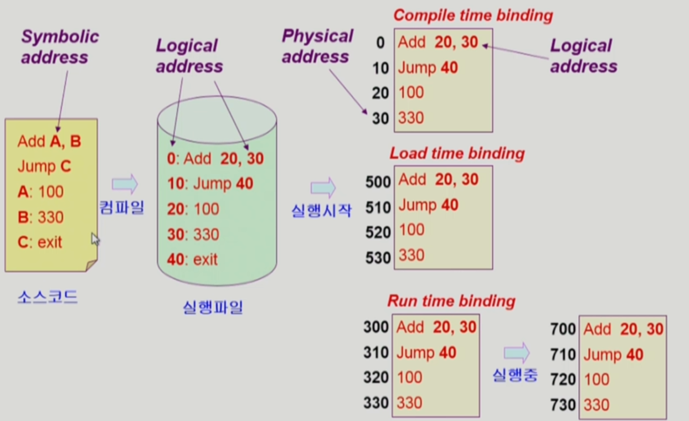
Compile time binding : Logical address때 결정된 주소대로 올려야함. 빈 공간이 많아도 0번지부터 시작. 옛날에는 한 개만 돌아가서 사용했으나, 현재는 빈 공간이 많기 때문에 사용 x
-> 위치주소를 바꾸고 싶으면 컴파일부터 다시 해야함

Load time binding : Load시점에서 비어있는 메모리를 보고 올리는 것. 500번지가 비어있어서 500부터 넣어줌 -> 컴파일러가 relocatable code 생성 이 코드는 어느 위치든 올라갈 수 있음

Run time binding : 실행중에 이동가능 (예시에서는 300번지에서 700번지로 이동) 지금 사용하는 컴퓨터들은 Run time binding 지원

### Memory-Management Unit(MMU)

#### MMU 
    - logical address를 physical address로 매핑해 주는 Hardware device
    - base register 와 limit register를 이용해 변환

#### MMU scheme
    - 사용자 프로세스가 CPU에서 수행되며 생성해내는 모든 주소값에 대해 base register(=relocation register)의 값을 더 한다.

#### user preogram
    - logical address만을 다룬다.
    - 실제 physical address를 볼 수 없으며 알 필요가 없다.

#### Dynamic Relocation
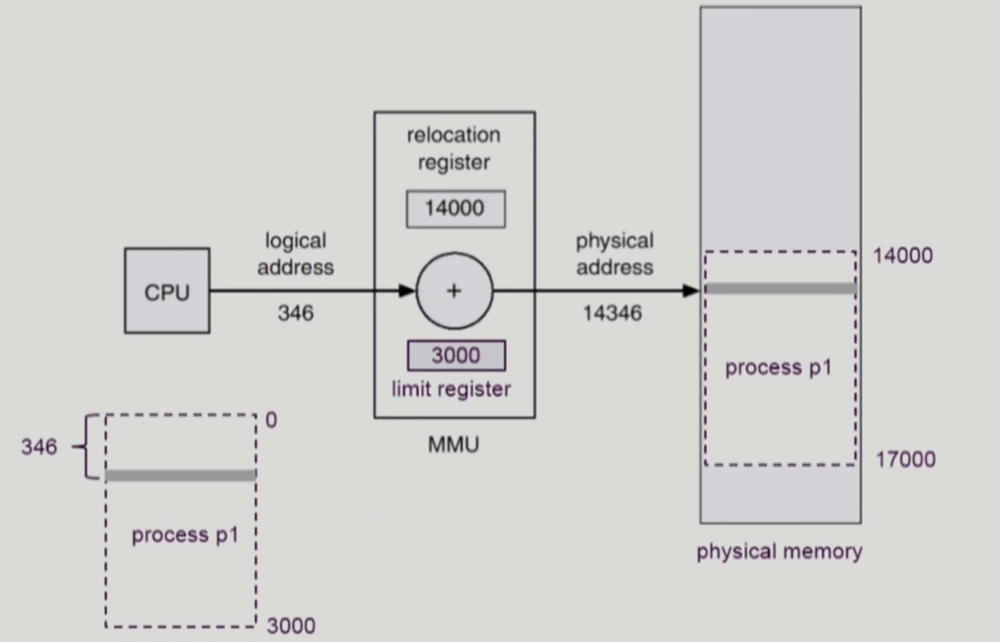    

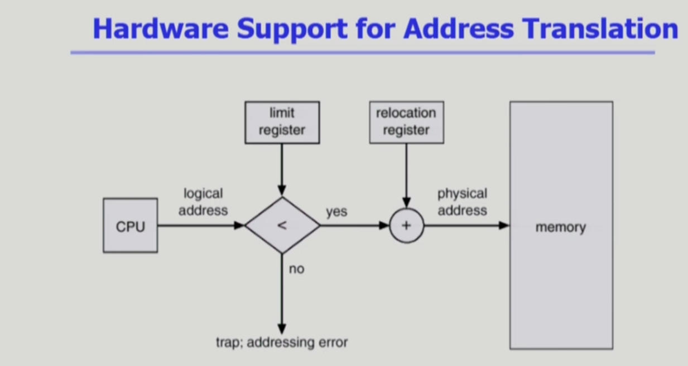
운영체제 및 사용자 프로세스 간의 메모리 보호를 위해 사용하는 레지스터
Relocation register(=base register) : 접근할 수 있는 물리적 메모리 주소의 최소값
Limit register는 프로그램의 크기를 담고 있음.
악의적 사용자가 불가능한 주소를 달라고 하면 trap에 걸리고,  운영체제가 이를 응징(프로그램을 닫는다는 등)

## Some_Terminologies
    1. Dynamic Loading
    2. Dynamic Linking
    3. Overlays
    4. Swapping

### Dynamic Loading
    - 프로세스 전체를 메모리에 미리 다 올리는 것이 아니라 해당 루틴이 불려질 때 메모리에 load 하는 것
    - memory utilization의 향상
    - 가끔씩 사용되는 많은 양의 코드의 경우 유용 ex) 오류 처리 루틴
    - 운영체제의 특별한 지원 없이 프로그램 자체에서 구현 가능 (OS는 라이브러리를 통해 지원 가능)
**Loading** : 메모리로 올리는 것

### Dynamic Linking
    - Linking을 실행 시간 (execution time)까지 미루는 기법
    - Static linking
        - 라이브러리가 프로그램의 실행 파일 코드에 포함됨
        - 실행 파일의 크기가 커짐
        - 동일한 라이브러리를 각각의 프로세스가 메모리에 올리므로 메모리 낭비 (eg. printf 함수의 라이브러리 코드)
    - Dynamic Linking
        - 라이브러리가 실행시 연결(link)됨
        - 라이브러리 호출 부분에 라이브러리 루틴의 위치를 찾기 위한 stub이라는 작은 코드를 둠
        - 라이브러리가 이미 메모리에 잇으면 그 루틴의 주소로 가고 없으면 디스크에서 읽어옴
        - 운영체제의 도움이 필요

### Overlays
    - 메모리에 프로세스의 부분 중 실제 필요한 정보만을 올림
    - 프로세스의 크기가 메모리보다 클 때 유용
    - 운영체제의 지원없이 사용자에 의해 구현
    - 작은 공간의 메모리를 사용하던 초창기 시스템에서 수작업으로 푸로그래머가 구현
        - "Manual Overlay"
        - 프로그래밍이 매우 복잡
Dynamic Loading vs Overlays : 운영체제의 지원없이 사용자가 하면 Overlays, 운영체제 라이브러리 통해서 도움을 받으면 Dynamic Loading

### Swapping

#### Swapping
    -프로세스를 일시적으로 메모리에서 backing store로 쫓겨나는 것
    
#### Backing store (=swap area)
    - 디스크 : 많은 사용자의 프로세스 이미지를 담을 만큼 충분히 빠르고 큰 저장 공간    

#### Swap in /Swap out
    - 일반적으로 중기 스케줄러(swapper)에 의해 swap out 시킬 프로세스 선정
    - priority-based CPU scheduling algorithm
        - priority가 낮은 프로세스를 swapped out 시킴
        - priority가 높은 프로세스를 메모리에 올려 놓음
    - Compoile time 혹은 load time binding에서는 원래 메모리 위치로 swap in 해야 함
    - Execution time binding에서는 추후 빈 메모리 영역 아무 곳에나 올릴 수 있음
    - swap time은 대부분 transfer time (swap되는 양에 비례하는 시간)임

## Allocation ohf Physical Memory
  
메모리는 일반적으로 두 영역으로 나뉘어 사용  
- OS 상주 영역   
    - interrupt vector와 함께 낮은 주소 영역 사용  
- 사용자 프로세스 영역
    - 높은 주소 영역 사용

사용자 프로세스 영역의 할당 방법
- Contiguous allocation
    : 각각의 프로세스가 메모리의 연속적인 공간에 적재되도록 하는 것
    - Fixed partition allocation
    - Variable partition allocation
- Noncontiguous allocation
    : 하나의 프로세스가 메모리의 여러 영역에 분산되어 올라갈 수 있음
    - Paging
    - Segmentaition
    - Paged Segmentation

### Contiguous allocation
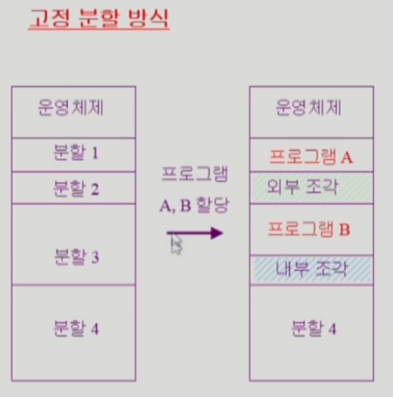  
- 고정분할 (Fixed parititon allocation) 방식  
    - 물리적 메모리를 몇 개의 영구적 분할(partition)으로 나눔  
    - 분할의 크기가 모두 동일한 방식과 서로 다른 방식 존재  
    - 분할당 하나의 프로그램 적재  
    - 융통성 x  
        - 동시에 메모리에 load 되는 프로그램의 수가 고정됨
        - 최대 수행 가능 프로그램 크기 제한
    - Internal fragmentation 발생 (external fragmentation도 발생)    

외부 조각(Internal fragmentation) : 조각이 너무 작아서 프로그램을 사용할 수 없는 공간  
내부 조각(external fragmentation) : 공간이 커서 프로그램을 사용하고 남는 공간

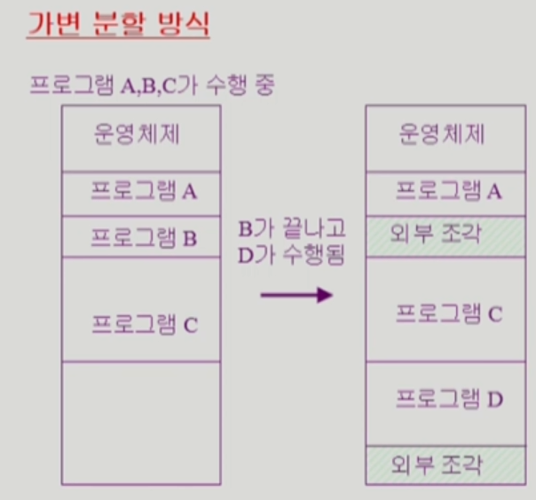  
- 가변분할 (Variable partition allocation) 방식
        - 프로그램의 크기를 고려해서 할당  
        - 분할의 크기, 개수가 동적으로 변함  
        - 기술적 관리 기법 필요  
        - External fragmentation 발생

#### Hole
    - 가용 메모리 공간
    - 다양한 크기의 hole들이 메모리 여러 곳에 흩어져 있음
    - 프로세스가 도착하면 수용가능한 hole을 할당
    - 운영체제는 다음의 졍보를 유지 1) 할당 공간 2) 가용 공간 (hole)
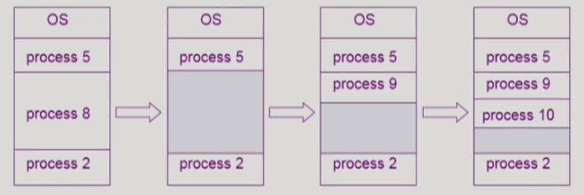

#### Dynamic Storage-Allocation Problem
: 가변 분할 방식에서 size n인 요청을 만족하는 가장 적절한 hole을 찾는 문제
**First-fit** : size가 n 이상인 것 중 최초로 찾아지는 hole에 할당
**Best-fit** 
-Size가 n 이상인 가장 작은 hole을 찾아서 할당  
-Hole들의 리스트가 크기순으로 정렬되지 않은 경우 모든 hole의 리스트를 탐색해야함
- 많은 수의 아주 작은 hole들이 생성됨

**Worst-fit**
- 가장 큰 hole에 할당
- 역시 모든 리스트를 탐색해야 함
- 상대적으로 아주 큰 hole들이 생성됨

First-fit과 best-fit이 worst-fit보다 속도와 공간 이용률 측면에서 효과적인 것으로 알려짐 (실험적인 결과)

#### compaction
디스크 조각 모음같은 느낌
- external fragmentation 문제를 해결하는 한 가지 방법 
- 사용 중인 메모리 영역을 한군데로 몰고 hole들을 다른 한 곳으로 몰아 큰 block을 만드는 것
- 매우 비용이 많이 드는 방법임(binding을 모두 확인하고 처리해야할 것이 많음)
- 최소한의 메모리 이동으로 compaction하는 방법 (매우 복잡한 문제)
- Compaction은 프로세스의 주소가 실행 시간에 동적으로 재배치 가능한 경우에만(Run time binding) 수행될 수 있다.

## Paging
불연속 할당을 쓰게 되면 주소 변환이 복잡해짐.

- 프로그램을 구성하는 주소공간을 같은 크기의 페이지로 자르는 것.
- Virtual memory의 내용이 page 단위로 noncontiguous하게 저장됨
- 일부는 backing storage에, 일부는 physical memory에 저장

### Basic Method
- physical memory를 동일한 크기의 frame으로 나눔
- logical memory를 동일 크기의 page로 나눔 (frame과 같은 크기)
- 모든 가용 frame들을 관리
- page table을 사용하여 logical address를 physical address로 변환
- External fragmentation 발생 안함
- Internal fragmentation 발생 가능
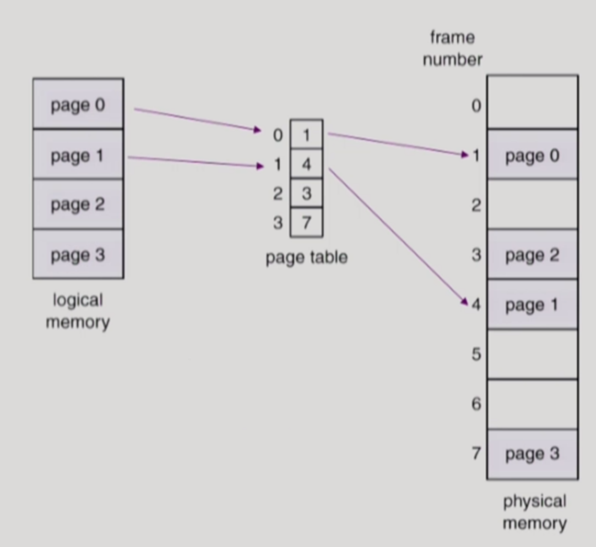  
페이지 개수만큼 페이지 엔트리가 존재하고 각각의 페이지 엔트리에는 몇번 물리적 프레임에 올라갔는지 기록됨

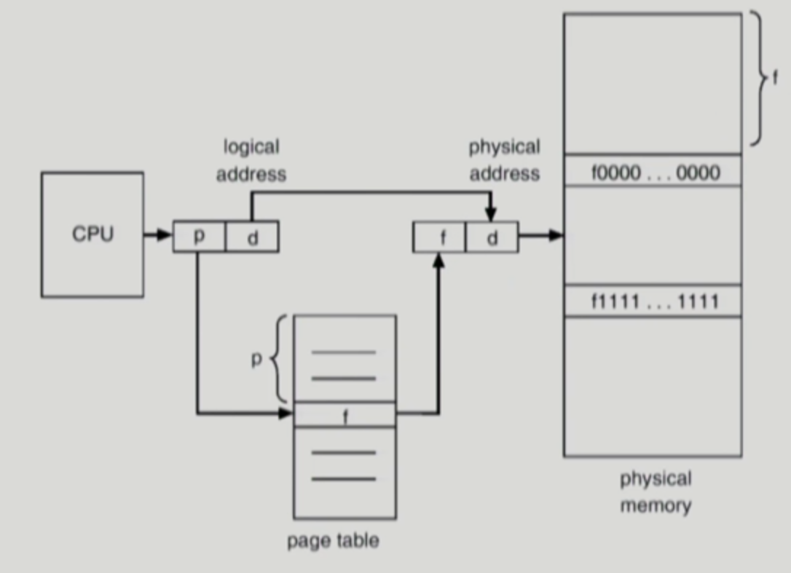

### Page Table 위치
프로그램 하나의 주소공간이 100만개정도로 짤림. 또한 프로그램마다 page table이 필요. page table 자체의 용량이 크기 때문에 저장이 골치
결국 page table도 메모리에 넣게 됨

### Implementation of Page Table
- Page Table은 main memory에 상주
- Page-table base register (PTBR)가 page table을 가리킴
- Page-table length register (PTLR)가 테이블 크기를 보관
- 모든 메모리 접근 연산에는 2번의 memory access 필요
- page table 접근 1번, 실제 data/instruction 접근 1번
- 속도 향상을 위해 **associative register** 혹은 **translation look-aside buffer(TLB)** 라 불리는 고석의 lookup hardware cache 사용

#### TLB (Associative register)
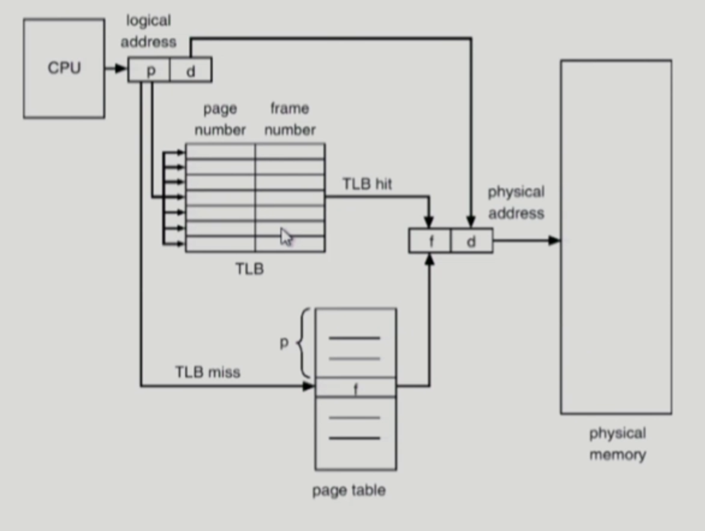  
- 메모리 주소 변환을 위한 캐시메모리  
- CPU가 주소 요청을 하면 주소 변환 정보 중에서 TLB에 저장되있는지 먼저 검색, 없으면 page table에서 확인. 전부 저장하는게 아닌 빈번히 참조되는 것만 저장  
- TLB는 결국 전체를 서치해야 체크가 가능  
- parrell search가 가능

#### Effective Access Time
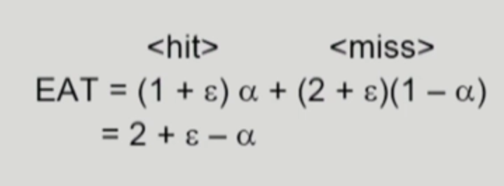
Hit ratio : α
Associative register lookup time : ε

### Two-Level Page Table
- 현대의 컴퓨터는 address space가 매우 큰 프로그램 지원
- 32 bit address 사용시 : 2^32(4G)의 주소 공간
    - page size가 4K시 1M개의 page table entry 필요
    - 각 page entry가 4B시 프로세스당 4M의 page table 필요
    - 보통 4G의 주소 공간 중 지극히 일부만 사용하므로 page table 낭비 심함

=> page table 자체를 page로 구성  
=> 사용되지 않는 주소 공간에 대한 outer page table의 엔트리 값은 NULL(대응하는 inner page table이 없음) => 이로인해 더 효율적인 공간 활용이 가능해짐   

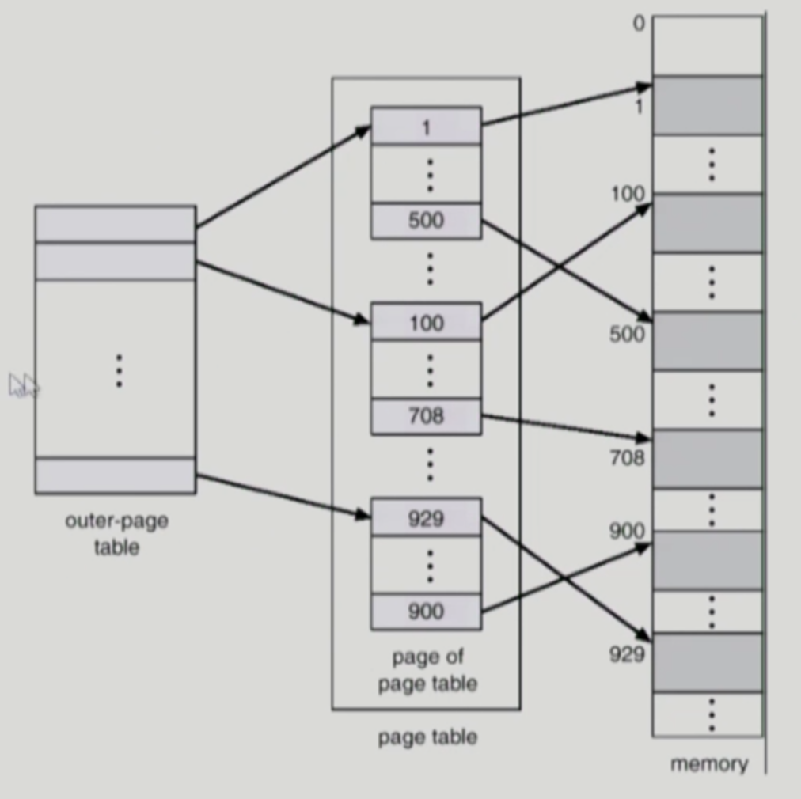
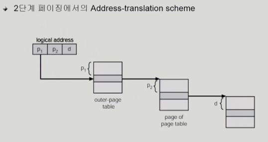

#### Two-Level Paging Example
logical address(on 32-bit machine with 4K pages size)의 구성
- 20 bit의 page number
- 12 bit의 page offset

page table 자체가 page로 구성되기 때문에 page number는 다음과 같이 나뉜다.
(각 page table entry가 4B)
- 10 bit의 page number (남는 비트)
- 10 bit의 page offset (1K구분하기 위해서는 10bit가 필요 (2^10 = 1K))

따라서, logical address는 다음과 같다.
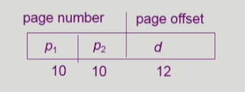
**P1** 은 outer page table의 index이고
**P2** 는 outer page table의 page에서의 변위(displacement)

### Multilevel Paging and Performance
2단계 뿐만 아니라, 3단계, 4단계도 가능  
이렇게 하면 테이블 공간은 줄일 수 있지만, 주소변환 시 거치는 관계가 많아져 시간 오버헤드가 심함(시간이 오래걸림) 
하지만 대부분의 주소변환은 TLB를 통해 직접적으로 변환되므로 시간이 그렇게 오래걸리지는 않음

#### Protection bit
- page에 대한 접근 구너한 (read/write/ read only)

#### Vaild-invalid bit
- Valid는 해당 주소의 frame에 그 프로세스를 구성하는 유효한 내용이 있음을 뜻함.
- invalid는 해당 주소의 frame에 유효한 프로세스가 없음 (프로세스가 그 주소 부분을 사용하지 않거나, swap area에 있던가)

### Inverted Page Table
- page table이 매우 큰 이유
    - 모든 procss 별로 그 logical address에 대응하는 모든 page에 대해 page table entry가 존재
    - 대응하는 page가 메모리에 있든 없든 간에 page table에는 entry로 존재

- Inverted Page Table
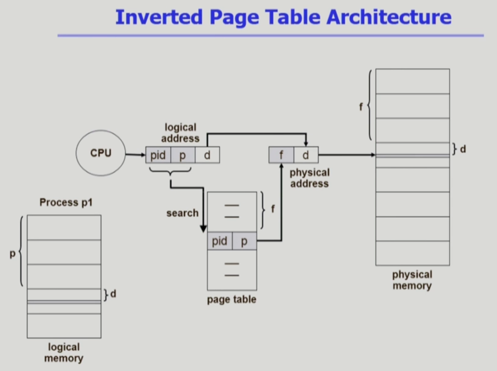  
**pid** : process id  
- 시스템에 page table이 한 개만 존재. (공간을 줄이기 위해 사용)  
- 물리적 메모리를 기준으로 변환 (physical memory -> logical memory)  
- 시간적인 오버헤드가 있음
- 이 방식에서는 테이블 전체를 탐새해야 하기 때문에 associative register를 사용해서 해결

### Shared Page
#### Shared code
    - Re-entrant Code (=Pire code)
    - read-only로 하여 프로세스 간에 하나의 code만 메모리에 올림
    (eg, text editors, compilers, window systems).
    - Shared code는 모든 프로세스의 logical address space에서 동일한 위치에 있어야 함.
    (코드 안에는 logical address가 적혀 있음)
#### Private code and data
    - 각 프로세스들은 독자적으로 메모리에 올림
    - Private data는 logical address space의 아무 곳에 와도 무방

### Shared Pages Example
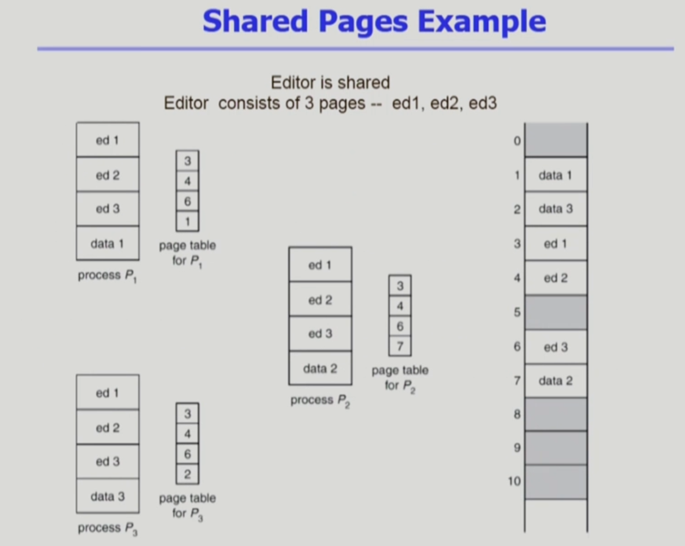
같은 프로그램이면 같은 내용일 것이니 바뀌는 data부분만 별도로 저장해서 꺼내 사용.

## Segmentation
프로그램은 의미 단위인 여러 개의 segment로 구성  
- 작게는 프로그램을 구성하는 함수 하나하나를 세그먼트로
- 크게는 프로그램 전체를 하나의 세그먼트로
- 일반적으로는 Code segment, Data segment, Stack segment

Segment는 다음과 같은 logical unit들임
- main()
- function
- global variables
- stack
- symbol table, arrays

Logical address는 다음의 두 가지로 구성
- segment-0number, offset

**Segment table**
each table entry has
- base : starting physical address of the segment
- limit : length of the segment

**Segment-table base register(STBR)**
물리적 메모리에서의 segment table의 위치

**Segment-table length register (STLR)**
프로그램이 사용하는 segment의 수 : segment number s is legal if s < STLR
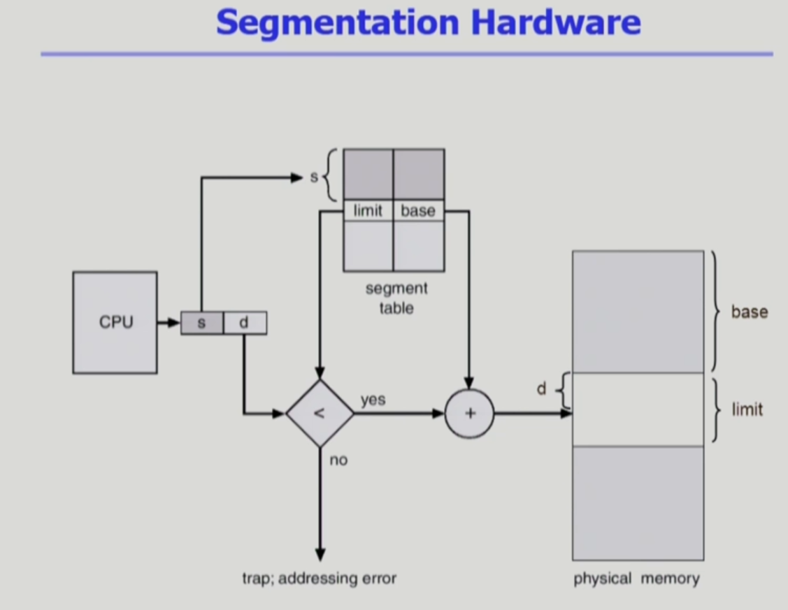
길이가 일정하지 않아서 길이를 나타내는 정보가 필요 : limit에 저장  
STLR보다 큰 s를 원할 시 trap 발동시킴

### Segmentation Architecture (Cont.)
paging에 비해 segment는 굉장히 개수가 적음
#### Protection
- 각 세그먼트 별로 protection bit가 있음
- each Entry : valid bit = 0 => illegal segment / Read/Write/Execution 권한 bit

#### Sharing
- shared segment
- same segment number  
*** segment는 의미 단위이기 때문에 공유(sharing)와 보안(protection)에 있어 paging보다 훨씬 효과적

#### Allocation
- first fit/ best fit
- external fragmentation 발생  
*** segment의 길이가 동일하지 않으므로 가변분할 방식에서와 동일한 문제점들이 발생

Segment는 크기가 균일치 않으므로 entry개수가 일정치 않음

  
Seg끼리 크기가 달라 hole들이 생김. 다만 segment table이 작기 때문에 메모리 낭비가 적음.

## Paged Segmentation
paging 과 segmetation을 섞은 것
segment를 여러가지 page로 구성한 기법

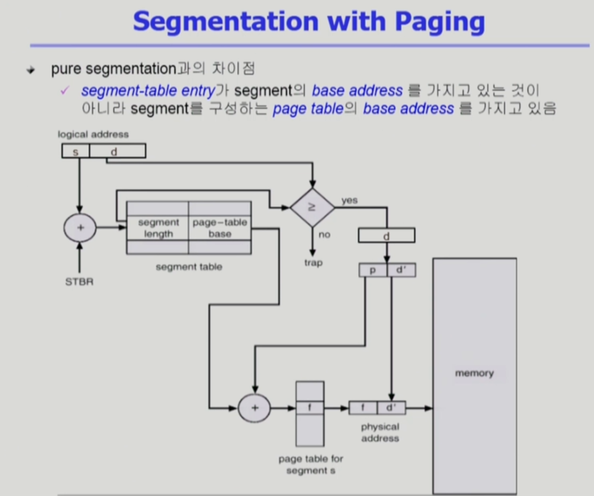

**이 모든 과정에서 운영체제가 하는 일은 없다. 전부 하드웨어가 해주어야 할 일**
