# 운영체제 9. Vitual Memory

- [Demand Paging](#✨demand-paging✨)
- [Valid / Invalid bit의 사용](#✨valid--invalid-bit의-사용✨)
- [Free frame이 없는 경우](#✨free-frame이-없는-경우✨)
- [다양한 캐슁 환경](#✨다양한-캐슁-환경✨)
- [Thrashing](#✨thrashing✨)
- [Working-Set Model](#✨working-set-model✨)
- [PFF (Page-Fault Frequency) Scheme](#✨pff-page-fault-frequency-scheme✨)
- [Page Size의 결정](#✨page-size의-결정✨)

# ✨Demand Paging✨

(요청이 있으면 그 페이지를 메모리에 올리겠다는 뜻)

### ✔️실제로 필요할 때 page를 메모리에 올리는 것

- I/O 양의 감소
- Memory 사용량 감소
- 빠른 응답 시간
- 더 많은 사용자 수용
- ex) 좋은 소프트웨어일수록 방어적으로 소프트웨어를 만든다
  - 정말 이상한 사용자가 이상한 짓을 하더라도 문제가 생기지 않도록 하는 코드가 대부분을 차지
  - 이런 부분은 거의 사용이 안 되는데 이 부분을 한꺼번에 메모리에 올려 놓는다면 메모리 낭비가 됨
  - 이런 의미로 Demand Paging을 쓰면 필요한 부분만 메모리로 올려서 I/O의 양이 감소한다.
  - 따라서 Memory 사용량 감소, 빠른 응답 시간, 더 많은 사용자 수용 등도 따라옴

# ✨Valid / Invalid bit의 사용✨

## 📌 Memory에 없는 Page의 Page Table

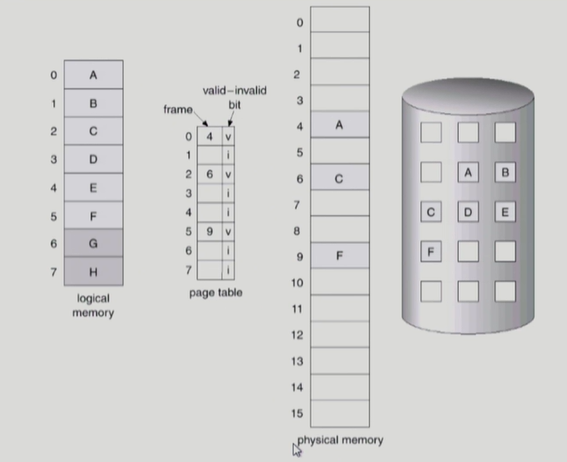

- logical memory(왼쪽): 하나의 프로그램을 구성하는 논리적인 메모리 (여러 페이지들로 구성되어 있음)
- page table: 페이지들의 주소변환 정보가 담겨 있음
- physical memory: 물리적인 메모리
- backing store(맨 오른쪽)

  => logical memory 중 당장 필요한 부분은 physical memory에, 그렇지 않은 부분은 backing store에 있게 됨

### ✔️ Invalid의 의미

- 사용되지 않는 주소 영역인 경우

  - 실제로 사용되는 주소는 0부터 5까지만.
  - 6, 7번은 사용되지 않음(invalid)
  - 1, 3, 4번은 이 프로그램에서 사용하는 주소지만 이 페이지들이 backing store에 내려가 있어서 invalid로 표시

- 페이지가 물리적 메모리에 없는 경우
  - 0번(A), 2번(C), 5번(F)는 물리적인 메모리에 올라가 있으니 Valid, 나머지 페이지들은 backing store에 있기 때문에 invalid로 표시됨.

### ✔️ 처음에는 모든 page entry가 invalid로 초기화

## 📌 address translation 시에 invalid bit이 set 되어 있으면?

(주소 변환하려고 할 때 invalid로 표시된 페이지에 대해서 나타나는 현상)

### ✔️ "page fault"

- 요청한 페이지에 메모리가 없는 경우
- invalid page를 접근하면 MMU(주소변환을 하는 하드웨어)가 trap을 발생시킴 (page fault trap)
- Kernel mode(운영체제)로 들어가서 page fault handler가 invoke(실행)됨

- 다음과 같은 순서로 page fault를 처리한다
  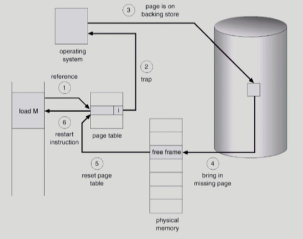

  1. invalid reference? (메모리 레퍼런스가 있었는데)

  - eg. bad address(주소가 잘못된 경우), protection violation(접근 권한에 대해 위반한 경우)
  - => abort process

  2. Get an empty page frame. (없으면 뻇어온다: replace)
     (빈 페이지 하나를 획득해야 하는데 없으면 빈 페이지 하나를 뺏어온다)
  3. 해당 페이지를 disk에서 memory로 읽어온다 (굉장히 느린 작업)
     1. disk I/O가 끝나기까지 이 프로세스는 CPU를 preempt 당함 (block)
        - CPU를 뺏어 와서 사용
     2. Disk read가 끝나면 page tables entry 기록, valid/invalid bit = "valid"
        - page table entry에 'valid'로 표시
     3. ready queue에 process를 insert => dispatch later
  4. 이 프로세스가 CPU를 잡고 다시 running
  5. 아까 중단되었떤 instruction을 재개

- page fault가 났을 때 Disk를 접근하는 것은 굉장히 오래 걸리는 작업
- page fault가 얼마나 나느냐에 따라 메모리에 접근하는 시간이 크게 좌우가 되는 편

## 📌Performance of Demand Paging

### ✔️ page fault의 비율을 0에서 1 사이 값으로 본다면

- page fault가 0이면 page fault가 없고 메모리에서 다 참조가 되는 경우
- page fault가 1이면 매번 메모리 참조 할 때마다 page fault가 난다는 뜻
- 대부분의 경우는 page fault가 나지 않음 (거의 0.08 정도)

### ✔️ 메모리 접근하는 시간 계산

(1-p) x memory access + p(OS & HW page fault overhead + [swap page out if needed] + swap page in + OS&HW restart overhead)

- 1-p(페이지 폴트가 안 나는 비율)은 memory access(메모리 접근)시간만 걸리고
- p(페이지 폴트가 나는 비율)는 운영체제로 CPU가 넘어가서...
- 하드웨어적으로 page fault를 처리하고...
- 빈 공간 없으면 하나 쫓아내고 그 공간에 페이지 올려야 하고... 등등의 엄청난 시간이 걸림

# ✨Free frame이 없는 경우✨

## 📌 Page replacement

- 어떤 fram을 빼앗아올지 결정해야 함
- 곧바로 사용되지 않을 page를 쫓아내는 것이 좋음
- 동일한 페이지가 여러 번 메모장에서 쫓겨났다가 다시 들어올 수 있음

## 📌 Replacement Algorithm

- page-fualt rate를 최소화하는 것이 목표
  - 페이지를 쫓아냈는데 그 페이지가 다시 참조가 되면 또 엄청난 시간이 걸림
- 알고리즘의 평가
  - 주어진 page reference string에 대해 page fault를 얼마나 보내는지 조사
- reference string의 예
  1, 2, 3, 4, 1, 2, 5, 1, 2, 3, 4, 5

  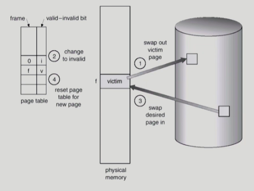

- 내쫓을 희생양(victim)을 찾음
- 근데 만약 victim이 디스크에서 메모리로 올라온 이후에 내용이 변경되었다면? (write 발생)
  - victim을 쫓아내기만 하면 X
  - 변경된 부분을 backing store에 써 줘야 함
- but 변경된 부분 없다면 그냥 물리적 메모리에서 지우기만 하면 됨

### ✔️ Optimal Algorithm

- **page fault를 가장 적게 하는 알고리즘**
- refrence string을 미리 알고 있다는 가정 하에 이 알고리즘을 운영함
- 가장 먼 미래에 참조되는 page를 replace(쫓아냄) (MIN, OPT)

- 4 frames example

  - ex) reference string이 1, 2, 3, 4, 1, 2, 5, 1, 2, 3, 4, 5이라 할 때
    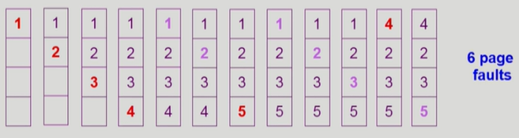
    (빨간색: page fault가 남, 연보라: 참조할 때 page fualt 안 남)
  - 1번, 2번, 3번, 4번 처음 참조될 때 메모리에 올라온다(처음엔 언제나 page fault가 난다)
  - 1번, 2번은 올라와 있었으니까 page fault가 나지
  - 그 다음 5번이 참조 되어야 하는데 page fault가 나서 누군가를 내쫓아야 하는데, 이때 optimal algorithm은 현재 있는 애들 중 가장 먼 미래에 참조 되는 애를 쫓아낸다. (미래를 볼 수 있기 때문)
  - 그래서 1, 2, 3, 4번으로 나오기 때문에 맨 마지막 참조되는 4번을 내쫓음

- 미래의 참조를 어떻게 아는가?
  - Offline algorithm
  - 실제로 사용은 하지 못 함
- 다른 알고리즘의 성능에 대한 upper bound 제공
  - 예를 들어 내가 알고리즘 하나를 만들었는데 그게 optimal 알고리즘과 비슷한 성능을 낸다면 이것보다 더 좋은 알고리즘을 만들 수 없다는 뜻
  - Belady's optimal algorithm, MIN, OPT 등으로 불림

### ✔️ FIFO (First In First Out) Algorithm

- 실제로 사용하는 알고리즘

- FIFO: 먼저 들어온 것을 먼저 내쫓음
  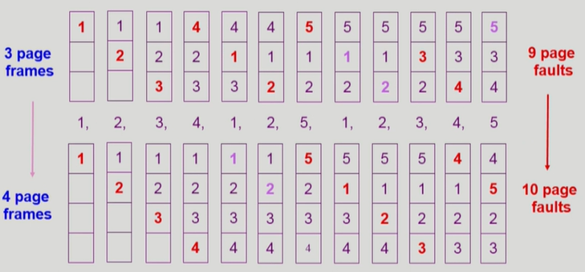
- FIFO Anomaly(Belady's Anomaly) (FIFO의 현상)
  - 3 page frames에서 4 page frames로 메모리를 늘리면 성능이 좋아져야 하는데 성능이 더 나빠지는 상황이 발생할 수 있음

### ✔️ LRU (Least Recently Used) Algorithm

- 가장 많이 사용되는 알고리즘

- LRU: 가장 오래 전에 참조된 것을 지움 (쫓아냄)

- 먼저 들어 와도 재사용이 되면 최근에 사용된 거니까 쫓아내지 않음

  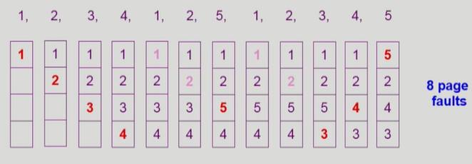

### ✔️ LFU (Least Frequently Used) Algorithm

- LFU: 참조 횟수(reference count)가 가장 적은 페이지를 지움
  - 최저 참조 횟수인 page가 여럿 있는 경우
    - LFU 알고리즘 자체에서는 여러 page 중 임의로 선정함
    - 성능 향상을 위해 가장 오래 전에 참조된 page를 지우게 구현할 수도 있음
  - 장단점
    - LRU처럼 직전 참조 시점만 보는 것이 아니라 장기적인 시간 규모를 보기 때문에 page의 인기도를 좀 더 정확히 반영할 수 있음
    - 참조 시점의 최근성을 반영하지 못함
    - LRU보다 구현이 복잡함

## 📌 LRU & LfU

### ✔️ LRU와 LFU 알고리즘 예제

- 둘 다 각각의 장단점이 있음

### ✔️ LRU와 LFU 알고리즘 구현

- #### LRU
  - 
  - 메모리에 있는 참조 페이지들을 참조 순서에 따라서 한 줄로 줄세움
  - 맨 위는 가장 오래전에 참조된 페이지, 아래로 갈수록 참조 시점이 최근인 페이지
  - LinkedList 형태
  - 쫓아낼 땐 맨 위에 있는 애를 쫓아내고, 새로운 참조를 할 땐 맨 밑에 추가
  - 시간 복잡도: O(1) complexity
    - 쫓아내기 위해서 비교가 필요가 없다는 뜻
- #### LFU

  - 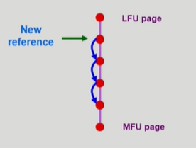
  - 비슷하게 한 줄로 줄 세우기 가능?
  - 가장 참조 횟수가 적은 페이지가 맨 위, 가장 참조 횟수가 많은 페이지가 맨 아래로
  - 그러나 사실상 한 줄로 줄 세우기 불가능
  - 참조 횟수가 1이 늘어났다고 해서 맨 밑으로 갈 수 있는 게 아니라 다른 애들이랑 비교해서 내려갈 수 있는 곳을 찾아야 함
  - 시간 복잡도: O(n) complexity

  => 그래서 LFU는 줄 세우기 X, heap을 이용해 구현 O

  - 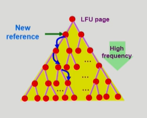
  - 맨 위는 참조 횟수가 가장 적은 페이지, 자식들은 무조건 부모보다 참조횟수가 많은 페이지
  - 만약 참조 횟수가 늘어난다면 직계 자식 두 명 하고만 비교해가며 내려가면 됨
  - 시간 복잡도: O(log n) complexity

# ✨다양한 캐슁 환경✨

### ✔️ 캐슁 기법

- 한정된 빠른 공간(=캐쉬)에 요청된 데이터를 저장해 두었다가 후속 요청시 캐쉬로부터 직접 서비스하는 방식
- paging system 외에도 cashe memory, buffer caching, Web caching 등 다양한 분야에서 사용
  - cashe memory: cpu와 메인 메모리 사이에 있음. cpu가 메모리를 접근할 때 혹시 요청된 내용이 cashe 메모리에 있는지 확인하고 없는 경우에만 요청함
  - buffer caching: 파일 시스템에 대한 read/write 요청을 메모리에서 빠르게 서비스하는 방식
  - Web caching: 멀리 있는 웹서버에서 가져와 내 웹 브라우저에 표시를 하는데 지금도 요청하고 나중에 다시 요청했을 때 다시 멀리 있는 걸 읽어 오려 하지 않고 이미 읽어온 웹페이지를 저장해뒀다가 보여줌

### ✔️ 캐쉬 운영의 시간 제약

- 교체 알고리즘에서 삭제할 항목을 결정하는 일에 지나치게 많은 시간이 걸리는 경우 실제 시스템에서 사용할 수 없음
- Buffer caching이나 Web caching의 경우
  - O(1)에서 O(log n) 정도까지 허용
- Paging system의 경우
  - page fault인 경우에만 OS가 관여함
  - 페이지가 이미 메모리에 존재하는 경우 참조시각 등의 정보를 OS가 알 수 없음
  - O(1)인 LRU의 list 조작조차 불가능

### ✔️ Paging System에서 LRU, LFU 가능한가?

Q. 만약 LRU 알고리즘을 사용한다면 과연 운영체제가 가장 오래전에 참조된 페이지를 알 수 있는가?

Q. 만약 LFU 알고리즘을 사용한다면 과연 운영체제가 가장 적게 참조된 페이지를 알 수 있는가?

A. 알 수 없음. 요청한 페이지가 이미 메모리에 올라와 있는 경우에는 운영체제한테 CPU가 넘어가지 않음. 하드웨어적으로 주소 변환을 해서 CPU가 읽어들임. 페이지의 접근 시간을 운영체제는 알 수 없음.

그러나 page fault가 나면, 운영체제는 disk에 있던 페이지가 메모리로 올라온 시간을 알 수 있음.

그래서 Paging System에서는 운영체제에게 정보가 반만 주어진다.

메모리에 그 페이지가 이미 있으면 운영체제는 알 수 없고, 메모리에 그 페이지가 없어서 page fault가 나면 cpu 제약권이 운영체제에게 넘어와서 그 페이지가 언제 메모리로 올라왔는지 알 수 있음.

=> 사실상 LRU, LFU는 Paging System에서는 사용할 수 없음

그러나 buffer caching, Web caching에서는 사용할 수도 있음

## 📌 Clock Algorithm

### ✔️Paging Sytstem에서 사용하는 알고리즘

- LRU의 근사시킨 알고리즘
- 여러 명칭으로 불림
  - Second chance algorithm
  - NUR (Not Used Recently) 또는 NRU(Not Recently Used)
  - (최근에 참조되지 않은 페이지를 쫓아냄!)

#### 💦알고리즘 실행

- 페이지마다 reference bit라는 게 붙어 있음
- 어떤 페이지를 참조하면 페이지의 reference bit 을 1로 바꿔줌 (하드웨어가 해 줌)
- Reference bit을 사용해서 교체 대상 페이지 선정 (circular list)
- reference bit가 0인 것을 찾을 때까지 포인터를 하나씩 앞으로 이동
- 포인터 이동하는 중에 reference bit 1은 모두 0으로 바꿈
- Reference bit이 0인 것을 찾으면 그 페이지를 교체
- 한 바퀴 되돌아와서도(=second chance) 0이면 그때에는 replace 당함
- 자주 사용되는 페이지라면 second chance가 올 때 1

#### 💦Clock algorithm의 개선

- reference bit와 modified bit(dirty bit)을 함께 사용
- reference bit =1 : 최근에 참조된 페이지
- modified bit=1 : 최근에 변경된 페이지 (I/O를 동반하는 페이지)
- (write로 참조될 때 modified bit을 사용 - 쫓아내야 하는데 modified bit이 1이면 backing store에 수정된 내용을 반영한 뒤에 지워야 하기 때문에)
- modified bit이 0인 애를 우선으로 쫓아내는 걸로 성능 향상 가능

#### 💦 예시

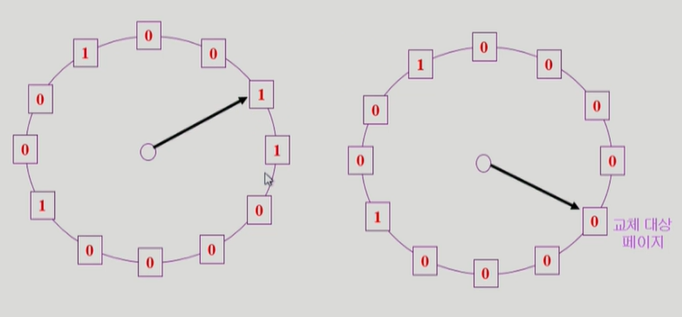

- 각각의 사각형: 물리적인 메모리 안에 들어있는 페이지들(page frame)
- 만약 reference bit이 1이면 최근에 참조된 것을 의미하기 때문에 0으로 바꾸면서 한 바퀴 돈다.
- 여기서 reference bit이 1이라는 건 시계가 한 바퀴 돌아오는 동안에 이 페이지에 대한 적어도 한 번의 참조가 있었다는 뜻, 0이라는 건 없었다는 뜻
- LRU와 비슷한 효과를 냄

# ✨Page Frame의 Allocation✨

- 각 process에 얼마만큼의 page frame을 할당할 것인가?

### ✔️ Allocation의 필요성

- 메모리 참조 명령어 수행시 명령어, 데이터 등 여러 페이지 동시 참조
  - 명령어 수행을 위해 최소한 할당되어야 하는 frame의 수가 있음
- Loop를 구성하는 page들은 한꺼번에 allocate 되는 것이 유리함
  - 최소한의 allocation이 없으면 매 loop마다 page fault

### ✔️ Allocation Scheme

- **Eqaul allocation**: 모든 프로세스에 똑같은 갯수 할당
- **Proportinal allocation**: 프로세스 크기에 비례하여 할당
- **Priority allocation**: 프로세스의 priority에 따라 다르게 할당

## 📌Global vs Local Replacement

### ✔️ Global replacement

- (미리 할당하지 않겠다! 그때 그때 하겠다! - 다른 프로그램의 페이지도 내쫓기 가능)
- replace시 다른 process에 할당된 frame을 빼앗아 올 수 있음
- Process별 할당량을 조절하는 또 다른 방법
- FIFO, LRU, LFU 등의 알고리즘을 global replacement로 사용시에 해당
- Working set, PFF 알고리즘 사용

### ✔️ Local replcement

- (미리 할당하겠다! - 내 프로그램 내의 페이지만 쫓아냄)
- 자신에게 할당된 frame 내에서만 replacement
- FIFO, LRU, LFU 등의 알고리즘을 process 별로 운영시

# ✨Thrashing✨

## 📌Thrashing

- 프로세스의 원활한 수행에 필요한 최소한의 page frame 수를 할당 받지 못한 경우 발생
- 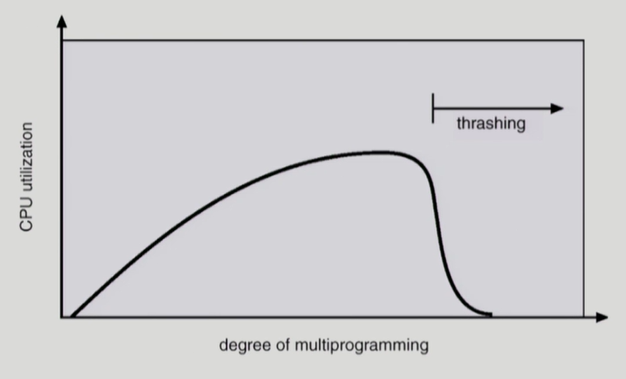
  - 너무 많은 멀티를 하려고 할때 발생
- page fault rate이 매우 높아짐
- CPU 활용성이 낮아짐
- OS는 MPD(Multiprogramming degree)를 높여야 한다고 판단
  - CPU가 놀고 있다고 생각함
- 또 다른 프로세스가 시스템에 추가됨 (higher MPD)
- 프로세스 당 할당된 frame의 수가 더욱 감소
- 프로세스는 page의 swqp in / swap out으로 매우 바쁨
- 대부분의 시간에 CPU는 한가함
- low throughput

# ✨Working-Set Model✨

- Thrashing 해결 방법 알고리즘

### ✔️ Locality of reference

- 프로세스는 특정 시간 동안 일정 장소만을 집중적으로 참조
- 집중적으로 참조되는 해당 page들의 집합을 locality set이라 함
- ex) for문이 돌고 있다면 for문 안의 페이지들이 locality set이 됨

### ✔️ Working-set Model

- Locality에 기반하여 프로세스가 일정 시간 동안 원활하게 수행되기 위해 한꺼번에 메모리에 올라와 있어야 하는 page들의 집합을 Working Set이라 정의함
- Working Set 모델에서는 process의 working set 전체가 메모리에 올라와 있어야 수행이 되고 그렇지 않을 경우 모든 frame을 반납한 후 swap out(suspend)
- ex) 난 5개가 필요한데 3개만 줄 수 있다고 하면 5개를 모두 반납! (난 5개 줄 때까지 하나도 안 받을래 ㅡ.ㅡ)

- Thrashing을 방지함
- Multiprogramming degree를 결정함

## 📌 Working-Set Algorithm

### ✔️ Working set의 결정

- Working set window를 통해 알아냄
  - 과거를 통해 wroking set을 추정
- 과거 델타 시간 동안 참조된 페이지들을 working set으로 간주해서, 메모리에서 쫓아내지 않고 유지하는 것
- 델타 시간을 window라고 함
  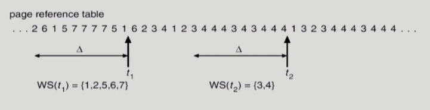
  - 과거 10개의 참조를 봤더니 1, 2, 5, 6, 7 이 다섯 개의 페이지가 이 프로그램에서 working set임
  - 이 다섯 개 줄 수 있으면 다 주고, 아니면 다 안 줌
  - 오른쪽의 경우는 3, 4가 working set

### ✔️ Working-Set Algorithm

- Process들의 working set size의 합이 page frame의 수보다 큰 경우
  - 일부 process를 swap out시켜 남은 process의 working set을 우선적으로 충족시켜 준다 (MPD를 줄임)
- Working set을 다 할당하고도 page frame이 남는 경우
  - Swap out 되었던 프로세스에게 working set을 할당 (MPD를 키움)

### ✔️ Window size △

- Working set을 제대로 탐지하기 위해서는 window size를 잘 결정해야 함
- △ 값이 너무 작으면 locality set을 모두 수용하지 못할 우려
- △ 값이 너무 크면 여러 규모의 locality set 수용
- △ 값이 무한대면 전체 프로그램을 구성하는 page를 working set으로 간주

# ✨PFF (Page-Fault Frequency) Scheme✨

- 이 방식도 multi-programming 수를 조절하면서 thrashing을 방지하는 알고리즘

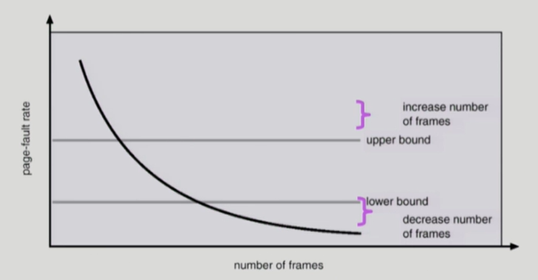

- (어떤 프로그램에서 page-fault를 많이 일어날 경우 페이지를 더 주는 것)
- (반대의 경우엔 메모리를 빼앗음)
- page-fault rate의 상한값과 하한값을 둔다.
  - Page fault rate이 상한 값이 넘으면 frame을 더 할당한다
  - Page fault rate이 하한값 이하면 할당 frame 수를 줄인다.
- 빈 frame이 없으면 일부 프로세스를 swap out
  - 메모리에 남아있는 프로그램이라도 page-fault rate이 일정 값 이하로 떨어지도록 해서 thrashing 방지

# ✨Page Size의 결정✨

### ✔️ Page size를 감소시키면

- 페이지 수 증가
- 페이지 테이블 크기 증가
- Internal fragmention 감소
- Disk transfer의 효율성 감소
  - Seek/rotation vs transfer
  - 한번에 통째로 올리는 게 효율성 높음.
  - size가 작으면 그때 그때 올려야 하기 때문
- 필요한 정보만 메모리에 올라와 메모리 이용이 효율적

  - Locality의 활용 측면에서는 좋지 않음

  => 메모리가 크기가 커지면 page size도 거기에 따라서 키워줄 필요가 있음

### ✔️ Trend

- Larger page size
