# 운영체제 10. File Systems

- [File & File System](#✨fat-file-system✨)
- [File Protection](#✨file-protection✨)
- [File System의 Mounting](#✨file-system의-mounting✨)
- [Access Methods](#✨access-methods✨)
- [Allocation of File Data in Disk](#✨allocation-of-file-data-in-disk✨---디스크에-파일의-데이터를-저장하는-방법)
- [UNIX 파일시스템의 구조](#✨unix-파일시스템의-구조✨)
- [FAT File System](#✨fat-file-system✨)
- [Free-Space Management](#✨free-space-management✨)
- [Directory Implementation](#✨directory-implementation✨)
- [VFS & NFS](#✨vfs--nfs✨)
- [Page Cashe & Buffer Cache](#✨page-cashe--buffer-cache✨)
- [프로그램의 실행](#✨프로그램의-실행✨)

# ✨File & File System✨

### ✔️ File

- 이름을 통해서 접근하는 단위
- 일반적으로 비휘발성의 보조기억장치(하드디스크 등)에 저장
- 저장하려는 목적으로만 file 시스템 사용하는 것이 아니라, 관리 목적도 있음
- 운영체제는 다양한 저장 장치를 file이라는 동일한 논리적 단위로 볼 수 있게 해 줌
- 파일에 대한 연산
  - 생성(create), 읽고(read), 쓰고(write), reposition(lseek), 삭제(delete), 열고(open), 닫고(close) 등
    - repositon: 현재 접근하고 있는 위치를 수정해 주는 연산
    - read, write 하려면 일단 open을 해야 하고, 파일 쓸 일 없으면 close 해야 함
    - 왜 open 따로 해야 함?
      => 파일의 메타데이터를 메모리에 올려 놓는 것이 open임

### ✔️ File attribute (== 파일의 metadata)

- 파일 자체의 내용이 아니라 파일을 관리하기 위한 각종 정보들
  - 파일 이름, 유형, 저장된 위치, 파일 사이즈
  - 접근 권한 (읽기/쓰기/실행), 시간 (생성/변경/사용), 소유자 등
  - ex) 음악 파일의 경우 내용은 음악이지만 이름, 유형, 위치, 사이즈 등은 파일 내용과 관련 없지만... 관리되기 위해 가지는 정보들

### ✔️ File System

파일을 어떻게 저장할지, 어떻게 관리할지, 어떻게 보호할지

- 운영체제에서 파일을 관리하는 부분
- 파일 및 파일의 메타데이터, 디렉토리 정보 등을 관리
- 파일의 저장 방법 결정
- 파일 보호 등

## 📌 Directory & Logical Disk

### ✔️ Directory

- 파일의 메타데이터 중 일부를 보관하고 있는 일종의 특별한 파일
- 그 디렉토리에 속한 파일 이름 및 파일 attribute들
- 디렉토리 연산
  - 디렉토리에 있는 파일 찾기(search for a file)
  - 디렉토리 안에 파일 생성(create a file)
  - 디렉토리 안의 파일 삭제(delete a file)
  - 디렉토리 목록 보기 (list a directory)
  - 디렉토리 안의 파일 이름 바꾸기 (rename a file)
  - 파일 시스템 전체를 탐색하기 (traverse the file system)

### ✔️ Partition (=Logical Disk)

디스크는 논리적 디스크/ 물리적 디스크가 나뉘어져 있는데, 운영체제가 보는 디스크는 논리적인 디스크이며 다른 말로 Partition이라고도 부름

- 하나의 (물리적) 디스크 안에 여러 파티션을 두는 게 일반적
- 여러 개의 물리적인 디스크를 하나의 파티션으로 구성하기도 함
- (물리적) 디스크를 파티션으로 구성한 뒤 각각의 파티션에 file system을 깔거나 swapping(9장에서 배운 virtual memory에서의 스왑 ) 등 다른 용도로 사용할 수 있음

#### 💦 디스크의 용도는 크게 file system 용도, swap area의 용도 2가지로 나눌 수 있음

## 📌 Open()

- 파일의 메타데이터를 디스크 위에 올려두는 것
- 논리적인 디스크 안에 파일 시스템에 특정 파일의 메타데이터, 내용도 저장이 되어 있음
  - 메타데이터 중에는 저장 위치도 있는데
  - 이 파일을 오픈하게 되면 이 정보들이 메모리에 올라가게 되는 것

### ✔️ open("/a/b/c")

- 디스크로부터 파일 c의 메타데이터를 메모리로 가지고 옴
- 이를 위하여 directory 경로를 찾음
  - 루트 디렉토리 '/'를 open 하고 그 안에서 파일 'a'의 위치 획득
    - 루트 디렉토리의 메타데이터는 이미 올려져 있음
  - 파일 'a'를 open 한 후 read하여 그 안에서 파일 'b'의 위치 획득
  - 파일 'b'를 open 한 후 read하여 그 안에서 파일 'c'의 위치 획득
  - 파일 'c'를 open

### ✔️ 그림으로 설명 open("/a/b")

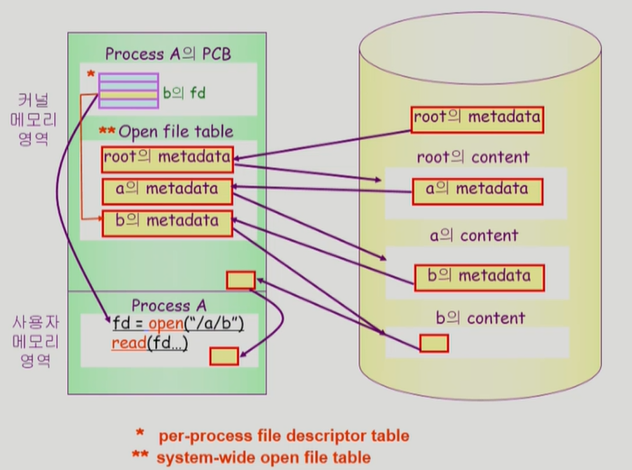

- 왼쪽: 물리적 메모리, 오른쪽: 논리적 메모리

- 사용자가 요청하면 해당 부분을 copy해서 buffer cash에 올려둠
- buffer cash: 이미 가져온 애들 가지고 있는 애

  - buffer cash는 운영체제의 판단권에 있음
  - 사용자가 다시 fd를 콜 했을 때 buffer cash에 이미 있으면 얘를 그냥 전달
  - 없으면 disk에서 가져와서 다시 buffer cash에 올려둠

open file table은 두 개로 나눌 수 도 있음

    - 프로세스와 무관하게 하나만 가지고 있는 현재 저 위의 테이블과
    - 현재 이 프로세스가 이 파일의 어느 위치를 접근하고 있다는 offset 정보를 가지고 있는 테이블

# ✨File Protection✨

- 각 파일에 대해 누구에게 어떤 유형의 접근 (read/write/execution)을 허락할 것인가?

## 📌 접근 제한(Access control) 방법

### ✔️ Access control Matrix

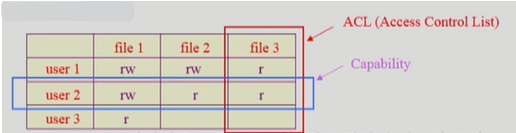

- 행과 열
- 각각의 사용자, 각각의 파일들을 나열한 뒤 각각의 사용자가 각각의 파일들에게 어떤 권한이 있는지 표시하는 법

#### 💦 단점

나만 볼 수 있게 만든 경우에도 다른 사람들 것도 죄다 적어야 하는데 낭비가 될 수 있음

#### 💦보완 방법 - Linked list 이용한 방식

1. 파일을 주체로 해서 linked list로 만든
   - Access control list: 파일별로 누구에게 어떤 접근 권한이 있는지 표시
   - 각각의 파일에 대해서 이 파일에 읽기 권한이 있는 경우는 사용자 1, 쓰기 권한이 있는 건 사용자 2 등등
2. 사용자를 주체로 해서 linked list로 만든

- Capability: 사요자별로 자신이 접근 권한을 가진 파일 및 해당 권한 표시

#### 💦 그러나 이렇게 해도... 너무 부가적인 것들이 큼

### ✔️ Grouping

     일반적인 운영체제가 사용하는 방법

- 전체 user를 owner, group, public의 세 그룹으로 구분
- 각 파일에 대해 세 그룹의 접근 권한(rwx)을 3비트씩으로 표시
- 9개의 비트만을 써서 구분 가능 (굉장히 효율적)
- ex) Unix
  - rwx r-- r--
  - owner group other

### ✔️ Password

- 파일마다 password를 두는 방법 (디렉토리 파일에 두는 방법도 가능)
- 모든 접근 권한에 대해 하나의 password: all-or-nothing
- 접근 권한별 password를 둬야 할 때가 있는데, 이러면 암기 문제, 관리 문제가 있음

# ✨File System의 Mounting✨

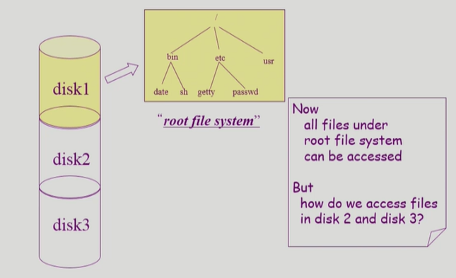

- 만약 다른 partition에 있는 파일 시스템에 접근하려면 어떻게 해야 하나?

### ✔️ Mounting 연산

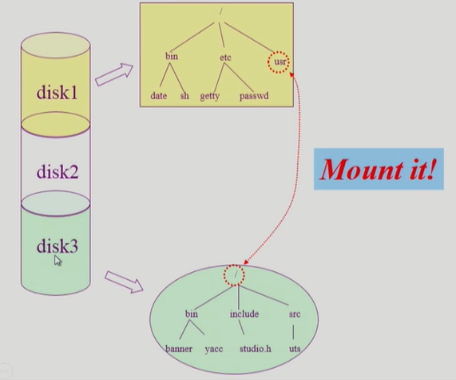

- root file system의 특정 디렉토리 이름에다가 또 다른 파티션에 있는 파일 시스템을 가져다가 mount을 해 주면 그 mount된 디렉토리를 접근하게 되면 또 다른 파일 시스템의 root 시스템을 접근할 수 있게 됨

# ✨Access Methods✨

    파일을 접근하는 방법

### ✔️ 순차 접근(sequential access)

- 카세트 테이프, 비디오 테이프를 이용하는 방식처럼 접근
- 다시 듣고 싶으면 테이프를 되감는
- 읽거나 쓰면 offset은 자동적으로 증가
- c를 보고 싶을 때, a, b를 꼭 봐야 c를 볼 수 있는

### ✔️ 직접 접근(임의 접근) (direct access, random access)

- LP 레코드 판과 같이 접근하도록 함
- 파일을 구성하는 레코드를 임의의 순서로 접근할 수 있음
- c를 보고 싶을 때, a를 보고 b를 건너 뛰고 c를 볼 수 있는

# ✨Allocation of File Data in Disk✨ - 디스크에 파일의 데이터를 저장하는 방법

- 한 저장 단위: '논리적인 블럭'
- 임의의 크기의 파일을 동일 크기의 블럭으로 나눠서 관리

## 📌 1. Contiguous Allocation (연속 할당)

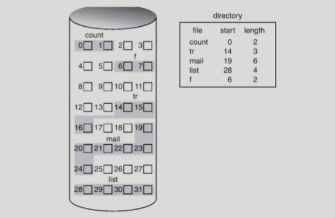

- 하나의 파일이 디스크상에 연속해서 저장이 되는 방법
- ex) 블럭 두 개로 구성되는 경우 - 0번, 1번 이렇게 연속해서 들어가도록

### ✔️ 단점

- external fragmentation (외부 조각)
  - 내용이 들어있지 않은 블럭들의 크기가 균일하지 않아서, 비어있는 블럭임에도 사용하지 못하는 경우가 생김
- File grow가 어려움
  - file 크기를 키우는데 제약이 있음
    - 만약 뒤에 빈 블럭이 2개 밖에 없는데 수정하려고 할 때 추가적으로 6개 블럭이 필요하다면?
  - file 생성시 얼마나 큰 hole을 배당할 것인가?
  - grow 가능 vs 낭비 (internal fragmentation (내부 조각))
    - 내부 조각: grow를 쉽게 하기 위해 누군가에게 크게 할당을 해 줬는데 사용이 안 되며 낭비가 되는 것

### ✔️ 장점

- 빠른 I/O 가능
  - 하드디스크 같은 경우 대부분의 접근 시간은 헤드가 이동하는 시간이고, 읽거나 쓰는데 시간은 별로 상관이 없음
  - 한번의 seek/rotation으로 많은 바이트를 옮길 수 있음
  - Realtime file용으로 이미 실행 중이던 프로세스의 swapping 용
    - swapping은 공간 효율보다 시간 효율을 더 중요시하기 때문
- Direct access(=random access) 가능 (직접 접근 가능)
  - ex) mail의 file의 앞에서부터 5번째 블럭을 보고 싶다! 할 때, 시작 위치 + 5 해서 보여주면 됨 == 직접 접근

## 📌 Linked Allocation (연결 할당)

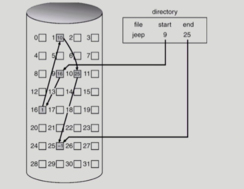

- jeep이라는 파일의 첫 번째 시작 위치는 9고 9에는 다음 블럭의 위치를 알려준다 (16번)
- 16번에는 또 다음 블럭 위치가 적혀 있는(1번) 형식

### ✔️ 장점

- 외부 조각 발생하지 않음

### ✔️ 단점

- 직접 접근 불가능
  - 한 파일의 중간 위치를 보고 싶다면 첫 번째부터 다 거쳐서 가야함
  - 순차 접근만 가능
- Reliability 문제
  - 중간에 한 sector가 고장나서 pointer가 유실되면 뒷 부분을 모조리 잃음
- Pointer를 위한 공간이 block의 일부가 되어 공간 효율성을 떨어뜨림
  - 512 bytes/sector, 4 bytes/pointer
  - 실제로 데이터를 저장할 수 있는 bytes는 512-4 = 508 bytes
  - 컴퓨터 내부와 디스크와 주고 받는 인터페이스가 512 bytes의 배수라서 문제가 생길 수 있음
    - 두 개를 사용해야 할 수도 있음

### ✔️ 변형

- File-allocation table (FAT) 파일 시스템
  - 포인터를 별도의 위치에 보관하여 reliability와 공간효율성 문제 해결

## 📌 Indexed Allocation (인덱스 할당)

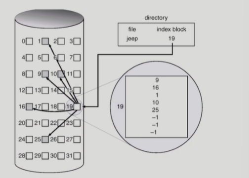

- 디렉토리에 파일의 위치 정보를 바로 저장 X
- 위치 정보를 모두 열거해 놓는 한 블럭을 만들고 이걸 가르키게 만든다.

### ✔️ 장점

- 외부 조각 발생하지 않음
- 직접 접근 가능

### ✔️ 단점

- small file이라 하더라도 블럭이 무조건 2개 이상이 필요함 (공간 낭비)
  - 실제로 많은 파일들이 작음
- 굉장히 큰 파일의 경우 하나의 블럭으로 index를 저장하기에 부족
- #### 💦 해결 방안
  1. Linked scheme
     - 인덱스 블럭에 실제 파일의 위치가 어딘지 적다가 이 파일 전부 현재 블럭에 위치를 다 못 적겠다! 했을 때 이 블럭 마지막에 또 다른 인덱스 블럭 위치를 가르키게 하는 것
  2. multil-level index
  - 인덱스 블럭이 바로 인덱스를 가리키지 않고 실제로 위치가 적혀 있는 다른 인덱스 블럭을 가리키게 해서 2단계를 거치는 듯한 느낌

# ✨UNIX 파일시스템의 구조✨

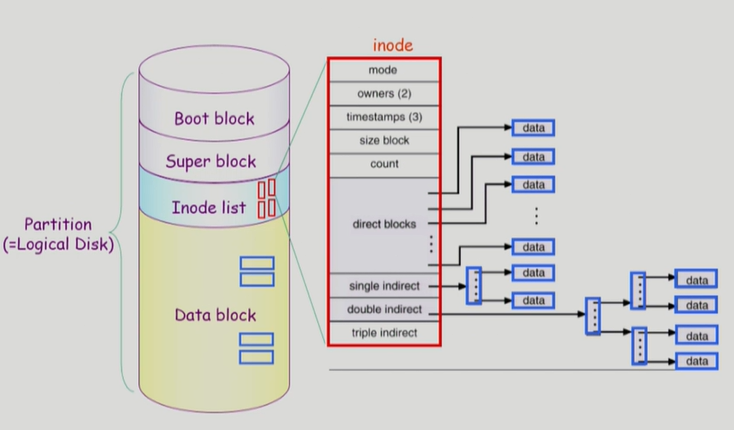

- 가장 기본적인 파일시스템 구조
- 논리적인 디스크(Partition)은 크게 네 가지로 분류가 된다.

### ✔️ 1. Boot block

- 어떤 파일 시스템이든 Boot block은 가장 먼저 설치가 되어 있음
- 부팅에 필요한 정보 (Bootstrap loader)

### ✔️ 2. Super block

- 파일 시스템에 관한 총체적인 정보를 담고 있음
- 어디가 빈 블럭이고, 어디가 실제로 사용 중인 블럭인지

### ✔️ 3. Inode list

- 파일 하나에 빨간색으로 표시된 inode(index node) 하나가 할당이 됨
- inode는 파일의 메타데이터가 저장 되어 있음 (디렉토리에 메타데이터가 모두 저장되지 않고 별도로 따로 빼서 정보를 저장하고는 하는데 inode가 그런 것 중 하나)
- 파일 이름을 제외한 파일의 모든 메타 데이터를 저장
  - 파일의 이름은 디렉토리가 직접 가지고 있음!!!

### ✔️ 4. Data block

- 파일의 실제 내용을 보관

#### 💦 파일의 위치는?

- unix는 Indexed Allocation을 변형해서 사용
- inode는 고정되어 있고! 여기서 위치를 가리키는 포인터들이 있음
  - direct blocks, single indirect, double indirect, triple indirect
  - 작은 파일의 경우 direct blocks만 사용, 이보다 큰 경우 single indirect ...
  - 효율성이 있다.
    - why? 대부분의 파일은 크기가 작아서 direct blocks을 이용해 직접 접근 가능하고, 큰 경우 indirect 이용해서 저장도 더 할 수도 있음

# ✨FAT File System✨

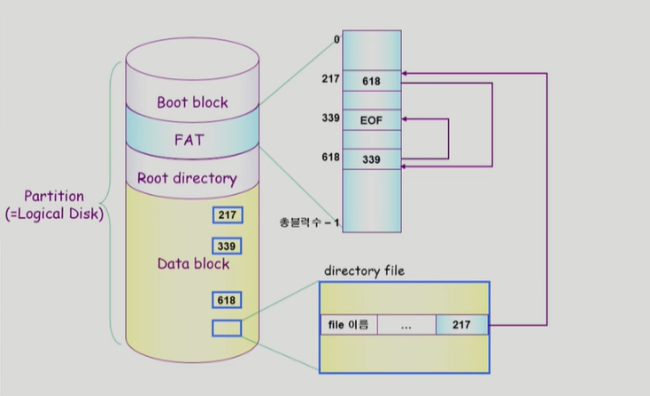

### ✔️ 1. Boot block

### ✔️ 2. FAT

- 메타데이터의 일부(위치 정보)를 FAT에 저장
- 나머지는 모두 directory가 가지고 있음
- 첫 번째 블럭의 위치도 directory가 가지고 있음
- 데이터 블럭의 갯수만큼의 크기를 배열로 가짐
- 이 배열에 담겨 있는 숫자는 그 블럭의 다음 블럭을 저장해 두는 것

#### 💦 예시

- 사진을 보면 첫 번째 블럭이 217번
- 두 번째 블럭은 FAT의 217번을 보면 618이라 적혀 있음 이것이 두 번째 블럭의 위치
- FAT의 618번을 보면 339라고 적혀 있고, 이것은 세 번째 블럭의 위치
- FAT의 339번을 보면 EOF라고 적혀 있는데 이것은 파일이 여기서 끝이 났다는 뜻임

#### 💦 장점

- 직접 접근이 가능함
  - FAT(작은 테이블임)에서만 왔다 갔다 하면 되기 때문에
- Reliability 문제 해결
  - FAT은 중요한 거라 2 copy 이상 저장을 해 두기 때문에 포인터 유실 될 걱정 X

### ✔️ 3. Root directory

### ✔️ 4. Data block

# ✨Free-Space Management✨

비어 있는 부분을 어떻게 관리?

## 📌 Bit map or bit vector

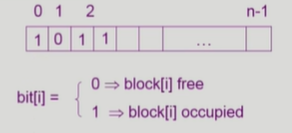

- 각각의 블럭 별로 번호가 있는데, 블럭이 사용 중이냐 비어있냐를 0과 1로 구성
- 0은 비어 있고, 사용 중이면 1로
- Bit map은 부가적인 공간을 필요로 함
- 연속적인 n개의 free block을 찾는데 효과적

## 📌 Linked list

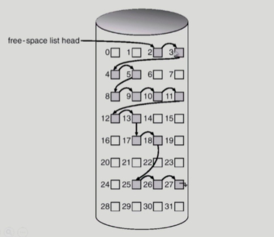

- 모든 free block들을 링크로 연결 (free list)
- 연속적인 가용공간을 찾는 것은 쉽지 않다
- 공간의 낭비가 없다

## 📌 Grouping

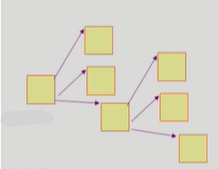

- Linked list 방법의 변형
- 첫 번째 free block이 n개의 pointer를 가짐
  - n-1 pointer는 free data block을 가리킴
  - 마지막 pointer가 가리키는 block은 또 다시 n pointer를 가짐

## 📌 Counting

- 프로그램들이 종종 여러 개의 연속적인 block을 할당하고 반납한다는 성질에 착안
- (first free block, # of contiguous free blocks)을 유지

# ✨Directory Implementation✨

디렉토리 어떻게 구조되어 있나

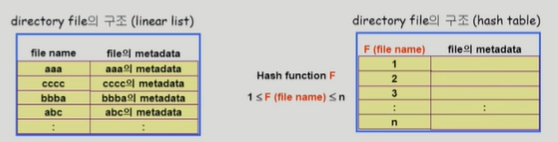

### ✔️ Linear list

- <file name, file의 metadata>의 list
- 크기가 고정적
- 장점: 구현이 간단
- 단점: 디렉토리 내에 파일이 있는지 찾기 위해서는 linear search 필요 (time-consuming)
  - 굉장히 비효율적

### ✔️ Hash Table

- Hash 함수를 적용하면 특정 범위 안으로 값이 나온다.
- linear list + hashing
- Hash table은 file name을 이 파일의 linear list의 위치로 바꿔 줌
- 장점: search time을 없앰
- 단점: Collision 발생 가능
  - 서로 다른 파일의 이름에 대해서 같은 결과로 매핑되는 경우

### ✔️ File의 metadata의 보관 위치

1. 디렉토리 내에 직접 보관
2. 디렉토리에는 포인터를 두고 다른 곳에 보관
   - inode, FAT 등

### ✔️ Long file name의 지원

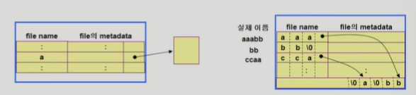

- <file name, file의 metadata>의 list에서 각 entry는 일반적으로 고정 크기
- file name이 고정 크기의 entry 길이보다 길어지는 경우 entry의 마지막 부분에 이름의 뒷부분이 위치한 곳의 포인터를 두는 방법
- 이름의 나머지 부분은 동일한 directory file의 일부에 존재 (뒤에서부터 거꾸로)

# ✨VFS & NFS✨

### ✔️ VFS(Virtual File System)

- 서로 다른 다양한 file system에 대해 동일한 시스템 콜 인터페이스 (API)를 통해 접근할 수 있게 해주는 OS의 layer

### ✔️ NFS(Network File System)

- 분산 시스템에서는 네트워크를 통해 파일이 공유될 수 있음
- NFS는 분산 환경에서의 대표적인 파일 공유 방법임

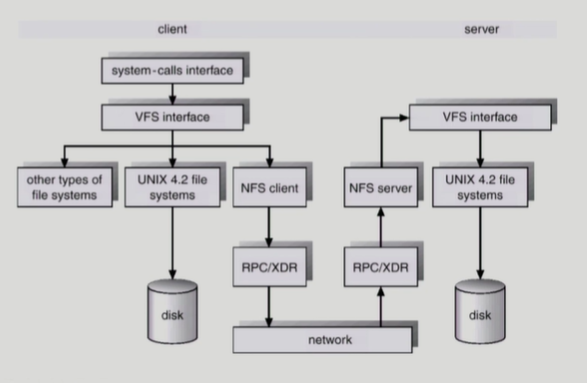

- 어떤 파일이든 상관 없이 VFS 인터페이스를 둠
  - 사용자 입장에서는 동일한 콜 인터페이스를 통해 접근할 수 있음
- client와 sever 컴퓨터가 네트워크로 연결되어 있는 것처럼 분산 시스템의 경우 NFS 사용
  - client 컴터에 a 파일이 없을 때 server에 있는 a 파일을 가져오는...

# ✨Page Cashe & Buffer Cache✨

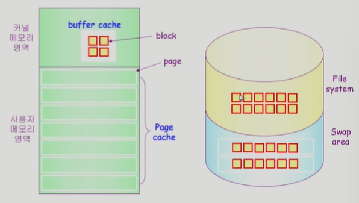

### ✔️ Page Cache

- Virtual memory의 paging system에서 사용하는 page frame을 caching의 관점에서 설명하는 용어
- Memory-Mapped I/O를 쓰는 경우 file의 I/O에서도 page cache 사용
- 프로세스의 주소 공간을 구성하는 페이지가 swap area에 있는가 페이지 cashe에 있는가

### ✔️ Memory-Mapped I/O

- File의 일부를 virtual memory에 mapping 시킴
- 매핑시킨 영역에 대한 메모리 접근 연산은 파일의 입출력을 수행하게 함
- 메모리에 읽고 쓰는데, 실제로는 파일에 읽고 쓰는 효과가 나게 하는 것
  - 메모리 접근하는 방식으로 파일 입출력

### ✔️ Buffer Cache

- 파일시스템을 통한 I/O 연산은 메모리의 특정 영역인 buffer cache 사용
- File 사용의 locality 활용
  - 한 번 읽어온 block에 대한 후속 요청시 buffer cache에서 즉시 전달
- 모든 프로세스가 공용으로 사용
- Replacement algorithm 필요 (LRU, LFU 등)
- file data가 file System에 있느냐 buffer cache에 있느냐

### ✔️ Unified Buffer Cache

- 최근의 OS에서는 기존의 buffer cache가 page cache에 통합됨
- buffer cache도 page 단위로 관리로 한다는 뜻
- 별도로 구분하지 않고 필요로 할 때마다 쓰는 것

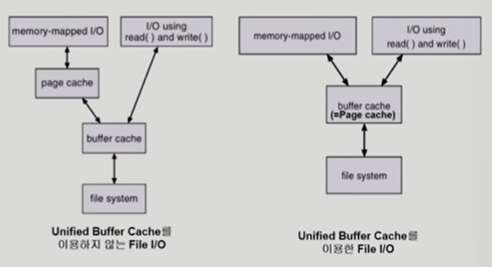

# ✨프로그램의 실행✨

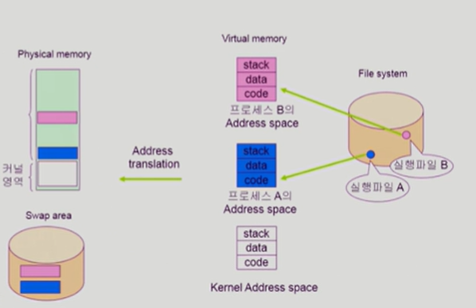

- 프로그램이 실행되면 실행 파일이 프로세스가 되고, 프로세스만의 독자적인 주소 공간이 만들어진다.
- 이 공간은 코드, 데이터, 스택으로 구분
  - 당장 사용될 부분은 물리적 메모리에, 당장 사용되지 않는 부분은 swap 영역에
- 이때 코드 부분은 이미 파일 시스템에 있고 only read기 때문에 swap 영역에 가지 않고 필요 없으면 물리적 메모리에서 지운다. 나중에 필요하면 파일 시스템에서 가져오면 됨

## 📌 Memory Mapped I/O 수행

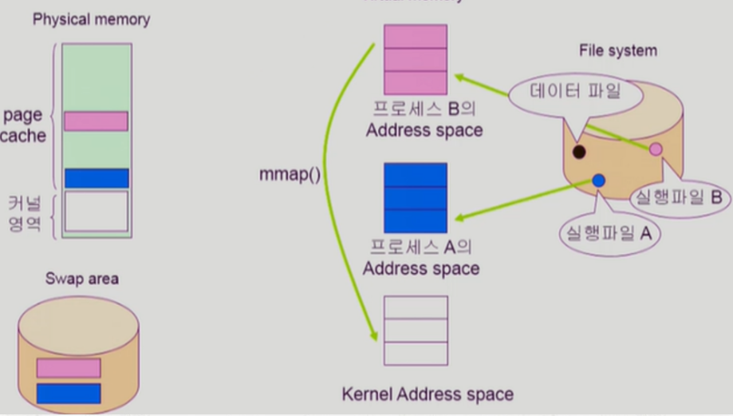

- 프로세스가 일반 데이터 파일을 I/O 하고 싶을 수 있음
- mmap()을 호출하면 Memory Mapped I/O 방식으로 파일을 I/O 할 수 있고, mmap()은 시스템 콜이므로 운영체제에 CPU의 제어권이 넘어간다.

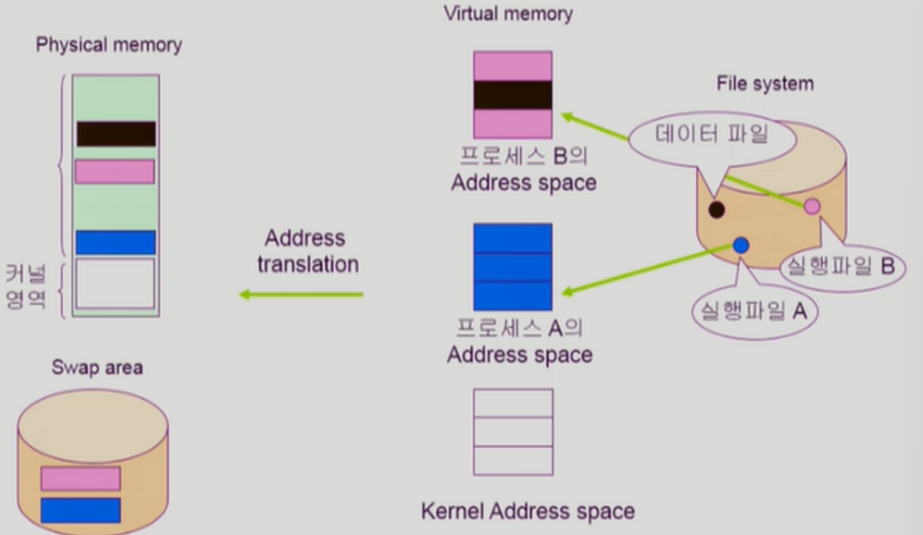

- 운영체제는 데이터 파일의 일부를 프로세스 주소 공간에 매핑
- 만약 데이터 파일이 매핑된 영역을 접근 했을 때 실제 물리적인 메모리에 페이지가 올라와 있지 않다면 페이지 부재가 발생
  - 그 이후부터는 가상 메모리의 매핑된 영역은 물리적 메모리의 페이지 프레임과 일치가 되므로 프로세스가 데이터 파일에 대해 I/O를 하고 싶을 때 운영 체제의 도움 없이 독자적으로 I/O를 수행할 수 있음
- 물리적 메모리에 올라간 데이터 파일과 매핑된 페이지 프레임을 쫓아내야 할 때는 스왑 영역으로 내리지 않음
  - 수정된 사항을 파일 시스템에 적용하고 물리적 메모리에서 지움
- 현재 프로세스 B가 데이터 파일에 대해 Memory Mapped I/O를 수행하여 물리적 메모리에 페이지 프레임을 올려 두었는데, 프로세스 A도 이 페이지 프레임을 공유하여 사용할 수 있음

## 📌 read() 수행

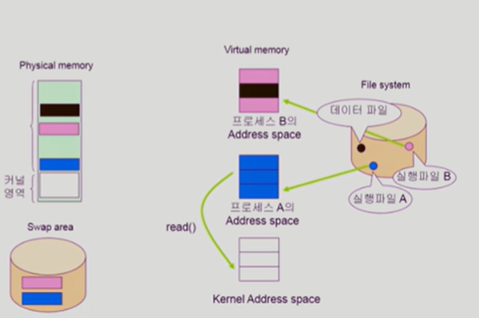

- 프로세스가 일반 데이터 파일을 I/O를 하는 방법으로 read() 시스템 콜을 사용해 호출할 수도 있음
- read() 시스템 콜을 호출하면 메모리의 버퍼 캐시를 확인함
  - Unified Buffer Cache의 경우 page cach가 buffer cache 역할을 동시에 수행하기 때문에 Memory Mapped I/O로 올라 간 page cache를 buffer cache로 사용 가능
- 그러면 운영체제는 buffer cache에 있던 내용을 복사해서 프로세스의 주소 공간에 할당함

## 📌 Memory Mapped I/O vs read()

### ✔️ Memory Mapped I/O

- 장점: 한 번에 memory에 올라감 / 이미 올라간 부분을 운영체제의 도움 받을 필요 없음
- 단점: buffer cache를 매핑하는 것이기 때문에 공유를 하게 될 때 일관성 문제가 생길 수 있음

### ✔️ read()

- 장점: 여러 프로세스가 read() 하여 사용해도 일관성 문제 발생 X
- 단점: 매번 운영체제의 중재를 받음, 페이키 캐시의 내용 복사해야 함
