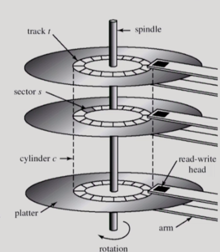
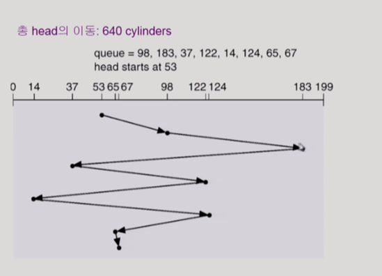
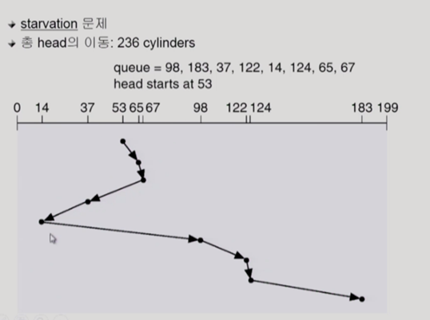
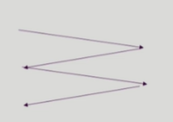
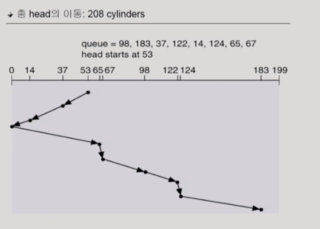
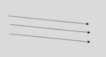
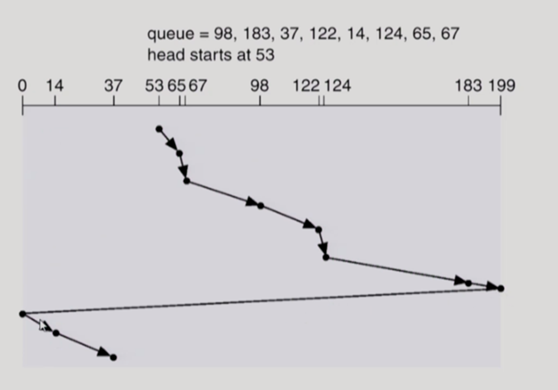
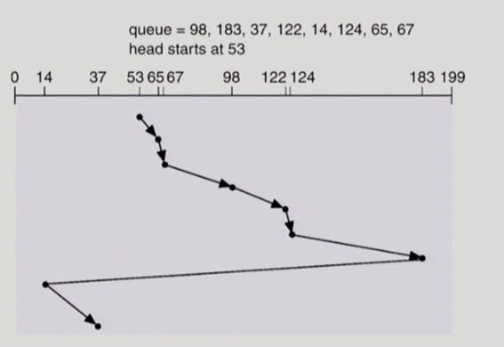
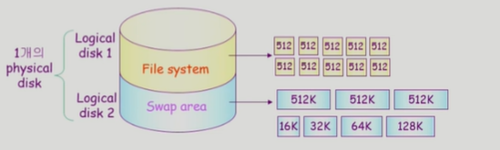

# 운영체제 11. Disk Management and Scheduling

- [Disk Structure](#✨disk-structure✨)
- [Disk Management](#✨disk-management✨)
- [Disk Scheduling](#✨disk-scheduling✨)
- [Disk Scheduling Algorithm](#✨disk-scheduling-algorithm✨)
- [Disk-Schduling Algorithm의 결정](#✨disk-schduling-algorithm의-결정✨)
- [Swap-Space Management](#✨swap-space-management✨)
- [RAID](#✨raid✨)

# ✨Disk Structure✨

### ✔️ logical block

- <디스크 외부(컴퓨터 호스트의 내부)>에서 보는 디스크의 단위 정보 저장 공간들
- 주소를 가진 1차원 배열처럼 취급
  - '배열 몇 번째에 있는 원소를 줘!' 이런 식으로 요청함
- 정보를 전송하는 최소 단위

### ✔️ sector

- <디스크 내부>에서 디스크를 관리하는 최소 단위
- Logical block이 물리적인 디스크에 매핑된 위치
- `Sector 0은 최외곽 실린더의 첫 트랙에 있는 첫 번째 섹터`

# ✨Disk Management✨

### ✔️ physical formatting(Low-level formatting)

- 디스크를 컨트롤러가 읽고 쓸 수 있도록 섹터들로 나누는 과정
- 각 섹터는 `header` + `실제 data`(보통 512 bytes)(여기에 sector 단위로 저장) + `trailer`로 구성
- header와 trailer는 sector number, ECC(Error-Correcting Code)(data를 작게 요약한 코드, 코드의 오류를 검출하는데 사용) 등의 정보가 저장되며 controller가 직접 접근 및 운영

### ✔️ Partitioning

- 디스크를 하나 이상의 실린더 그룹으로 나누는 과정
- OS는 이것을 `독립적 disk`로 취급(logical disk)

### ✔️ Logical formatting

- 파일시스템을 만드는 것
- FAT, inode, free space 등의 구조 포함

### ✔️ Booting

- ROM에 있는 “small bootstrap loader”의 실행
- sector 0(boot block)을 load 하여 실행
- sector 0는 “full Bootstrap loader program”
- OS를 디스크에서 load 하여 실행

# ✨Disk Scheduling✨

## 📌 Access time의 구성

### ✔️ Seek time

- 헤드를 해당 실린더로 움직이는데 걸리는 시간
- Access time에서 가장 큰 시간 차지함 (오래 걸림)

### ✔️ Rotational latency

- 헤드가 원하는 섹터에 도달하기까지 걸리는 회전 지연시간
- 적은 시간을 차지함

### ✔️ Transfer time

- 실제 데이터의 전송 시간
- Access time에서 아주 작은 시간 차지

## 📌 Disk bandwidth

- 디스크 성능을 나타내는 표현
- 단위 시간당 전송된 바이트의 수

## 📌 Disk Scheduling

- seek time을 최소화하는 것이 복표
- Seek time = seek distance

# ✨Disk Scheduling Algorithm✨

- logical block으로 스케줄링을 수행하여 디스크 외부에서 스케줄링을 한다고 볼 수 있음

## 📌 FCFS(First Come First Service)

- 먼저 들어온 순서대로 처리
- 번갈아 요청이 들어와도 순서대로 처리하느라 디스크 헤드가 많이 이동함
  - 굉장히 비효율적

## 📌 SSFS(Shortest Seek Time First)

- 현재 head 위치에서 가장 가까운 요청부터 수행
- 위의 사진의 경우 현재 헤드와 가장 가까운 53번 먼저 처리, 그 다음은 65번 ...
- 장점: head의 이동거리가 줄어든다
- 단점: starvation이 발생할 수 있음
  - queue에 계속 낮은 숫자의 주소만 들어 온다면 한참 전에 요청한 높은 숫자의 주소는 영원히 처리가 안 될 수도 있음

## 📌 SCAN(== Elevator Scheduling)

- 가장 간단하고 획기적인 방법
- disk arm이 디스크의 한쪽 끝에서 다른 쪽 끝으로 이동하며 가는 길목에 있는 모든 요청을 처리한다.
- 다른 한쪽 끝에 도달하면 역방향으로 이동하며 오는 길목에 있는 모든 요청을 처리하며 다시 반대쪽 끝으로 이동한다.
- 장점: 디스크 헤드의 이동 거리 감소, starvation 발생 가능성 없음
- 문제점 : 실린더 위치에 따라 대기시간이 다르다.
  - 가운데 부분은 기다리는 기대치가 짧음
  - 양 끝 부분은 가운데에 비해 오래 걸림

## 📌 C-SCAN(Circular SCAN)

- 헤드가 한쪽 끝에서 다른 쪽 끝으로 이동하며 가는 길목에 있는 모든 요청을 처리
- 다른 쪽 끝에 도달했으면 요청을 처리하지 않고 곧바로 출발점으로 다시 이동한다.
- SCAN보다 균일한 대기 시간을 제공한다.

## 📌 N-SCAN

- SCAN의 변형 알고리즘
- 일단 arm이 한 방향으로 움직이기 시작하면 움직이는 동안 들어온 요청은 처리하지 않고 넘어가면서 arm이 출발할 때 들어온 요청만을 수행하면서 움직인다.
- 대기시간의 편차를 줄일 수 있다.

## 📌 LOOK과 C-LOOK

- SCAN이나 C-SCAN은 헤드가 디스크 끝에서 끝으로 이동, 비효율성이 발생 가능
- LOOK과 C-LOOK은 헤드가 진행 중이다가 그 방향에 더 이상 기다리는 요청이 없으면 헤드의 이동방향을 즉시 반대로 이동한다.
- 굳이 끝까지 가지 않음

#### 💦 C- LOOK

# ✨Disk-Schduling Algorithm의 결정✨

- SCAN, C-SCAN 및 그 응용 알고리즘은 LOOK, C-LOOK 등이 일반적으로 디스크 입출력이 많은 시스템에서 효율적인 것으로 알려져 있음
- File의 할당 방법에 따라 디스크 요청이 영향을 받는다.
- 위의 이유 때문에 디스크 스케줄링 알고리즘은 필요할 경우 다른 알고리즘으로 쉽게 교체할 수 있도록 OS와 별도의 모듈로 작성되는 것이 바람직하다.

# ✨Swap-Space Management✨

## 📌 Disk를 사용하는 2가지 이유

- memory의 volatile(휘발성) 한 특성 -> file system (휘발적이면 안 됨)
- 프로그램 실행을 위한 memory 공간 부족 -> swap space (swap area)

## 📌 Swap-space

- Virtual memory system에서는 디스크를 memory의 연장 공간으로 사용
- 파일 시스템 내부에 둘 수도 있으나 별도 partition 사용이 일반적
  - 공간 효율성보다는 속도 효율성이 우선(어차피 시스템 종료 시 사라지기 때문)
  - 일반 파일보다 훨씬 짧은 시간만 존재하고 자주 참조됨
  - 따라서, block의 크기 및 저장 방식이 일반 파일 시스템과 다름

# ✨RAID✨

## 📌 RAID(Redundant Array of Independent Disks)

여러 개의 값싼 디스크를 묶어서 사용

## 📌 RAID의 사용 목적

### ✔️ 디스크 처리 속도 향상

- 여러 디스크에 block의 내용을 분산 저장
- 병렬적으로 읽어옴(interleaving, striping)

### ✔️ 신뢰성(reliability) 향상

- 동일 정보를 여러 디스크에 중복 저장
- 하나의 디스크가 고장(failure) 시 다른 디스크에서 읽어옴(Mirroring, shadowing)
- 단순한 중복 저장이 아니라 일부 디스크에 parity를 저장하여 공간의 효율성을 높일 수 있다.
  - 오류가 생겼는지를 알 수 있도록 하는 공간만 저장하여 효율성 높임
